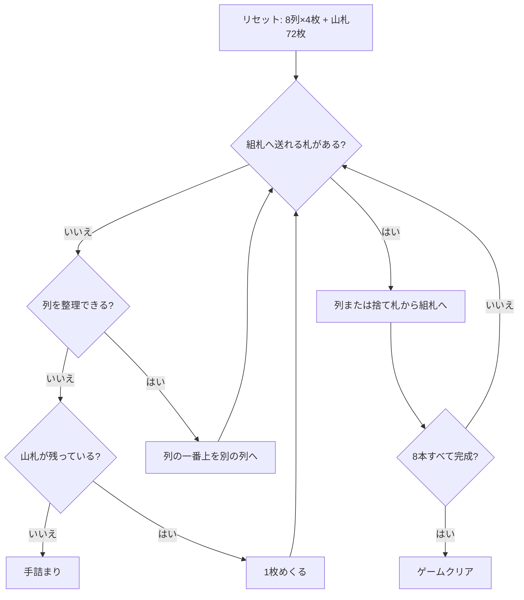

# ディプロマット（CUI版）遊び方

## ゲーム概要

アメリカ発祥の 2 デッキソリティア。8 列に 4 枚ずつ配り、8 本の組札に A から K まで積み上げる。

Forty Thieves 系の「易しい版」と呼ばれる理由はひとつだけ — **タブローがスートを問わない**こと。あちらは同スートの降順しか繋げないが、こちらは数字さえ 1 つ下なら何でも重ねられる。それでも動かせるのは各列の一番上 1 枚だけで、まとめ移動は無い。

## 起動方法

```sh
go run ./cmd/trumpcards diplomat
go run ./cmd/trumpcards --lang en diplomat   # 英語
```

## ルール

- 52 枚 2 組（104 枚）。**8 列に 4 枚ずつ、計 32 枚**を表向きで配り、残り 72 枚が山札
- **組札は 8 本**（スートごとに 2 本）。最初は空で、A が出たらそこへ置き、同スートで K まで積む
- **タブローはスートを無視した降順**。9 の上には数字 8 のカードなら何でも置ける
- 動かせるのは各列の**一番上 1 枚だけ**。連番のまとめ移動は無い
- **空いた列にはどのカードでも置ける。** 別の列か捨て札から 1 枚を移す（山札から直接は置けない）
- 山札は 1 枚ずつ捨て札へめくる。**めくり直しは無い（1 巡のみ）**
- 8 本すべてが K まで揃えばクリア

## ゲームの流れ



## コマンド一覧

| コマンド | 短縮形 | 説明 |
|----------|--------|------|
| `draw` | `d` | 山札から1枚めくる |
| `m t <col> f` |  | 列 `<col>` の一番上を組札へ |
| `m t <from> t <to>` |  | 列 `<from>` の一番上を列 `<to>` へ（空き列も可） |
| `m w f` |  | 捨て札を組札へ |
| `m w t <col>` |  | 捨て札を列 `<col>` へ（空き列も可） |
| `hint` | `h` | ヒントを表示する |
| `autocomplete` | `ac` | 送れるカードを自動で組札へ送る |
| `undo` | `u` | 1 手戻す |
| `giveup` | `g` | ギブアップ |
| `log` | `l` | 棋譜（アクションログ）を表示する |
| `reset` | `r` | 最初からやり直す |
| `quit` | `q` | 終了する |
| `help` | `?` | コマンド一覧を表示 |

## 画面の見方

```
基礎札: [空] | [空] | [空] | [空] | [空] | [空] | [空] | [空]
山札: 72枚 捨て札: なし
----------
列0: [0]♠12 [1]♥7 [2]♣3 [3]♦10
列1: [0]♥5 [1]♠9 [2]♦2 [3]♣8
...
列7: [0]♦4 [1]♣11 [2]♥6 [3]♠1
----------
手数: 0
```

- `列0`〜`列7` がタブロー。`[n]` は下から数えた位置で、動かせるのは一番右（一番上）だけです
- `(空)` の列にはどのカードでも置けます
- 基礎札は 8 本。スートごとに 2 本ずつあり、同じ数字の札が 2 枚あるのでどちらに置いても詰みません

## 遊び方のコツ

- **スートを気にしない代わりに、数字の並びだけを見る。** 同じ数字が 8 枚あるので、置き先は思ったより多くあります
- **空き列は最強の資源。** どのカードでも置けるので、埋めるのは急がず、詰まったときの逃げ場として温存する
- **A と 2 は見つけ次第すぐ組札へ。** 埋もれると掘り出す手数が跳ね上がります
- **深い列の下に沈んだ札は、上の 4 枚を全部どかさないと出てきません。** 序盤に長い列を作りすぎないこと
- 山札はめくり直しが無いので、捨て札に流す前に置ける場所がないか毎回確認する

