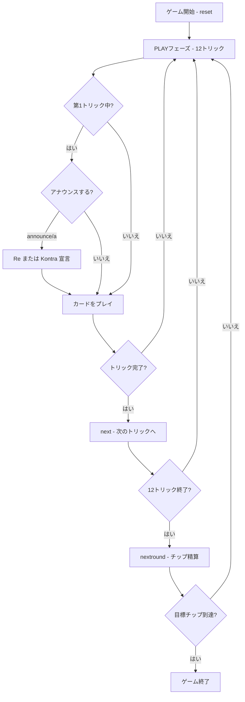

# ドッペルコップ（CUI版）遊び方

## ゲーム概要

Doppelkopf（ドッペルコップ）はドイツで広く親しまれているトリックテイキングゲームです。48枚の二重デッキ（9,10,J,Q,K,A × 4スート × 各2枚）を4人（1人の人間 + 3人のCPU）でプレイします。切り札が26枚と非常に多く、Q♣2枚の持ち主が秘密裏に「Reチーム」を形成するチップ賭け形式です。相手チームのメンバーはラウンド終了まで隠されています。

## 起動方法

```sh
go run ./cmd/trumpcards doppelkopf
go run ./cmd/trumpcards --lang en doppelkopf  # 英語モード
```

## ルール

### デッキと配布

- **デッキ**: 48枚（9,10,J,Q,K,A × ♠♣♥♦ × 各2枚）
- **プレイヤー**: 4人（プレイヤー0 = あなた、プレイヤー1〜3 = CPU）
- **配布**: 各プレイヤー12枚

### 固定切り札（26枚）

強い順:

| 順位 | カード |
|------|--------|
| 1 | ♥10（ドゥッレ / Dulle、最強） |
| 2 | Q♣ |
| 3 | Q♠ |
| 4 | Q♥ |
| 5 | Q♦ |
| 6 | J♣ |
| 7 | J♠ |
| 8 | J♥ |
| 9 | J♦ |
| 10 | A♦ |
| 11 | 10♦ |
| 12 | K♦ |
| 13 | 9♦ |

※ 各カードは2枚ずつあります。同じカードが2枚出た場合、**先に出した方が勝ちます（ドゥッレのルール）**。

### フェイルスート（♣♠♥）

フェイルスートはQ・J・♥10を除くカードで構成されます:
- ♣スート: A,10,K,9（各2枚）
- ♠スート: A,10,K,9（各2枚）
- ♥スート: A,K,9（各2枚）※ ♥10は切り札

同スート内の強さ: **A > 10 > K > 9**

### チームの決定

- Q♣（♣クイーン）を2枚持つプレイヤー2人が秘密の **Reチーム** を形成します
- 残りの2人が **Kontraチーム** になります
- 1人が両方のQ♣を持つ場合はソロRe（1対3）になります
- あなたは自分のチームを知っていますが、相手のチームはラウンド終了まで非公開です

### カード点数

| カード | 点数 |
|--------|------|
| A | 11点 |
| 10 | 10点 |
| K | 4点 |
| Q | 3点 |
| J | 2点 |
| 9 | 0点 |

全カードの合計は **240点**。Reチームは **121点以上** で勝利します（Kontraは120点以上）。

### アナウンスメント

- 第1トリック中に **Re**（`a` または `announce`）を宣言するとチップが×2になります
- 同様に **Kontra** 宣言も×2になります
- 両方宣言された場合は合わせて×4になります

### チップ精算

ゲームポイント = 1（勝利）＋1（負けた側が90点未満）＋1（60点未満）＋1（30点未満）＋1（負けた側がトリックなし）× アナウンスメント乗数。

ソロReの場合は対戦相手3人から各1ずつ受け取る（負けた場合は各1ずつ払う）代わりに、Re側のポイントは×3で計算されます。いずれかのプレイヤーが目標チップ数に達した時点でゲーム終了です。

## ゲームの流れ



## コマンド一覧

| コマンド | 短縮形 | 説明 |
|----------|--------|------|
| `play <idx>` | — | 手札のidx番目のカードを出す（PLAYフェーズ） |
| `announce` | `a` | Re または Kontra を宣言する（第1トリック中のみ） |
| `next` | `n` | 次のトリックへ進む（トリック終了後） |
| `nextround` | `nr` | チップ精算して次のラウンドへ |
| `setdifficulty <0-2>` | `sd <0-2>` | CPU難易度設定（0=Easy, 1=Normal, 2=Hard） |
| `setbasechips <n>` | `sb <n>` | ベースチップ数設定 |
| `log` | `l` | アクションログを表示 |
| `reset` | `r` | 新しいゲームを開始（設定保持） |
| `quit` | `q` | ゲーム終了 |
| `help` | `?` | コマンド一覧を表示 |

## 画面の見方

```
==========
Doppelkopf (ドッペルコップ)
==========
ラウンド: 1  トリック: 1
チップ: You=0 CPU1=0 CPU2=0 CPU3=0
You: 12枚 0トリック [Reチーム]
[0]♥10 [1]Q♣ [2]Q♣ [3]J♠ [4]A♠ [5]10♠ [6]K♠ [7]9♠ [8]A♥ [9]K♥ [10]9♥ [11]A♣
CPU 1: 12枚  CPU 2: 12枚  CPU 3: 12枚
----------
フェーズ: PLAY
アナウンス可能 (a/announce でRe宣言)
あなたの手番です。カードを出してください。
play <idx>
```

- **チップ行**: 各プレイヤーの現在のチップ枚数
- **`[n]`付き行**: あなたの手札（インデックス付き）。切り札は強い順に表示されます
- **チーム表示**: `[Reチーム]` または `[Kontraチーム]` があなたのチームを示します
- **フェーズ表示**: 現在のフェーズ（PLAY）
- **アナウンス行**: 第1トリック中のみ表示。`a` または `announce` で宣言できます
- 相手プレイヤーのチームはラウンド終了後に公開されます

## 遊び方のコツ

- **Q♣の枚数確認**: ゲーム開始時に手札のQ♣を数えましょう。2枚持っていれば確実にReチームです。Q♣が1枚ならパートナーを探しながらプレイします。
- **ドゥッレ（♥10）の活用**: 最強の切り札♥10は2枚あります。どちらが先に出るかが重要です。相手の♥10に対抗して2枚目を取っておくと有利です。
- **アナウンスのタイミング**: 第1トリック中のみ宣言できます。Q♣を2枚持つなど手が強いと確信したときにReを宣言するとチップが2倍になります。ただし弱い手で宣言すると逆にリスクになります。
- **切り札の温存**: 強いQ系・J系は高得点トリックの奪取やラストトリック狙いに取っておきましょう。特にQ♣は切り札の上位です。
- **フェイルスートのリード**: 相手に切り札を使わせてトランプを枯らすのが基本戦術です。
- **パートナーの見抜き方**: 相手がQ♣を出した瞬間やReアナウンスをした瞬間にパートナーが分かります。それまでは全員が敵の可能性があるため、高得点カードは慎重に扱いましょう。
- **点数管理**: A（11点）と10（10点）を多く取ることが勝利への近道です。Reチームは121点以上が目標です。
- **ソロReの戦術**: 1人でQ♣を2枚持つ場合は1対3の不利な戦況です。切り札を有効活用して効率よく点数を集めましょう。
