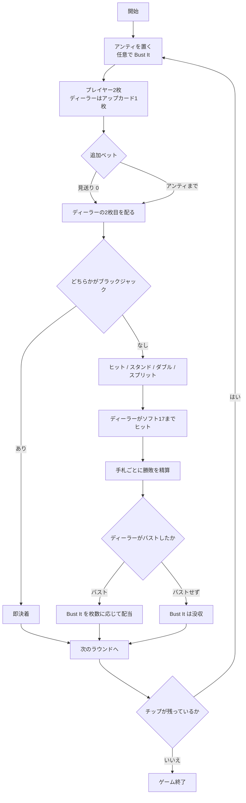

# 追加ベット・ブラックジャック（CUI版）遊び方

## ゲーム概要

追加ベット・ブラックジャックは、アメリカ・アトランティックシティ発祥のブラックジャック派生です。**10 を抜いた 48 枚のスパニッシュデッキ**を 8 組（384 枚）使います。

最大の特徴は**情報が届く順番**です。ディーラーはまずアップカードを 1 枚だけ見せ、それを見てからプレイヤーは**アンティと同額まで賭け増し**できます。ディーラーの 2 枚目が配られるのは、その決定の後です。

その有利さの対価として、**プレイヤーのブラックジャックは 1:1**（通常の 3:2 ではありません）。

> このゲームの商品名は日本で商標登録されているため、本プロジェクトでは機能を表す名前で呼んでいます。詳細は [`TRADEMARKS.md`](../../../TRADEMARKS.md) を参照してください。

## 起動方法

```sh
go run ./cmd/trumpcards doubleattack
```

英語で起動する場合:

```sh
go run ./cmd/trumpcards --lang en doubleattack
```

## ルール

- デッキは **10 を除いた 48 枚 × 8 組**。絵札（J・Q・K）は残っているので 10 点札は減っていますが、絵札ぶんは存在します。
- アンティを置きます。任意で **Bust It** サイドベットも置けます。
- プレイヤーに 2 枚、ディーラーに**アップカード 1 枚**を配ります。
- アップカードを見て、**アンティと同額まで追加ベット**できます（0 で見送り）。
- 追加ベットを決めた後に**ディーラーの 2 枚目**が配られます。
- 以降は通常のブラックジャック進行です。
  - ヒット / スタンド
  - ダブル（最初の 2 枚のときだけ。賭け金を倍にして 1 枚だけ引く）
  - スプリット（同じ数字 2 枚。4 手まで。**エースを割ったら 1 枚ずつで打ち止め**）
- **ディーラーはソフト 17 でヒット**します。
- **プレイヤーのブラックジャックは 1:1**。通常勝利も 1:1、引き分けはプッシュです。
- **自分が全部バストしても、ディーラーは引き切ります。** Bust It が生きているためです。
- Bust It はディーラーがバストしたときだけ、**バスト時の手札枚数**に応じて払われます。

## ゲームの流れ



## コマンド一覧

| コマンド | 短縮形 | 説明 |
|----------|--------|------|
| `bet <額> [BI額]` | `b` | アンティを置く（BI額 = Bust It、省略可） |
| `attack <額>` | `a` | アップカードを見て追加ベット（`attack 0` で見送り） |
| `hit` | `h` | 1枚引く |
| `stand` | `s` | 打ち止めにする |
| `double` | `d` | 賭け金を倍にして1枚だけ引く |
| `split` | `sp` | 同じ数字2枚を分ける |
| `next` | - | 次のラウンドへ |
| `hint` | - | 助言を表示する |
| `log` | - | 棋譜を表示する |
| `reset` | `r` | ゲームをやり直す |
| `quit` | `q` | ゲームを終了する |
| `help` | - | ヘルプを表示する |

## 画面の見方

```
フェーズ: ATTACK
ラウンド: 3（チップ: 850）
アンティ 50 / 追加ベット 0 / Bust It 20
----------
ディーラー: ♠6 ※ 2枚目は追加ベットの後に配られます
*[1] ♥K ♣7 = 17（賭け 50）
追加ベットの上限: 50
```

- **フェーズ**: `BET`（賭け）→ `ATTACK`（追加ベット）→ `PLAY`（プレイ）→ `RESULT`（決着）
- **ディーラー**: `ATTACK` の間は**アップカード 1 枚だけ**。点数も表示されません（1 枚だけの点数は 2 枚目の手掛かりになるためです）
- **手札行**: `*` が付いているのがいま操作している手札。スプリットすると `[1]` `[2]` と増えます
- **追加ベットの上限**: アンティと同額まで

決着すると、ディーラーの全札と点数、手札ごとの勝敗、Bust It の配当、収支が表示されます。

## 遊び方のコツ

- **アップカードが弱い（2〜6）ときが賭け増しどころ**です。ディーラーがバストしやすいので、追加ベットが活きます。
- 逆に**強いアップカード（7〜A）では見送る**のが基本です。10 が抜けているぶんディーラーはバストしにくく、賭け増しは損になりがちです。
- **ブラックジャックが 1:1 である**ことを忘れないでください。通常のブラックジャックの感覚で強気に賭けると、期待値が合いません。
- Bust It は**ディーラーが何枚でバストしたか**で配当が変わります。3 枚バストは約 15% 起きるので配当は控えめ、7 枚以上は極めて稀です。ハウスエッジは 5.21% です。
