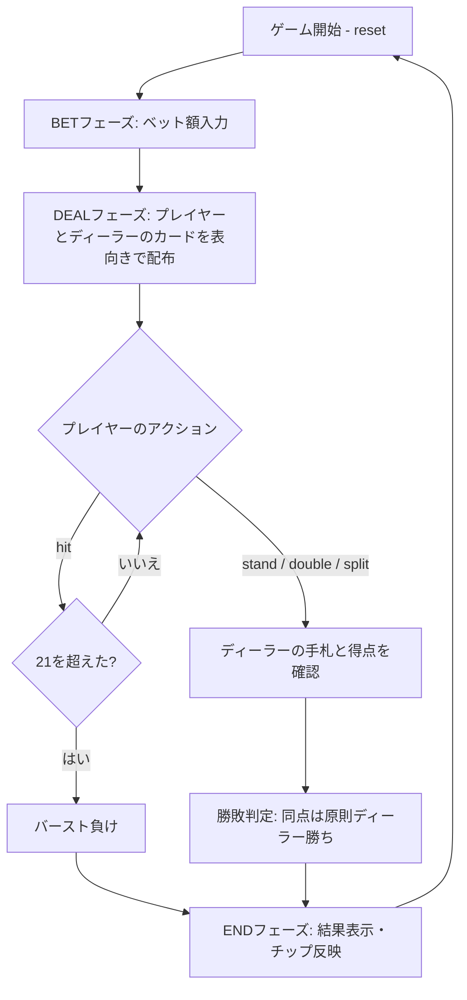

# ダブルエクスポージャー・ブラックジャック（CUI版）遊び方

## ゲーム概要

ダブルエクスポージャー・ブラックジャックは、1979年に考案されたアメリカのカジノゲームです。1人のプレイヤーがディーラーと対戦し、ディーラーの2枚のカードが最初から両方とも表向きになります。完全情報を得られる代わりに、通常の同点負けとブラックジャックの等倍配当が適用されます。

## 起動方法

```sh
go run ./cmd/trumpcards doubleexposure
go run ./cmd/trumpcards --lang en doubleexposure  # 英語モード
```

## ルール

### ブラックジャックとの3つの違い

- ディーラーの2枚は最初から両方とも表向きで、ディーラーの得点も見えます。
- 同点は原則としてディーラーの勝ちです。ただし、ナチュラルブラックジャック同士だけはプレイヤーの勝ちです。
- プレイヤーのナチュラルブラックジャックは3:2ではなく1:1（等倍）で配当されます。

### 共通ルール

6〜8組のデッキを使用します。ヒット、スタンド、スプリット、ダブルは標準ブラックジャックと同じです。21を超えた手は即座にバースト負けになります。完全情報という利点と引き換えに、同点負けと配当切り下げで釣り合いを取っているゲームです。

## ゲームの流れ



## コマンド一覧

| コマンド | 短縮形 | 説明 |
|----------|--------|------|
| `reset` | `r` | 新しいゲームを開始 |
| `bet <額>` | `b <額>` | ベット |
| `hit` | `h` | カードを1枚引く |
| `stand` | `s` | スタンド |
| `doubledown` | `d` | ベットを倍にしてプレイ |
| `split` | `sp` | ペアを2つの手に分ける |
| `quit` | `q` | ゲーム終了 |
| `help` | `?` | コマンド一覧を表示 |

## 画面の見方

```
===============================
Double Exposure Blackjack
===============================
Dealer: ♠K, ♥6  (Score: 16)
Your hand: ♦10, ♣7  (Score: 17)
Phase: ACTION
```

ディーラーのカードは2枚とも表向きで表示されます。結果表示では、同点がディーラー勝ちになったことや、ナチュラルブラックジャックの配当も確認できます。

## 遊び方のコツ

- ディーラーの2枚と得点が見えるため、相手のバースト可能性を計算して行動します。
- 通常のブラックジャックと同じ感覚で同点を期待せず、同点なら負けることを前提に判断します。
- プレイヤーのブラックジャックは1:1なので、完全情報の価値と配当の低下を合わせて考えます。
