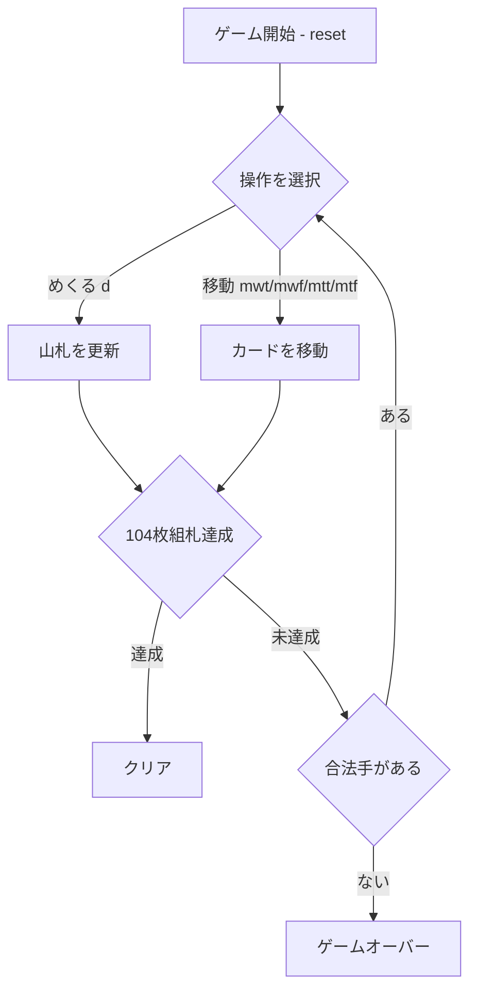

# ダブル・クロンダイク（CUI版）遊び方

## ゲーム概要

ダブル・クロンダイク（Double Klondike）は、定番のクロンダイクを **2 デッキ 104 枚** で遊ぶ拡張版です。**9 列の場札**、**8 つの組札（各スート 2 組）**、そして **3 枚めくりのストック** を使います。場札は色違いの降順に重ね、組札はスートごとに A→K で積み上げ、**104 枚すべてを組札に上げるとクリア** です。

## 起動方法

```sh
go run ./cmd/trumpcards doubleklondike
go run ./cmd/trumpcards --lang en doubleklondike  # 英語モード
```

## ルール

1. **めくる**: `d` でストックから 3 枚を山札（waste）にめくります。ストックが空のときは山札を戻して再利用します。
2. **山札→場札**: `mwt <col>` で山札の最上位を場札の列 `col` へ移します。
3. **山札→組札**: `mwf` で山札の最上位を適切な組札へ上げます。
4. **場札→場札**: `mtt <from> <idx> <to>` で列 `from` の `idx` 番目（0 始まり）以降の表向き連番列を列 `to` へ移します。
5. **場札→組札**: `mtf <col>` で列 `col` の最上位カードを組札へ上げます。
6. **配置**: 場札は色違いで 1 つ小さいランク、空列には K のみ置けます。組札はスートごとに A→K の昇順です。
7. **勝敗**: 104 枚すべてを組札に上げればクリア、合法手がなくなれば失敗です。

## ゲームの流れ



## コマンド一覧

| コマンド | 短縮形 | 説明 |
|----------|--------|------|
| `draw` | `d` | ストックから 3 枚めくる |
| `mwt <col>` | | 山札の最上位を場札の列 col へ移す |
| `mwf` | | 山札の最上位を組札へ上げる |
| `mtt <from> <idx> <to>` | | 列 from の idx 番目以降を列 to へ移す |
| `mtf <col>` | | 列 col の最上位を組札へ上げる |
| `autocomplete` | `ac` | 自動で組札へ上げられるだけ上げる |
| `undo` | `u` | 直近の手を取り消す |
| `giveup` | `g` | 投了する |
| `hint` | `h` | ヒントを表示 |
| `log` | `l` | 棋譜を表示 |
| `reset` | `r` | 新しいゲームを開始 |
| `quit` | `q` | ゲーム終了 |
| `help` | `?` | コマンド一覧を表示 |

## 画面の見方

```
==========
ダブル・クロンダイク (Double Klondike)
==========
ストック: 59  山札: ♦A
組札: ♠- ♠- ♥- ♥- ♦- ♦- ♣- ♣-
列0: ♠9
列1: ## ♥8
...
手数: 0
==========
```

- `ストック` … 残りのめくり可能枚数
- `山札` … めくった最上位カード
- `組札` … 各スート 2 組の積み上げ先
- `列0〜8` … 場札（右端が最上位、`##` は裏向き）

## 遊び方のコツ

- 2 デッキあるため、同じカードが 2 枚あります。組札を均等に育てると手詰まりを避けやすくなります。
- 裏向きカードを早く表に返すため、長い列から先に崩しましょう。
- `ac` は終盤の取りこぼしを防ぐのに便利です。
