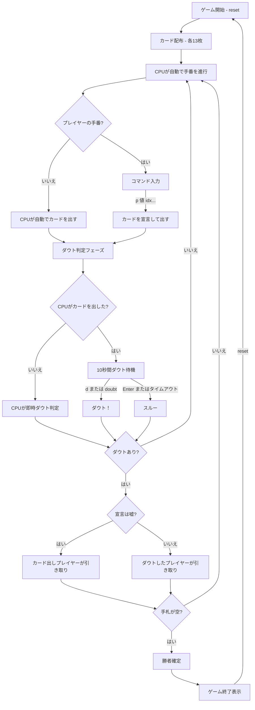

# ダウト（CUI版）遊び方

## ゲーム概要

4人（プレイヤー1人 + CPU 3人）で遊ぶカードゲームです。カードを場に出す際に宣言する値が本当かどうかを見極めながら、手札を最初になくしたプレイヤーが勝者です。

## 起動方法

```sh
go run ./cmd/cli doubt
```

## ルール

### 基本ルール

- 52枚のトランプを4人に配布（1人13枚）
- 順番にカードを1枚以上場に出し、出した枚数と宣言する値を伝える
- 宣言する値は本当でも嘘でも構わない（ブラフ可）
- 他のプレイヤーは「ダウト（嘘だ）」または「スルー（信じる）」を選択する
- **ダウトの結果**:
  - 宣言が嘘だった場合 → カードを出したプレイヤーが場のカードをすべて引き取る
  - 宣言が本当だった場合 → ダウトしたプレイヤーが場のカードをすべて引き取る
- 最初に手札をなくしたプレイヤーが勝者

### ダウト判定ウィンドウ

- カードが場に出された後、設定した秒数（デフォルト **10秒**）のダウト判定ウィンドウがある
- CPU がカードを出した場合: 制限時間内に `d`（ダウト）または Enter（スルー）を入力する
- あなたがカードを出した場合: CPU がダウトするかどうかを即時自動判定する
- ダウト判定ウィンドウの長さは、CUI版では `sw <sec>` コマンドで変更できます（デフォルト10秒）。Web版では設定パネルから変更できます

### CPU のメモリ・推理 AI

- CPU は公開されたカード（ダウト解決時）を記憶する
- 記憶したカードと自分の手札を合わせて「**物理的に不可能な宣言**」を検出すると 100% ダウトを宣言する
  （例: 既に4枚すべての「7」が確認済みなのにさらに「7」が宣言された場合）
- 通常時は 30% の確率でランダムにダウトを宣言する
- 記憶の精度（保持確率）は `sm <level>` コマンドで変更可能:
  - `DoubtMemoryLevelEasy` (0): 約 30% 保持
  - `DoubtMemoryLevelNormal` (1): 約 70% 保持（デフォルト）
  - `DoubtMemoryLevelHard` (2): 100% 保持

### 記憶の減衰

- CPU の記憶はターンが進むにつれて確率的に忘れていく（人間らしい忘却）
- 忘却確率 = 減衰率 × 経過ターン数（古い記憶ほど忘れやすい）
- 減衰率は記憶力レベルに連動:
  - Easy: 0.15/ターン（忘れやすい）
  - Normal: 0.05/ターン
  - Hard: 0.0（忘れない）

### ペナルティ上限（PenaltyDrawLimit）

- ダウト敗者が引き取るカードの上限枚数を設定できる
- 0（デフォルト）= 無制限（敗者が場のカードをすべて引き取る）
- 上限を超えた分のカードはゲームから除外される（誰の手札にも入らない）
- CUI版では `sp <limit>` コマンドで変更可能
- Web版では設定パネルから変更できる

### 動的ブラフ確率

- CPU のブラフ確率は状況に応じて変動する（基本 40%）
- 手札残り1枚: 10%（リスク回避）
- テーブルに20枚以上: 基本から −15%（引き取りリスクが大きい）
- テーブルに10枚以上: 基本から −10%

## ゲームの流れ



## コマンド一覧

| コマンド | 短縮形 | 説明 |
|----------|--------|------|
| `reset` | `r` | 新しいゲームを開始 |
| `play 値 idx...` | `p 値 idx...` | 手札のカードを出す（値=宣言値, idx=手札インデックス） |
| `d` または `doubt` | - | ダウト！（ダウト判定ウィンドウ中のみ有効） |
| `s` | - | スキップ（ダウトしない） |
| `setwindow <sec>` | `sw <sec>` | ダウト判定ウィンドウの秒数を設定（1〜60） |
| `setmemory <level>` | `sm <level>` | CPU記憶力レベルを設定（0=Easy, 1=Normal, 2=Hard） |
| `setpenalty <limit>` | `sp <limit>` | ペナルティドロー上限を設定（0=無制限, >0=上限） |
| `setmetaai N` | `smai N` | Meta-AI の切替（0=OFF, 1=ON） |
| `resetprofile` | `rp` | Meta-AI のプロファイル（学習データ）をリセット |
| `quit` | `q` | ゲーム終了 |
| `help` | `?` | コマンド一覧を表示 |

### `play` コマンドの詳細

`p 値 idx...` の各引数:

| 引数 | 説明 |
|------|------|
| `値` | 宣言する値（1〜13。1=A、11=J、12=Q、13=K） |
| `idx...` | 場に出す手札のインデックス（複数指定可） |

例:
- `p 5 0` → インデックス0のカードを「5」と宣言して1枚出す
- `p 3 0 2` → インデックス0と2のカードを「3」と宣言して2枚出す
- `p 1 0 1 2` → インデックス0・1・2のカードを「A」と宣言して3枚出す

## 画面の見方

```
==========
Doubt (ダウト)
==========
[You]: 11枚
[0]SPADE 2  [1]CLOVER 5  [2]HEART 9  [3]DIAMOND 11  ...
CPU 1: 13枚
CPU 2: 12枚
CPU 3: 上がり
----------
テーブル: 3枚
[最後のプレイ] CPU 2が「7」を2枚出しました
[ダウト] あなたがCPU 2をダウト → 嘘つき！ CPU 2が5枚引き取りました
  (2枚がゲームから除外されました)
  公開カード: HEART 3, SPADE 11
手番: あなた
正直に申告するなら: 8
p <値> <idx...>・・・カードを出す
==========
```

- `[You]: N枚`: プレイヤーの手札枚数
- `[0]SPADE 2`, `[1]CLOVER 5`...: インデックス付きの手札カード（`play` で指定）
- `CPU N: M枚`: CPU の手札枚数
- `上がり`: 手札がなくなったプレイヤー
- `テーブル: N枚`: 現在場に積まれているカードの枚数
- `[最後のプレイ]`: 直前に出されたカードの情報（誰が、何を宣言して何枚出したか）
- `[ダウト]`: ダウト判定の結果（嘘/正直、引き取り枚数、除外枚数、公開カード）
- `[あなたの行動]`: 自分が出したカードの宣言情報
- `[CPUの行動]`: CPU が出したカードの宣言情報
- `正直に申告するなら: N`: 嘘をつかずに出す場合の宣言値（直前の宣言 +1、K の次は A、開始直後は A）。別の値を宣言しても構いません

## ダウトウィンドウの見方

CPU がカードを出した後、以下のメッセージが表示されます:

```
ダウト！と言いますか？ (d / doubt → ダウト、Enter でスキップ) [N秒]
```

- `d` または `doubt` を入力してEnter → ダウトを宣言
- Enter のみ（または何も入力せず制限時間経過） → スルー（ダウトしない）

## 遊び方のコツ

- 手持ちのカードを見て、宣言と一致するカードが多い値を宣言すると安全です
- 相手がブラフを続けているようであれば積極的にダウトしましょう
- 逆に正直に出し続けることで相手を油断させる戦略も有効です
- 場のカードが多いときにダウトして成功すると、相手に大量のカードを引き取らせられます
- 場のカードが少ないときにダウトを宣言してもリスクが低いため、疑わしいときは早めに宣言しましょう
