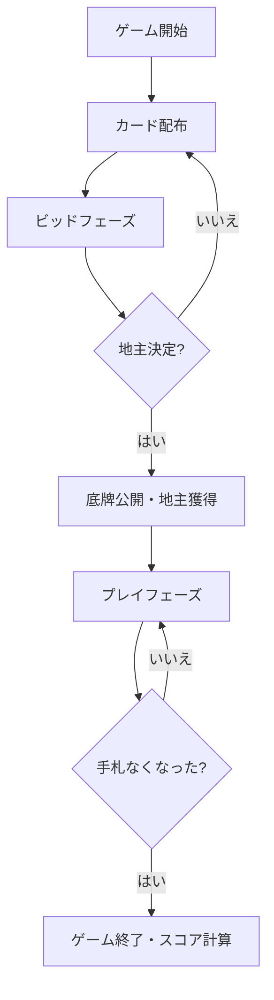

# 斗地主（CUI版）遊び方

## ゲーム概要

斗地主（Dou Dizhu / Fight the Landlord）は、中国で最も人気のある3人用カードゲームです。1人の「地主」と2人の「農民」チームに分かれ、手札を先に出し切ることを目指します。

## 起動方法

```bash
go run ./cmd/trumpcards doudizhu
```

## ルール

- 54枚のカード（ジョーカー2枚含む）を使用
- 各プレイヤーに17枚ずつ配り、3枚を底牌として伏せる
- ビッドで地主を決定。地主は底牌3枚を獲得し20枚で戦う
- カードの強さ: 3 < 4 < ... < K < A < 2 < 小ジョーカー < 大ジョーカー
- 役: 単張、対子、三条、三帯一、三帯二、順子(5+)、連対(3+)、飛機、爆弾(4枚)、火箭(ジョーカー2枚)

## ゲームの流れ



## コマンド一覧

| コマンド | 短縮形 | 説明 |
|----------|--------|------|
| `play [idx...]` | `p` | カードを出す（インデックス指定）。空=パス |
| `bid [0-3]` | `b` | ビッド（0=パス、1-3=ビッド値） |
| `setdifficulty [0-2]` | `sd` | CPU難易度設定（0=通常、1=簡単、2=難しい） |
| `log` | `l` | 棋譜表示 |
| `reset` | `r` | リセット |
| `quit` | `q` | 終了 |
| `help` | `?` | コマンド一覧を表示 |

## 画面の見方

```
=== 斗地主 ===
ビッドフェーズ
最高ビッド: 0

Player 0 (あなた) (17枚)
  [0]♠3 [1]♥5 [2]♦7 ...

Player 1 (CPU) [農民] (17枚)
Player 2 (CPU) [農民] (17枚)
----------
```

## 遊び方のコツ

- 弱いカードから出して強いカードを温存
- 爆弾は決定的な場面まで温存
- ビッドは手札の質に応じて判断（爆弾・2・Aが多ければ高く）
