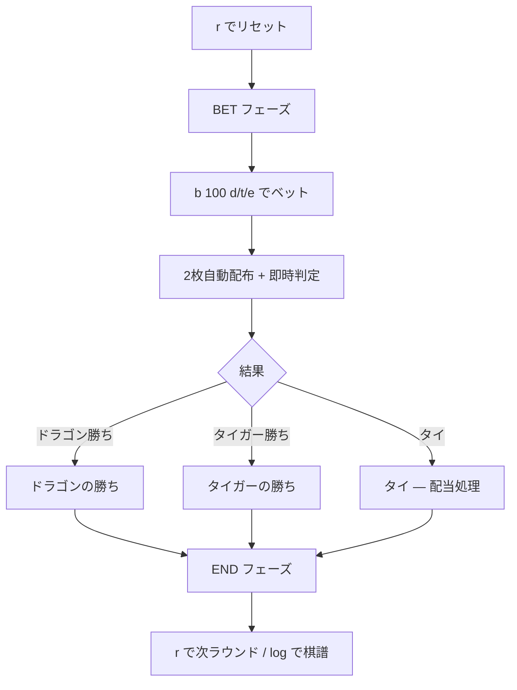

# ドラゴンタイガー（CUI版）遊び方

## ゲーム概要

Dragon Tiger（ドラゴンタイガー）は、アジアンカジノで人気の超高速 1 対 1 比較ゲーム。ドラゴン枠とタイガー枠に 1 枚ずつカードを配り、ランクの高い側が勝つ。Aceが最弱、Kingが最強。プレイヤーはドラゴン勝ち / タイガー勝ち / タイ（同ランク）の 3 つから 1 つにベットする。

## 起動方法

```sh
go run ./cmd/trumpcards dragontiger
go run ./cmd/trumpcards --lang en dragontiger  # 英語表示
```

## ルール

### 基本ルール

- ドラゴン / タイガーの 2 枠に 1 枚ずつカードが配られる
- ランク比較: A=1（最弱） < 2 < 3 < … < J=11 < Q=12 < K=13（最強）
- スートは無視

### 配当

| ベット | 結果 | 配当 |
|---|---|---|
| ドラゴン or タイガー | 的中 | 1:1（賭け金 + 同額） |
| ドラゴン or タイガー | タイ | 賭け金の半分が返還 |
| タイ | タイ | 8:1（賭け金 + 8 倍） |
| 全種別 | 外れ | 没収 |

### ベット制限

- 最低 10 チップ / 最大 10,000 チップ / 10 単位

## ゲームの流れ



## コマンド一覧

| コマンド | 説明 |
|---|---|
| `r` / `reset` | ゲームリセット |
| `b <amount> <d\|t\|e>` | ベット（`d`=ドラゴン, `t`=タイガー, `e`=タイ） |
| `bet <amount> <dragon\|tiger\|tie>` | 上記の長い形式 |
| `clear` | Big Road（履歴）をクリア |
| `log` | 棋譜を表示 |
| `q` / `quit` | 終了 |

### 例

```
[dragontiger] > b 100 d        # ドラゴンに 100 チップ
[dragontiger] > b 50 tiger     # タイガーに 50 チップ
[dragontiger] > b 10 e         # タイに 10 チップ（8:1 配当狙い）
```

## 画面の見方

```
==========
Dragon Tiger (ドラゴンタイガー)
==========
チップ: 1000
フェーズ: BET
ベット: 100 (DRAGON)
----------
ドラゴン: SPADE 13
タイガー: HEART 5
ドラゴンの勝ち！
払戻し: 200
==========
```

- **チップ**: 現在の残高
- **フェーズ**: BET（ベット待ち） / END（結果表示）
- **ドラゴン / タイガー**: 配られたカード
- **払戻し**: ベット結果による払い戻し額（賭け金返還を含む）

## 遊び方のコツ

1. **ハウスエッジが小さい順**: ドラゴン or タイガーベット（約 3.73%） < タイベット（約 32%）
2. **タイ時の半額返還**を意識する。Dragon/Tiger ベットでもタイで全額没収にはならない
3. **タイベット**は高配当（8:1）だが期待値が悪いので長期的には不利。エンタメ目的で
