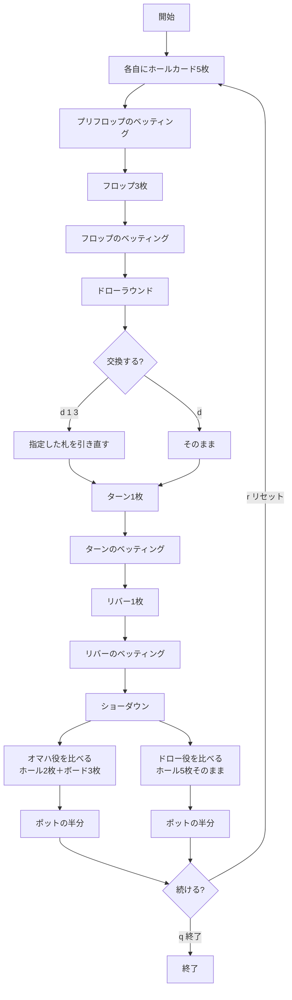

# ドラマハ（CUI版）遊び方

## ゲーム概要

アメリカのミックスゲームで遊ばれるスプリットポットのポーカーです。**同じ5枚を二度使う**のがこのゲームの発想で、ポットは常に二分されます。

- **オマハ役**: ホールカードから**ちょうど2枚**＋ボードから**ちょうど3枚**（オマハと同じ）
- **ドロー役**: 5枚のホールカードを**そのまま**。ボードは一切使いません

さらに、フロップのベッティングが終わったところで**ドローラウンド**があり、ホールカードを好きな枚数だけ1回交換できます。

## 起動方法

```sh
go run ./cmd/trumpcards dramaha
go run ./cmd/trumpcards --lang en dramaha   # 英語モード
```

## ルール

### 基本ルール

- 52枚のトランプ（ジョーカーなし）を使用
- 各プレイヤーに**ホールカード5枚**（オマハは4枚）
- コミュニティカードはフロップ3枚・ターン1枚・リバー1枚。各段階でベッティング
- **フロップのベッティング後にドローラウンド**。何枚でも1回だけ交換できる
- ショーダウンでポットを**常に二分**する

### オマハとの違い

| | オマハ | ドラマハ |
|---|---|---|
| ホールカード | 4枚 | **5枚** |
| 交換 | 無し | **フロップ後に1回** |
| ポット | ハイのみ（Hi-Lo版はハイ/ロー） | **常にオマハ役 / ドロー役で二分** |
| 二つ目の評価 | ロー（8以下・ペア無しで成立） | **ドロー役（5枚そのまま）** |

**ドロー側は必ず成立します。** Hi-Lo のローは条件を満たさなければ不成立になり得ましたが、5枚あればどんな手でも役として順位が付きます。だから「片方に勝者が居ないので反対側が総取り」は起きません。

### 配当

ポットは半分ずつ。オマハ役の最強手が半分、ドロー役の最強手が半分を取ります。**同じプレイヤーが両方を制すれば総取り**です。奇数チップはポーカーの慣例どおりオマハ側に寄せます。

## ゲームの流れ



## コマンド一覧

| コマンド | 短縮形 | 説明 |
|---------|--------|------|
| `check` | `c` | チェック |
| `bet <額>` | `b` | ベット |
| `call` | | コール |
| `raise <額>` | `ra` | レイズ |
| `fold` | `f` | フォールド |
| `allin` | `a` | オールイン |
| `draw [番号...]` | `d` | ドローラウンドで交換。**番号は1始まり**。番号なしで交換しない |
| `log` | `l` | 棋譜（アクションログ）を表示 |
| `reset` | `r` | ゲームをリセット |
| `help` | `?` | ヘルプを表示 |
| `quit` | `q` | 終了 |

**番号は画面と同じ1始まり**です。`d 1 3` なら左から1枚目と3枚目を交換します。

## 画面の見方

```
==========
ドラマハ（オマハ役とドロー役でポット二分）
==========
※手札5枚のうちちょうど2枚＋ボード3枚を使用
ポットは常に二分されます: 同じ5枚を「ホール2枚＋ボード3枚のオマハ役」と「5枚そのままのドロー役」の両方で競います。
テーブル: 4-max
ディーラー: Player 0
コミュニティ: ♦7  ♥10  ♣13
ポット: 15
----------
あなた チップ:1000 VPIP:0% PFR:0% 3Bet:0% AF:-
  手札: ♠6  ♦12  ♣11  ♥12  ♠7
----------
```

**上部の2行が常に出ます** —— 「ちょうど2枚＋3枚」というオマハ側の縛りと、ポットが二分されること。どちらも題名だけでは伝わらず、間違えると手の作り方そのものが変わります。

ドローラウンドに入ると交換を促す行が出ます。

```
ドローラウンド: 交換したい札の番号を指定してください（`d 1 3`）。番号なしで交換しません。
```

ショーダウンでは、各プレイヤーについて**オマハ役とドロー役の両方**と、それぞれで取った額が出ます。
