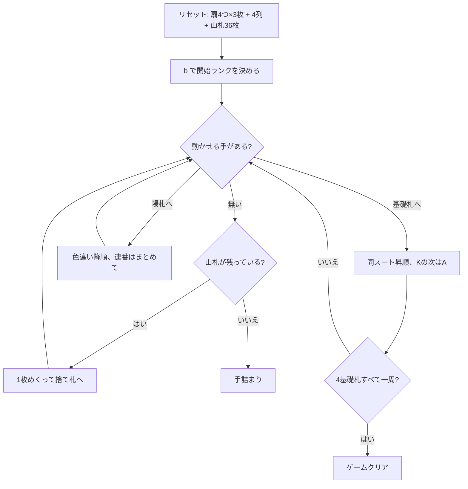

# ダッチェス（CUI版）遊び方

## ゲーム概要

52 枚 1 組で遊ぶカンフィールド系ソリティア。別名グレンウッド (Glenwood)。**4 つのリザーブ扇に 3 枚ずつ（計 12 枚）**、タブロー 4 列に 1 枚ずつ配り、残り 36 枚が山札になる。

最大の特徴は**基礎札の開始ランクを自分で選ぶ**こと。ゲーム開始時に 4 つの扇の一番上から 1 枚を選び、そのランクが 4 つの基礎札すべての開始ランクになる。

## 起動方法

```sh
go run ./cmd/trumpcards duchess
go run ./cmd/trumpcards --lang en duchess   # 英語
```

## ルール

- 52 枚 1 組。リザーブは 3 枚ずつの扇が 4 つ（計 12 枚）、タブローは 4 列に 1 枚ずつ、残り 36 枚が山札
- 使えるのは各リザーブ扇の**一番上の 1 枚だけ**
- 最初に `b <扇番号>` で開始ランクを決める。**それまで他の操作はすべてできない**
- 基礎札はスートごとに 4 つ。開始ランクから同スートで昇順、**K の次は A に折り返す**。開始ランクの 1 つ手前まで積めばその基礎札は完成
- タブローは**色違いの降順**。こちらも A の下に K を置ける。連番はまとめて動かせる
- **リザーブが 1 枚でも残っているうちは、空いた列にはリザーブからしか置けない**
- 山札は 1 枚ずつめくって捨て札へ送る。**めくり直しは無い（1 巡のみ）**
- 4 つの基礎札すべてが一周すればクリア

> 補足: issue #4408 の仕様案は扇を「それぞれ 4 枚ずつ計 16 枚」としているが、ダッチェス（グレンウッド）は 3 枚ずつ計 12 枚。issue の数字は 52 枚の内訳としては破綻していない（52-16-4=32）ものの実際の規則と違うため、実ゲームに合わせた。また issue が触れていない「空き列はリザーブ優先」も本来の規則なので実装している。

## ゲームの流れ



## コマンド一覧

| コマンド | 短縮形 | 説明 |
|----------|--------|------|
| `base <fan>` | `b` | リザーブ扇の一番上の札を開始ランクに選ぶ（最初に 1 回だけ） |
| `draw` | `d` | 山札を 1 枚めくって捨て札へ送る |
| `move r <fan> f` | `m` | リザーブからそのランクの基礎札へ |
| `move r <fan> t <col>` | `m` | リザーブからタブローへ |
| `move w f` | `m` | 捨て札から基礎札へ |
| `move w t <col>` | `m` | 捨て札からタブローへ |
| `move t <col> f` | `m` | タブロー最上段を基礎札へ |
| `move t <from> t <to> [idx]` | `m` | タブロー間で移動（`idx` は連番の先頭、省略時は最上段） |
| `hint` | `h` | ヒントを表示する |
| `autocomplete` | `ac` | 基礎札へ送れる札がなくなるまで自動で送る |
| `undo` | `u` | 1 手戻す |
| `giveup` | `g` | ギブアップ |
| `log` | `l` | 棋譜（アクションログ）を表示する |
| `reset` | `r` | 最初からやり直す |
| `quit` | `q` | 終了する |
| `help` | `?` | コマンド一覧を表示 |

## 画面の見方

```
開始ランク: 5
基礎札: SPADE 5 | [空] | [空] | [空]
リザーブ: #0 CLOVER 2 (3枚) | #1 DIAMOND 7 (2枚) | [空] | #3 HEART 6 (3枚)
山札: 33枚 捨て札: HEART 9 (3枚)
----------
列0: [0]SPADE 9 [1]HEART 8 [2]CLOVER 7
列1: [0]DIAMOND 11 [1]SPADE 10
列2: [空]
列3: [0]CLOVER 4
----------
手数: 12
```

- 開始ランクを決めるまでは 1 行目が黄色の案内文に変わる
- リザーブの `#n (m枚)` の `n` が `b <fan>` と `m r <fan> ...` の扇番号、`m` は残り枚数
- 各列の `[n]` は列内のインデックス。`m t <from> t <to> <idx>` の `<idx>` に対応する

## 遊び方のコツ

- **開始ランクは扇の一番上 4 枚から選ぶ「唯一の自由」。** 選んだランクの札が場と山札にどれだけ埋まっているかで難度が変わる。極端に高い／低いランクより、扇や場で続きが見えているスートを基準にすると回りやすい
- **空き列は掘る道具ではなく、リザーブの出口。** リザーブが残っているうちは他から置けないので、列を空けたら必ずリザーブから埋める
- 逆に言えば、**リザーブ 12 枚を先に消化してしまえば空き列が自由になる**。序盤はリザーブ優先で組み立てる
- 山札は 1 巡しか回らない。捨て札に送る前に、その札の置き場所を先に作っておく
- 詰まったら `undo` で分岐をやり直す
