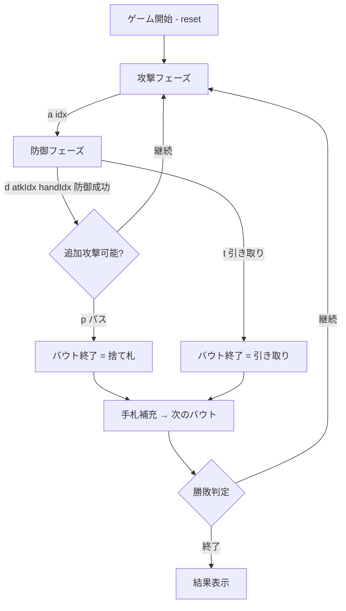

# ドゥラーク（CUI版）遊び方

## ゲーム概要

Durak（ドゥラーク）は東欧で人気のカードゲーム。36枚のデッキ（各スートの6〜A）を使用し、2〜6人でプレイする。最後まで手札を持っていたプレイヤーが「ドゥラーク（愚か者）」として負けとなる。

## 起動方法

```sh
go run ./cmd/trumpcards durak
go run ./cmd/trumpcards --lang en durak  # 英語モード
```

## ルール

### デッキと配り

- 36枚デッキ（6, 7, 8, 9, 10, J, Q, K, A × 4スート）
- 各プレイヤーに6枚ずつ配る
- 山札の底のカードが切り札スートを決定

### 基本ルール

- 攻撃者はカードを1枚出し、防御者はより強い同スートのカード、または切り札で防御する
- 切り札スートのカードは非切り札の全てに勝つ
- 異スート（切り札でない）同士では防御不可
- 防御に成功すればカードは捨て札へ、失敗すれば防御者が場のカードを全て引き取る
- 各バウト終了後、山札から手札が6枚になるよう補充

### カードの強さ

同スート内: 6 < 7 < 8 < 9 < 10 < J < Q < K < A

### 勝敗

- 手札を先になくしたプレイヤーから順に上がり
- 最後まで手札を持っていたプレイヤーが「ドゥラーク」（負け）

### CPU難易度

- 0 (Normal): 基本戦略
- 1 (Easy): ランダム寄り
- 2 (Hard): 高度な戦略

## ゲームの流れ



## コマンド一覧

| コマンド | 短縮形 | 説明 |
|----------|--------|------|
| `a <idx>` | — | 手札のカード番号で攻撃 |
| `d <atkIdx> <handIdx>` | — | 攻撃カードを手札のカードで防御 |
| `p` | — | パス（追加攻撃をやめる） |
| `t` | — | テーブルのカードを全て引き取る |
| `sort <0\|1>` | — | 手札ソート（0=スート順, 1=値順） |
| `sd <0-2>` | — | CPU難易度設定（0=普通, 1=簡単, 2=難しい） |
| `reset` | `r` | ゲームリセット |
| `log` | `l` | 棋譜表示 |
| `quit` | `q` | ゲーム終了 |
| `help` | `?` | コマンド一覧を表示 |

## 画面の見方

```
==========
Durak
==========
Trump: ♥   Stock: 12
Phase: ATTACK
Table: [♠9 / --] [♦J / ♥Q]
You (Attacker):
  0:♣7 1:♠10 2:♥A 3:♦K 4:♣Q 5:♥8
CPU1: 6  CPU2: 6  CPU3: 6
```

- **Trump**: 切り札スート
- **Stock**: 山札の残り枚数
- **Phase**: 現在のフェーズ（ATTACK / DEFEND）
- **Table**: 場の攻撃カードと防御カードの組
- **You**: 自分の手札（インデックス付き）
- **CPU1〜3**: 各CPUの残り手札枚数
