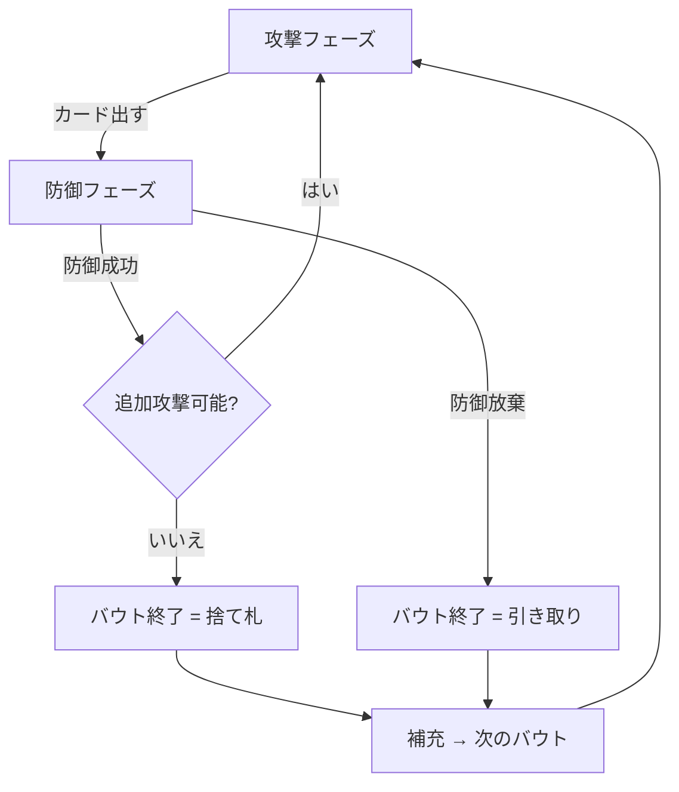

# Durak (ドゥラーク) - CUI マニュアル

## ゲーム概要

Durak（ドゥラーク）は東欧で人気のカードゲームです。36枚のデッキ（6〜A）を使用し、最後まで手札を持つプレイヤーが負けとなります。

## コマンド一覧

| コマンド | 説明 |
|----------|------|
| `a <idx>` | 手札のカード番号で攻撃 |
| `d <atkIdx> <handIdx>` | テーブルの攻撃カード番号と手札のカード番号で防御 |
| `p` | パス（追加攻撃をやめる） |
| `t` | テーブルのカードを全て引き取る |
| `sort <0\|1>` | 手札ソート（0=スート順, 1=値順） |
| `sd <0-2>` | CPU難易度設定（0=普通, 1=簡単, 2=難しい） |
| `r` | ゲームリセット |
| `l` | 棋譜表示 |
| `q` | 終了 |

## ゲームの流れ

