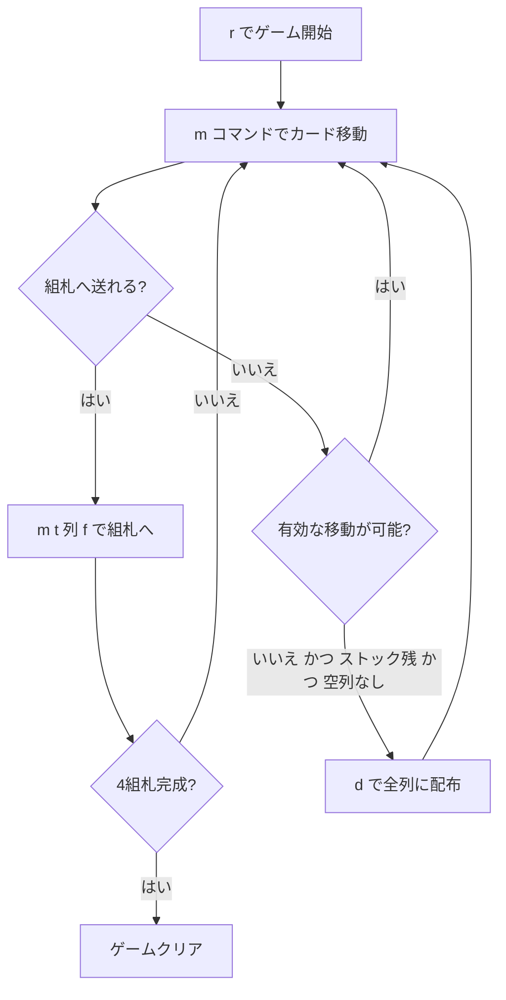

# イーストヘイブン（CUI版）遊び方

## ゲーム概要

イーストヘイブン（Easthaven）は1人用のソリティアカードゲームで、クロンダイク（Klondike）とスパイダー（Spider）のメカニクスを融合させた作品です。タブローの移動ルール（赤黒交互・降順）と組札（A→K昇順）はクロンダイクと同じですが、ストックからの配り方（全タブロー列に1枚ずつ配る）はスパイダーと同じです。「クロンダイクより戦略的で、スパイダーほど時間がかからない」として愛好家に高く評価されています。52枚のうち最初に7列×3枚（裏2枚＋表1枚）が配られ、残り31枚はストックとして保持されます。

## 起動方法

```sh
go run ./cmd/trumpcards easthaven           # 日本語
go run ./cmd/trumpcards --lang en easthaven # 英語
```

## ルール

### 配り方

- 7列のタブローに3枚ずつ配ります（先頭2枚が裏向き、末尾1枚が表向き）
- 残り31枚はストックとして保持

### 移動ルール

- **タブロー → タブロー**: 赤黒交互・降順に並んだ表向きのカード群を移動できます。移動先の最上段カードと **色が交互で1つ下のランク** の関係が必要です
- **空の列にはK（およびKで始まる正しい並び）のみ** 置けます（クロンダイクと同じ）
- **タブロー → 組札**: A→Kの昇順で、同じスートのみ積み上げられます

### ストック

- `d` コマンドでストックから各列に1枚ずつ表向きで配ります（スパイダー方式）
- 空の列が1つでもある場合は配れません

### クリア

- 4つの組札すべてをA→Kまで積み上げるとゲームクリアです

## ゲームの流れ



## コマンド一覧

| コマンド | 短縮形 | 説明 |
|----------|--------|------|
| `move <列> <列>` | `m` | 列間の最上段カード移動（ショートハンド） |
| `move t <列> <ID> t <列>` | `m` | タブロー間移動（カードID指定、表向きの並びとその上） |
| `move t <列> f` | `m` | タブローから組札へ移動 |
| `deal` | `d` | ストックから全列へ配布 |
| `giveup` | `g` | ギブアップ |
| `hint` | `h` | ヒント |
| `autocomplete` | `ac` | オートコンプリート |
| `undo` | `u` | 元に戻す |
| `log` | `l` | 棋譜表示 |
| `reset` | `r` | リセット |
| `quit` | `q` | 終了 |
| `help` | `?` | コマンド一覧を表示 |

## 画面の見方

```
=== Easthaven (イーストヘイブン) ===
Foundation: -- | -- | -- | --
Stock: 31
----------
列0: [0]?? [1]?? [2]♠K
列1: [0]?? [1]?? [2]♥8
列2: [0]?? [1]?? [2]♣5
...
列6: [0]?? [1]?? [2]♣2
----------
手数: 0
```

`[i]XY` 形式の `i` はカードインデックス、`X` はスート、`Y` はランクです。`??` は裏向きカードです。Foundation 行は各組札の最上段カードを示します。

## 遊び方のコツ

- まず裏向きカードを早く解放することを優先しましょう
- 空列はKでしか埋められないため、Kの確保を意識しましょう
- 低いランクのカードは早めに組札へ送ると盤面が整理しやすくなります
- `h` コマンドでヒントを活用しましょう
- ストックの配布は全列が埋まっている必要があります。空列をなくしてから `d` で配りましょう
- 手詰まりになったら `u` で戻ってやり直しましょう
