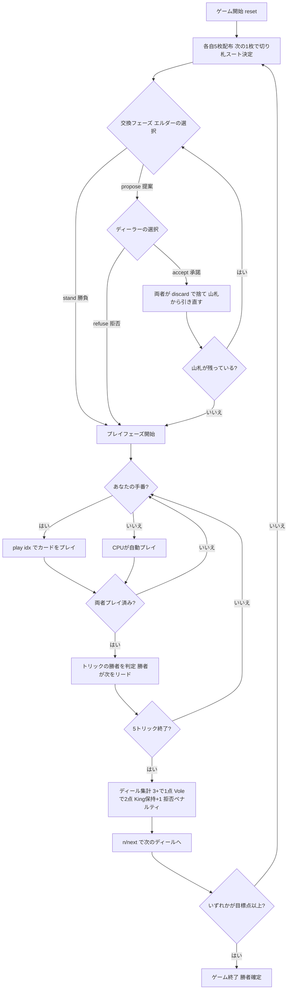

# エカルテ（CUI版）遊び方

## ゲーム概要

Écarté（エカルテ）は2人用のフランス系トリックテイキングゲームです。**32枚のデッキ**（A,7,8,9,10,J,Q,K × 4スート）を使い、各自5枚を持って戦います。プレイの前に**交換（エクスチェンジ）フェーズ**があり、エルダー（非ディーラー）が交換を提案（propose）するか勝負（stand）するかを決め、提案された場合はディーラーが承諾（accept）か拒否（refuse）を選びます。承諾されると各自が任意の枚数を捨てて山札から引き直し、これを山札が尽きるまで繰り返せます。その後5トリックのマストフォロー戦に入ります。ランクは K>Q>J>A>10>9>8>7。3トリック以上で1点、全5トリック（Vole）で2点。スコアはディールをまたいで累積し、先に**目標点（既定5点）**へ達したプレイヤーの勝利です。

## 起動方法

```sh
go run ./cmd/trumpcards ecarte
go run ./cmd/trumpcards --lang en ecarte  # 英語モード
```

## ルール

### デッキと配布

- **デッキ**: 32枚（A,7,8,9,10,J,Q,K × 4スート）
- **プレイヤー**: 2人（あなた vs CPU）
- **配布**: 各プレイヤー5枚。残りは山札となり、次の1枚を表向きにして**切り札スート**を決めます。
- **めくれたキング**: 表向きにされたカードが King だった場合、ディーラーに **+1点** が入ります。

### カードの強さ

トリック内での強さ（強い順）。切り札はすべての非切り札を上回ります。

| 強さ順 | カード |
|--------|--------|
| 1位 | K（キング） |
| 2位 | Q（クイーン） |
| 3位 | J（ジャック） |
| 4位 | A（エース） |
| 5位 | 10（テン） |
| 6位 | 9 |
| 7位 | 8 |
| 8位 | 7 |

### 交換（エクスチェンジ）フェーズ

プレイの前に、手札を引き直すかどうかを決めます。

- **エルダー（非ディーラー、＝あなたが先手のときはあなた）** が選択します。
  - `propose`（提案）: カード交換を申し込みます。
  - `stand`（勝負）: 交換せず、配られた手札のままプレイへ進みます。
- 提案された場合、**ディーラー** が応じます。
  - `accept`（承諾）: 交換に応じます。両者が任意の枚数を `discard` で捨て、山札から同じ枚数を引き直します。引き直し後、エルダーが再び `propose` か `stand` を選びます（山札が尽きるまで繰り返せます）。
  - `refuse`（拒否）: 交換を断り、そのままプレイへ進みます。
- **拒否ペナルティ**: ディーラーが拒否したのに、そのディールで **3トリック未満** しか取れなかった場合、エルダーに **+1点** が加算されます。

### プレイフェーズ

- **マストフォロー**: リードされたスートを持っていれば必ず出します。さらに**勝てるなら勝たなければなりません**（フォローして勝てる札があれば、それを出す義務があります）。リードスートを持たない場合は切り札を出します（切り札もなければ任意札）。
- 5トリックを切り札ありで戦います。各トリックの勝者が次のトリックをリードします。

### 切り札の King

- 切り札の **King を手札に持っている** プレイヤーは **+1点**（自動で宣言されます）。

### 得点計算と勝利条件

| 条件 | 得点 |
|------|------|
| 3トリックまたは4トリック獲得 | 1点 |
| 全5トリック獲得（Vole） | 2点 |
| 切り札の King を手札に保持 | +1点 |
| めくれたカードが King（ディーラー） | +1点 |
| ディーラーが拒否して3トリック未満 | エルダーに +1点 |

- スコアはディールをまたいで累積し、先に**目標点（既定5点）**へ達したプレイヤーが勝利します。

### CPU難易度

- **Easy（0）**: ランダムな合法手。
- **Normal（1）**: 基本戦略。
- **Hard（2）**: 高度なヒューリスティック。

## ゲームの流れ



## コマンド一覧

| コマンド | 短縮形 | 説明 |
|----------|--------|------|
| `propose` | `pr` | 交換を提案する（エルダー、交換フェーズ） |
| `stand` | `st` | 交換せず勝負する（エルダー、交換フェーズ） |
| `accept` | `a` | 提案を承諾する（ディーラー、交換フェーズ） |
| `refuse` | `rf` | 提案を拒否する（ディーラー、交換フェーズ） |
| `discard <i j k>` | `d` | 指定したインデックスのカードを捨てて引き直す（承諾後） |
| `play <i>` | `p` | 手札のidx番目のカードを出す（プレイフェーズ） |
| `next` | `n` / `nextround` | 次のトリック／次のディールへ進む |
| `setdifficulty <0-2>` | `sd` | CPU難易度設定（0=Easy, 1=Normal, 2=Hard） |
| `settarget <n>` | `tg` | 目標点設定 |
| `hint` | `h` | ヒント表示 |
| `log` | `l` | アクションログを表示 |
| `reset` | `r` | 新しいゲームを開始（設定保持） |
| `quit` | `q` | ゲーム終了 |
| `help` | `?` | コマンド一覧を表示 |

## 画面の見方

```
==========
Écarté (エカルテ)
==========
ディール: 1
スコア: あなた=0  CPU=0
切り札: ♥  山札: 21枚
----------
フェーズ: EXCHANGE
あなた（エルダー）の手番です。交換を提案するか勝負するか選んでください。
[0]K♥ [1]Q♠ [2]J♦ [3]9♣ [4]7♠
propose  または  stand

==========
ディール: 1
スコア: あなた=0  CPU=0
切り札: ♥  山札: 19枚
----------
フェーズ: EXCHANGE
交換が承諾されました。捨てるカードを選んでください。
[0]K♥ [1]Q♠ [2]J♦ [3]9♣ [4]7♠
discard <i j k>

==========
ディール: 1
スコア: あなた=0  CPU=0
切り札: ♥  山札: 17枚
----------
フェーズ: PLAY
あなたの手番です。カードを出してください。
[0]K♥ [1]Q♥ [2]J♦ [3]10♠ [4]7♠
play <idx>
```

- **フェーズ: EXCHANGE**: 交換フェーズ。エルダーは propose/stand、ディーラーは accept/refuse、承諾後は discard を入力します。
- **フェーズ: PLAY**: トリックフェーズ。マストフォロー（フォロー→勝てるなら勝つ→出せないなら切り札）。
- **切り札行**: 表向きカードで決まった切り札スートと、山札の残り枚数を表示。
- **スコア行**: 両プレイヤーの累積スコア（目標点に先着で勝利）。
- **`[n]`付き行**: あなたの手札（インデックス付き）。

## 遊び方のコツ

- **交換の見極め**: 弱い手札のときは `propose` で引き直し、強い手札のときは `stand` で即勝負。切り札の King や K/Q が揃っているなら無理に交換する必要はありません。
- **拒否のリスク**: ディーラーで `refuse` した場合、そのディールで3トリック取れないとエルダーに +1点を献上します。拒否は3トリック以上を確実に見込めるときだけにしましょう。
- **切り札の King を温存**: 切り札の King を手札に保持しているだけで +1点。安易に切らず、終盤まで持っておくと得点源になります。
- **Vole（5トリック総取り）を狙う**: 3トリックで1点に対し、5トリック総取りは2点。強い手札のときは全勝を狙って大きくリードしましょう。
- **マストフォローで勝ちにいく**: プレイフェーズではフォローして勝てる札があれば出す義務があります。手なりで取れるトリックを逃さず、3トリックの確保を最優先に組み立てます。
