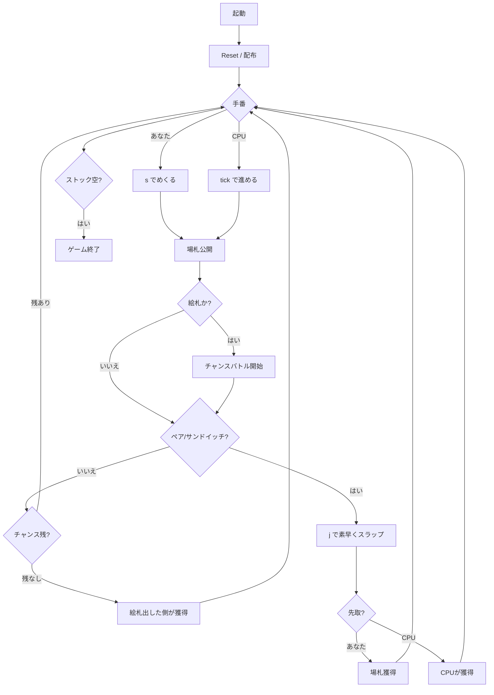

# エジプシャン・ラットスクリュー（Egyptian Ratscrew・CLI版）遊び方

## ゲーム概要

CLI版エジプシャン・ラットスクリューは、Webと同じ反射神経＋チャンスバトル系ゲームをターミナル上で遊ぶモードです。場のトップがペアまたはサンドイッチになったら `j` を素早く入力して場札を奪い取りましょう。絵札 (J/Q/K/A) が出るとチャンスバトルが発生し、規定枚数以内に絵札を返せないと負けます。CPU は Tick ベースで設定難易度に応じた反応速度で動作します。

## 起動方法

```sh
go run ./cmd/trumpcards egyptianratscrew          # 日本語
go run ./cmd/trumpcards --lang en egyptianratscrew # 英語
```

## ルール

Web版と同じです。詳細は [docs/manual/web/egyptianratscrew.md](../web/egyptianratscrew.md) を参照してください。

## ゲームの流れ



## コマンド一覧

| コマンド | 動作 |
|---------|------|
| `s` / `step` | 現手番プレイヤーがストックのトップを場に出す |
| `j` / `slap` | スラップを試みる |
| `tick`       | CPU の保留アクションを進める（スラップ / CPU の番でめくる） |
| `sd <0-2>`   | CPU 難易度を設定して再開（0=Easy, 1=Normal, 2=Hard） |
| `r` / `reset` | ゲームをリセット |
| `l` / `log`  | 棋譜を表示 |
| `q` / `quit` | 終了 |

## 画面の見方

- `CPU: ストックX枚` ... CPU の残ストック数
- `[場札] <カード>  (場にN枚)` ... 場の top と総枚数
- `あなた: ストックX枚` ... 自分の残ストック
- `チャンス残: N` ... チャンスバトル中の残挑戦回数
- 状況に応じて「あなたの番」「ペア/サンドイッチ！叩け」「誤スラップ」「チャンス勝利！」などのメッセージが出力される

## 遊び方のコツ

- ターミナル CUI では反応スピードに限界があるため、`Easy` や `Normal` で慣らしてから `Hard` に挑戦するのが推奨
- `tick` を 1 回打つたびに 1tick だけ進むので、1 ターンずつじっくり進めて場の top がペア/サンドイッチになった瞬間に `j` を叩く運用も可能
- 絵札を頻繁に出されるとチャンス勝負で攻め込まれる。手札の絵札は適切なタイミングで出して反撃の機会を作る
- Web 版と同じく「条件外でスラップ」は 1 枚ペナルティ。誤入力に注意
