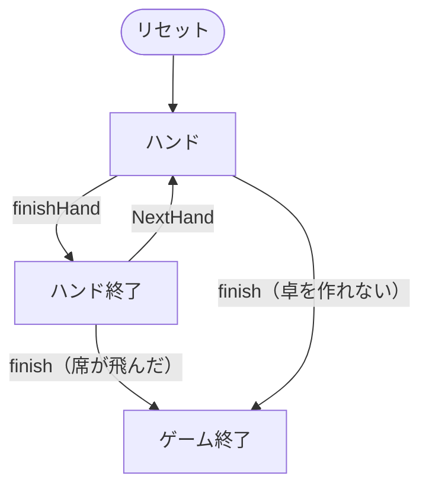

# エイトゲーム・ミックス（CUI版）遊び方

## ゲーム概要

エイトゲーム・ミックスは**8種目のポーカーを1つの卓で順に回すミックスゲーム**です（4人：あなた + CPU3人）。[H.O.R.S.E.](horse.md) が回す5種目に、**ノーリミット・ホールデム / ポットリミット・オマハ / 2-7 トリプルドロー**を加えた形式で、WSOP の種目としても知られています。**チップは種目をまたいで持ち越され**、規則だけが入れ替わります。

H.O.R.S.E. との一番の違いは、**引き直し（ドロー）のある種目が1つ混ざる**ことです。8種目目の 2-7 トリプルドローだけは、賭けるのではなく**捨てる札を選ぶ**番が回ってきます。

## 起動方法

```sh
go run ./cmd/trumpcards eightgame
go run ./cmd/trumpcards --lang en eightgame  # 英語モード
```

## ルール

### 種目の並び

| 記号 | 種目 | 形 | 共有札 | リミット |
|------|------|----|--------|----------|
| H | テキサスホールデム | 伏せ2枚 + 共有5枚 | あり | フィックスドリミット |
| O | オマハ ハイロー | 伏せ4枚 + 共有5枚（手札からちょうど2枚） | あり | フィックスドリミット |
| R | ラズ | スタッド7枚（**最も低い手が勝ち**） | なし | フィックスドリミット |
| S | セブンカードスタッド | スタッド7枚 | なし | フィックスドリミット |
| E | スタッド ハイロー | スタッド7枚（ハイとローで分ける） | なし | フィックスドリミット |
| NLH | ノーリミット・ホールデム | 伏せ2枚 + 共有5枚 | あり | **ノーリミット** |
| PLO | ポットリミット・オマハ | 伏せ4枚 + 共有5枚（手札からちょうど2枚） | あり | **ポットリミット** |
| 2-7 | 2-7 トリプルドロー | 伏せ5枚 + **3回の引き直し** | なし | フィックスドリミット |

- **同じホールデムでもリミットが違えば別の種目**です。H はレイズ幅が固定、NLH は残り全部まで賭けられます。PLO も同様に、ポットまでのベットを許すオマハで、ハイのみ（ローは取りません）。
- **1種目あたりのハンド数は 1〜10（既定2）**です。規定ハンドを打ち切ると次の種目へ進み、2-7 の次は H に戻ります。
- 各種目の役の判定・ベッティングの規則は、その種目の実装がそのまま使われます。単体で遊ぶときと同じです。

### 席数は4人だけ

H.O.R.S.E. は 4 / 6 / 9 人から選べますが、**エイトゲーム・ミックスは4人卓だけ**です。2-7 トリプルドローが最大4席（CPU 3人）までしか作れないためで、それより大きい卓を選べるようにすると、8種目目に入った瞬間に卓が作れず**理由も出ないままマッチが終わります**。

52枚のデッキも同じことを言っています。トリプルドローは1人5枚配ったうえで3回引き直すので、9人卓では配り終えた時点で山が7枚しか残りません。

### チップと決着

- 初期チップは全席同じで、**ハンドごとに正本へ回収**されます。種目が変わっても残高はそのまま引き継がれます。
- **1席でも飛んだ時点でマッチ終了**です。リバイ・アドオンは行いません（補充するとチップが湧きます）。最も多く持っている席の勝ちです。

### 見えるもの

- あなたの手札はすべて見えます。
- スタッド系（R / S / E）では**各席の表向きの札（ドアカード）も見えます**。伏せ札は最後まで見えません。
- ホールデム系（H / O / NLH / PLO）と 2-7 トリプルドローでは、CPU の札は1枚も見えません。**引いた枚数だけが公開情報**です。

## ゲームの流れ

ゲームの進行は `internal/domain/Horse.go` のフェーズ機械そのものです。各ノードは同ファイルの `HorsePhase` 定数、矢印ラベルはその遷移を行うメソッド名です。



## コマンド一覧

| コマンド | 短縮形 | 説明 |
|----------|--------|------|
| `fold` | `f` | フォールドする |
| `check` | `x` | チェックする |
| `call` | `c` | コールする |
| `bet <n>` | `b` | n チップをベットする |
| `raise <n>` | - | n チップへレイズする |
| `allin` | - | 残り全部を賭ける |
| `draw <n...>` | `d` | 指定した札を交換する（2-7 トリプルドローのみ、**0始まり**） |
| `stand` | `sp` | 引かずに進む（スタンドパット） |
| `next` | `n` | 次のハンドへ（種目が変わることがあります） |
| `setseats <4>` | `ss` | 席数設定（4人卓のみ） |
| `sethands <1-10>` | `sh` | 1種目あたりのハンド数設定 |
| `hint` | `h` | ヒントを表示 |
| `log` | `l` | 棋譜を表示 |
| `reset` | `r` | ゲームをリセット |
| `quit` | `q` | 終了 |
| `help` | `?` | コマンド一覧を表示 |

## 画面の見方

```
==========
エイトゲーム・ミックス（8 種目ローテーション）
==========
2-7 — 2-7 トリプルドロー  (1/2 ハンド目、通算 15)
YOU: 940 チップ  [0]SPADE 2 [1]HEART 7 [2]CLOVER 12 [3]DIAMOND 4 [4]SPADE 9  ← 手番
CPU1: 1030 チップ
CPU2: 1000 チップ
CPU3: 1030 チップ
----------
引き直し 2 回目 — 交換する札を選んでください
d <番号...>=交換（例: d 0 2）  sp=スタンドパット（引かない）
```

- 先頭行が**いまの種目**です。記号と種目名、そして「この種目で何ハンド目か／通算何ハンド目か」が出ます。
- **番号が振られるのは引き直しの番だけ**です。`[0]` から数え、`d 0 2` のように空白区切りで指定します。1枚でも読めない番号があると**1枚も捨てません**。
- 席の行に並ぶのは**見えている札だけ**です。スタッド系では CPU のドアカードが並び、ホールデム系と 2-7 では何も並びません。

## 遊び方のコツ

- **種目が変わった最初のハンドで手を止める。** 8種目ぶんの規則が同じ操作の裏で入れ替わります。特に H と NLH、O と PLO は**見た目が同じでリミットだけが違う**ので、賭けられる額を確かめてから打ってください。
- **2-7 トリプルドローは「最も低い5枚」を作る種目。** ストレートもフラッシュも**役として数えられる（＝弱くなる）**ので、7-5-4-3-2 のバラバラが最強です。A は常に高い札として扱います。
- **引かないのも手。** 良い5枚が揃ったら `sp` で 3 回とも引かずに通せます。何枚引いたかは相手に見えているので、0枚は強さの主張にもなります。
- **短期の勝敗より残高。** 1種目で大きく勝っても、次の種目で同じだけ失えば元に戻ります。飛ばないことが第一で、飛んだ席が出た時点でマッチが終わります。
