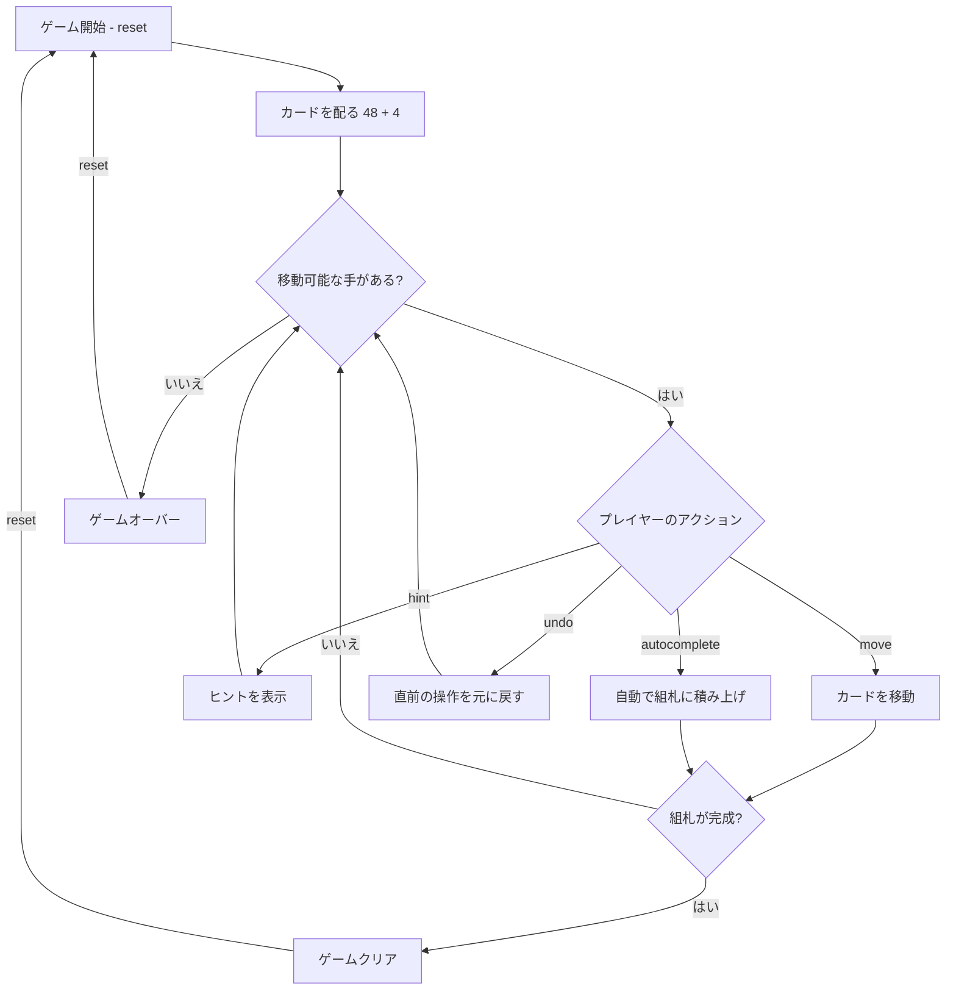

# エイトオフ（CUI版）遊び方

## ゲーム概要

1人用のソリティアカードゲームで、FreeCellの厳格バリアントです。52枚のカードを使い、8列のタブロー、8つのフリーセル、4つの組札で構成されます。初期状態でタブローに各列6枚ずつ48枚、残り4枚はフリーセル0〜3に配られます。組札にA→Kまでスート別に積み上げればクリアです。

## 起動方法

```sh
go run ./cmd/trumpcards eightoff
```

## ルール

### 基本ルール

- 52枚のトランプ（ジョーカーなし）を使用
- 8列のタブローに各列6枚ずつ配る（計48枚）、すべて表向き
- 残り4枚を最初の4つのフリーセル（セル0〜3）に配置
- フリーセルは8つあり、それぞれ1枚のカードを一時的に保持できる
- 4つの組札（ファンデーション）はスート別にA→Kの順に積み上げる
- **タブローでは「同じスート」の降順でのみ重ねる**（例: ♠10の上に♠9）
- **空いた列にはK（キング）のみ置くことができる**

### スーパームーブ

一度に移動できるカード数は以下の計算式で決まります:

```
最大移動枚数 = (1 + 空きフリーセル数) × 2^(空きタブロー列数)
```

### ゲームクリア

- 4つの組札すべてにA→Kまで13枚ずつ積み上げるとゲームクリア

### ゲームオーバー

- これ以上移動可能な手がない場合はゲームオーバー（ギブアップ時）

### 手詰まり検出

- 各操作の後、ソルバー（A* + メモ化）がボード全体を解析し、解法が存在しないと判定された場合「手詰まりです」と表示します
- 手詰まり状態では「元に戻す」またはギブアップを選択できます
- ソルバーの探索上限（100,000状態）を超えた場合は手詰まりとは判定しません

## ゲームの流れ



## コマンド一覧

| コマンド | 短縮形 | 説明 |
|----------|--------|------|
| `reset` | `r` | 新しいゲームを開始 |
| `move` | `m` | カードを移動する（サブ引数で移動元・移動先を指定） |
| `undo` | `u` | 直前の操作を元に戻す |
| `giveup` | `g` | ギブアップしてゲームを終了 |
| `hint` | `h` | 次の一手のヒントを表示 |
| `autocomplete` | `ac` | 自動的に組札へ積み上げ可能なカードを移動 |
| `log` | `l` | アクションログ（棋譜）を表示 |
| `quit` | `q` | ゲーム終了 |
| `help` | `?` | コマンド一覧を表示 |

### 移動コマンドの構文

- `m t <列> f` — タブローから組札へ
- `m t <列> t <列>` — タブローの一番上のカードを別タブロー列へ
- `m t <列> <カードIdx> t <列>` — タブローのカード列をまとめて別タブロー列へ
- `m t <列> c <セル>` — タブローからフリーセルへ（0〜7）
- `m c <セル> t <列>` — フリーセルからタブローへ
- `m c <セル> f` — フリーセルから組札へ
- 省略形: `m <列> <列>` — タブロー間の一番上のカード移動
- 省略形: `f <列>` — タブローから組札への移動

### コマンド例

- `m t 0 c 4` → タブロー列0の一番上のカードをフリーセル4へ
- `m t 0 2 t 1` → タブロー列0の2番目以降のカード列をタブロー列1へ
- `h` → ヒントを表示

## 画面の見方

```
==========
Eight Off (エイトオフ)
==========
FreeCells: [♠K] [♥7] [♦3] [♣8] [  ] [  ] [  ] [  ]
Foundation:  [空] | [空] | [空] | [空]
----------
列0: [0]♥Q [1]♥J [2]♥10 [3]♥9 [4]♥8 [5]♥7
列1: [0]♠J [1]♠10 [2]♠9 [3]♠8 [4]♠7 [5]♠6
列2: [0]♦Q [1]♦J [2]♦10 [3]♦9 [4]♦8 [5]♦7
列3: [0]♣Q [1]♣J [2]♣10 [3]♣9 [4]♣8 [5]♣7
列4: [0]♥6 [1]♥5 [2]♥4 [3]♥3 [4]♥2 [5]♥A
列5: [0]♠5 [1]♠4 [2]♠3 [3]♠2 [4]♠A [5]♦K
列6: [0]♦6 [1]♦5 [2]♦4 [3]♦2 [4]♦A [5]♣6
列7: [0]♣5 [1]♣4 [2]♣3 [3]♣2 [4]♣A [5]♦A
----------
手数: 0
==========
```

- `FreeCells: [♠K] [♥7] ...`: 8つのフリーセルの状態（カードまたは空）
- `Foundation:`: 各スートの組札の状態（[空]は何も置かれていない状態）
- `列0: ...`: タブロー列（すべて表向き、初期は各列6枚）
- `手数: N`: 現在の手数

## 遊び方のコツ

- フリーセルは8つありますが、初期状態で既に4つ埋まっています
- タブロー移動は「同じスート」の降順のみなので、FreeCellより制約が厳しいです
- 空いた列にはK以外を置けないため、Kを優先的に確保しましょう
- 序盤は組札に上がりやすいA・2を取り出すために、上に重なっている邪魔なカードをフリーセルへ退避させる動きが基本です
- ヒントコマンドで詰まった時のアドバイスを得られます
- オートコンプリートは組札に安全に移動できるカードがある場合に便利です
