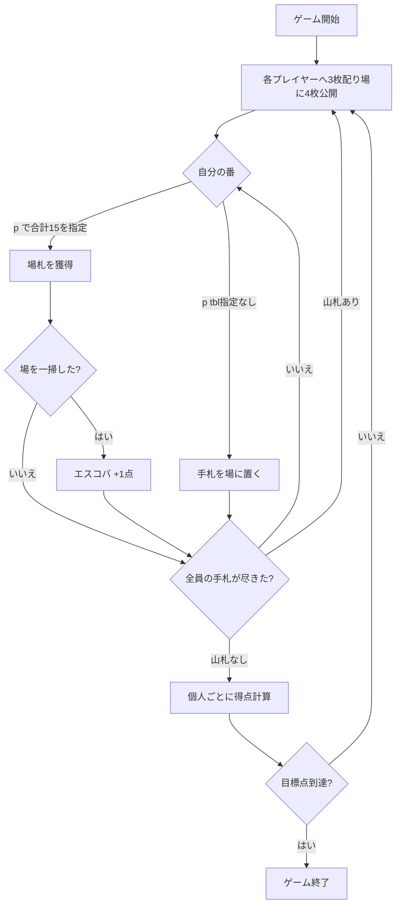

# エスコバ（CUI版）遊び方

## ゲーム概要

エスコバ (Escoba / Escoba de 15) はスペイン発祥の数合わせ漁系ゲームです。40枚のスペイン式デッキを使い、4人がそれぞれ個人で（チームなし）得点を競います。手札のカード1枚と場札の組み合わせの**合計をちょうど15**にして場札を取ります。獲得したカードで得点を集計し、先に目標点（既定10点）に到達したプレイヤーの勝ちです。

スコパ（およびスコポーネ）との主な違いは次の3点です。

- **4人個人戦（チームなし）**: 向かい合った2人でチームを組むスコポーネと違い、4人それぞれが自分の得点を競います。
- **合計15で取る**: 「手札の値と一致する場札」を取るスコパと違い、**手札+場札の合計がちょうど15**になる組み合わせを取ります。
- **3枚ずつ配り、尽きたら再配布**: 全札を配り切るスコポーネと違い、各プレイヤーに3枚配り、全員の手札が尽きたら山札からまた3枚ずつ配ります。

## 起動方法

```sh
go run ./cmd/trumpcards escoba
```

英語表示で起動する場合は `go run ./cmd/trumpcards --lang en escoba` を実行します。

## ルール

1. 各プレイヤーに3枚配り、場に4枚を公開します。
2. 自分の番に手札を1枚選び、アクションを選択します。合計15を作れる場札があれば必ず取ります。
   - **取る**: 手札の値と取る場札の値の合計がちょうど15になる組を選びます。複数の取り方があれば選べます。
   - **場に置く**: 合計15を作れない場合は手札を場に置きます。
3. カードの値: A=1、2〜7はそのまま、J=8、Q=9、K=10。
4. 場札をすべて取り切ると「エスコバ」となり1点加算されます（最後の1手を除く）。
5. 全員の手札が尽きると、山札から3枚ずつ再配布されます。山札も尽きてすべてのカードをプレイし終えるとラウンド終了、個人ごとに得点を計算します。先に目標点に到達したプレイヤーが勝ちです。

### 得点（個人単位）

全カードをプレイし終えると、各プレイヤーに次の点を加算します。

| 項目 | 点数 |
|------|------|
| 最多カード | 1点 |
| 最多エスパダ (剣＝♠) | 1点 |
| 最多の7 | 1点 |
| 最多オロ (金貨＝♦) | 1点 |
| エスコバ | 各1点 |
| エスパダの A を取得 | 1点 |
| エスパダの 7 を取得 | 1点 |

## ゲームの流れ



## コマンド一覧

| コマンド | 短縮形 | 説明 |
|----------|--------|------|
| `play <hand> [tbl...]` | `p` | 手札を1枚出す（合計15になる場札インデックスを指定すると取る、指定なしで場に置く） |
| `next` / `nextround` | `n` | 次のラウンドへ進む |
| `reset` | `r` | ゲームをリセット |
| `setdifficulty <0-2>` | `sd` | CPU難易度を設定（0=easy / 1=normal / 2=hard） |
| `settarget <n>` | `st` | 目標スコアを設定（既定10） |
| `log` | `l` | アクションログを表示 |
| `quit` | `q` | ゲームを終了 |
| `help` | `?` | コマンド一覧を表示 |

## 4. 操作の例

場札が `Table: 6 K 4 A`（インデックス 0=6, 1=K, 2=4, 3=A）の場合：

```
> p 0 1        # 手札0が5なら 5 + K(=10) = 15 → K を取る
> p 0 0 3      # 手札0が8なら 8 + 6 + A(=1) = 15 → 6 と A を取る
> p 1          # 合計15を作れないとき、手札1を場に置く
```

カードの値: A=1、2〜7はそのまま、**J=8、Q=9、K=10**。出した手札の値と、取る場札の値の**合計がちょうど15**になる必要があります。合計15を作れる組み合わせがないときだけ `p <hand>` で場に置けます。場札をすべて取り切ると「エスコバ」で+1点になります（ただし最後の1手は対象外）。

## 画面の見方

```
Phase: playerTurn / Turn: Player 0
P0 (You): hand=3 captured=0 escobas=0 score=0
P1: hand=3 captured=0 escobas=0 score=0
P2: hand=3 captured=0 escobas=0 score=0
P3: hand=3 captured=0 escobas=0 score=0
Table: 6 K 4 A
Stock: 24
```

- **Phase**: 現在のフェーズ（`playerTurn` / `roundEnd` / `gameEnd`）。
- **P0〜P3**: 各プレイヤーの手札枚数（hand）・獲得枚数（captured）・エスコバ数（escobas）・得点（score）。あなたは P0 です。
- **Table**: 場に公開されているカード。手番ではこのカードを取る対象にします。
- **Stock**: 山札の残り枚数。全員の手札が尽きると、ここから3枚ずつ再配布されます。

## 6. 得点（個人単位）

全カードをプレイし終えると、各プレイヤーに次の点を加算します。

| 項目 | 点数 |
|------|------|
| 最多カード | 1点 |
| 最多エスパダ (剣＝♠) | 1点 |
| 最多の7 | 1点 |
| 最多オロ (金貨＝♦) | 1点 |
| エスコバ | 各1点 |
| エスパダの A を取得 | 1点 |
| エスパダの 7 を取得 | 1点 |

## 遊び方のコツ

- **15の作り方を覚える**: 場札の値を足して、自分の手札と合わせて15になる組を探します。絵札は J=8 / Q=9 / K=10 と数えるので、低い手札（A〜5）でも絵札と組ませて取れることが多いです。
- **エスパダの A と 7 を狙う**: エスパダ（剣＝♠）の A と 7 は、取った人にそれぞれ+1点が入ります。場に出たら積極的に回収しましょう。
- **7とオロを集める**: 最多の7・最多オロ（金貨＝♦）・最多エスパダ（♠）・最多カードはいずれも1点です。終盤に近づいたら、これらの内訳で1点を取り切れるか意識します。
- **エスコバを狙う/防ぐ**: 場札を払い切ると1点ですが、払い切った直後は次の人が場に置きやすくなります。相手にエスコバを与えない配慮も重要です。

## 8. 困ったときは

- **コマンドが効かない**: 形式を確認してください。手札番号と場札番号は0始まりです。
- **場に置けない**: 合計15を作れる場札があるときは必ず取る必要があります。取れる組み合わせがあるのに `p <hand>` だけで置くことはできません。
- **合計が15にならない**: 絵札の換算（J=8 / Q=9 / K=10）を確認してください。手札と場札の値の合計がちょうど15になる組だけ取れます。
- **ゲームをやり直したい**: `r` または `reset` と入力してください。
