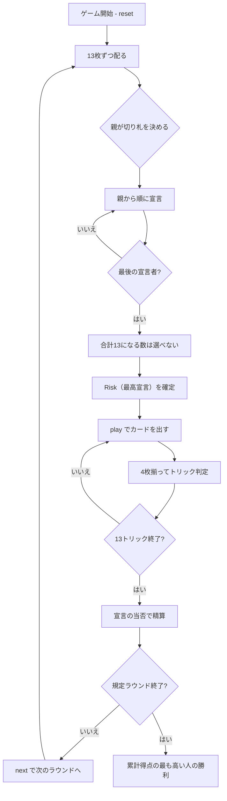

# エスティメーション（CUI版）遊び方

## ゲーム概要

中東・湾岸諸国で家庭的に遊ばれる予想制トリックテイキング。52枚を4人に13枚ずつ配る**個人戦**で、Oh Hell 系のなかでも振れ幅が大きい形。**獲得トリック数をぴたりと当てたときだけ得点が入り**、1つ足りなくても5つ多くても減点は同じです。0を宣言する **Dash Call** と、その場の最高宣言である **Risk** は、得点の桁が変わります。

## 起動方法

```sh
go run ./cmd/trumpcards estimation
go run ./cmd/trumpcards --lang en estimation  # 英語モード
```

## ルール

### 進行

1. 各プレイヤーに**13枚**配る（52枚をちょうど配り切る）
2. **親が切り札スートを決める**
3. 親から順に、獲得予定トリック数を宣言する
4. 13トリックを進行する
5. 宣言の当否で得点を精算し、次のラウンドへ（親は時計回り）
6. 規定ラウンド（既定5）を終えた時点の累計得点で順位が決まる

### 宣言の合計は13になってはいけない

**最後に宣言する人は、合計がちょうど13になる数を選べません。** 13になると全員が宣言どおり取れてしまい、賭けが成り立たないためです。CUI は禁止値を先に表示するので、押してから断られることはありません。

> この制約は Oh Hell（`ohhell`）の親にも同じものが掛かっています。エスティメーション固有ではありません。

### 得点

| 宣言 | 的中 | 外し |
|------|------|------|
| 通常 n | **+(10 + n)** | **-(10 + n)** |
| Dash Call（0宣言） | **+23** | **-23** |
| Risk（その場の最高宣言） | 上記の**2倍** | 上記の**2倍** |

**過不足の量では変わりません。** 1つ足りなくても5つ多くても同じ減点なので、宣言を大きくするほど賭けが大きくなります。Risk が最高宣言者に付くのは、切り札を選ぶ親の優位と釣り合わせるためです。

> 得点表は出典によって割れます。この実装は写したものではなく、4つの宣言が互いに一貫するように選んだものです。

### 札の強さ

切り札 > リードのスート > その他。同じスートなら A > K > Q > J > 10 > … > 2。**フォロー義務があります**（リードのスートを持っていれば必ず出す）。

## ゲームの流れ



## コマンド一覧

| コマンド | 短縮形 | 説明 |
|----------|--------|------|
| `trump <suit>` | `t` | 切り札スートを決める（1:♠ 2:♣ 3:♥ 4:♦、親のみ） |
| `bid <n>` | `b` | 獲得予定トリック数を宣言する（0..13、0 は Dash Call） |
| `play <idx>` | `p` | 手札の `<idx>` 番目のカードを出す |
| `next` | `n` | 次のラウンドを開始する |
| `hint` | `h` | 宣言すべき数、または打つべき札を提示する |
| `giveup` | `g` | 投了する |
| `log` | `l` | 棋譜（アクションログ）を表示する |
| `reset` | `r` | 最初からやり直す |
| `quit` | `q` | 終了する |
| `help` | `?` | コマンド一覧を表示 |

## 画面の見方

```
==========
Estimation (エスティメーション)
==========
ラウンド: 1/5  トリック: 1/13
得点: 的中 +(10+宣言) / 外し -(10+宣言)。Dash Call(0宣言) は ±23、Risk(最高宣言) は 2 倍。

ラウンド終了時には、各プレイヤーの行に `今回: +23` のように**そのラウンドの増減**が付きます（動かなかった席は `±0`）。累計との差を暗算する必要はありません。
切り札: ハート
あなた: 宣言3 獲得0 累計0 手札13枚
  [0]♠2 [1]♠7 [2]♠K [3]♣4 [4]♣10 [5]♥A ...
CPU1: Risk(6) 獲得0 累計0 手札13枚
CPU2: Dash(0) 獲得0 累計0 手札13枚
CPU3: 宣言3 獲得0 累計0 手札13枚
----------
手番: あなた
play <idx>・・・カードを出す
```

- **得点行**: 的中だけが得点になること。盤面からは読み取れません
- **宣言欄**: `Dash(0)` と `Risk(n)` は得点の振れ幅が通常と違います
- **累計**: 順位はこの数字で決まります
- **`[n]`**: `play <n>` で指定する手札の番号

## 遊び方のコツ

- **宣言は小さめが安全。** 外したときの減点も宣言に比例します
- **宣言ぶん取り終えたら、あとは全部逃げる。** 強い札をわざと捨てるのが定石です
- **Dash Call は13枚で1つも取らない宣言。** A や K が無く、短いスートが多い手のときだけ
- **Risk になるかは他人次第。** 高く宣言すると自動的に Risk になり、当否が2倍になります
- **自分が最後の宣言者なら、禁止値が出る。** それを避けて1つずらすだけで構いません
- **相手の宣言を見る。** 宣言ぶん取り終えた相手は逃げに回るので、そこからトリックを取りやすくなります
