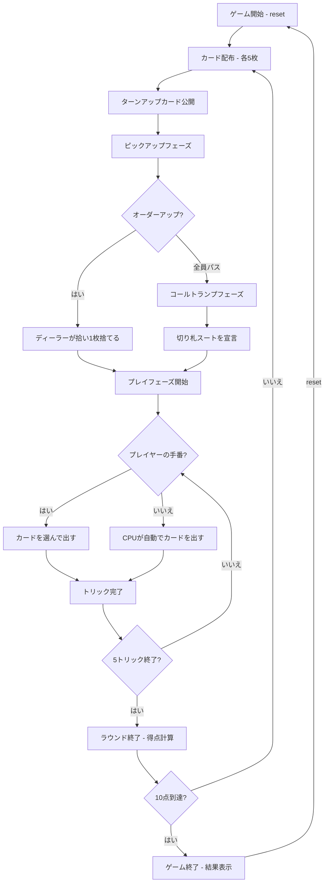

# ユーカー（CUI版）遊び方

## ゲーム概要

4人（プレイヤー1人 + CPU 3人）で遊ぶ2チーム制（0+2 vs 1+3）のトリックテイキング型カードゲームです。24枚のカード（各スート9〜A）を使用し、ライトバウアー（切り札のJ）とレフトバウアー（同色スートのJ）が最強の切り札です。先に10点に到達したチームが勝者です。

## 起動方法

```sh
go run ./cmd/trumpcards euchre
go run ./cmd/trumpcards --lang en euchre  # 英語モード
```

## ルール

### 基本ルール

- 24枚のカード（各スート9, 10, J, Q, K, A）を4人に配布（1人5枚）
- 4人を2チームに分ける（プレイヤー0+2 vs プレイヤー1+3）
- ディーラーが1枚めくり（ターンアップカード）、そのスートが切り札候補
- **ライトバウアー**（切り札のJ）が最強カード
- **レフトバウアー**（切り札と同色スートのJ）が2番目に強い切り札
- リードスートに従う（フォロースート）
- トリックの勝者: 切り札が出ていれば最高の切り札、なければリードスートの最高値

### ビッド（切り札決定）

- **ピックアップフェーズ**: ターンアップカードのスートを切り札にするか各プレイヤーが判断
  - オーダーアップ: ディーラーがターンアップカードを拾い、1枚捨てる
  - パス: 次のプレイヤーへ
- **コールトランプフェーズ**: 全員パスした場合、ターンアップ以外のスートを切り札に宣言
- **ゴーイングアローン**: オーダーアップ/コール時にアローンを選択可（パートナーが休み）

### 得点

- **メイカー（切り札を決めたチーム）3〜4トリック**: +1点
- **マーチ（5トリック全取り）**: +2点
- **ユーカード（ディフェンダーが勝利）**: ディフェンダー +2点
- **ゴーイングアローン マーチ**: +4点
- **ゴーイングアローン 3〜4トリック**: +1点

### ゲーム終了

- **勝利条件**: 先に10点に到達

### CPU難易度

- **Easy** (0): ランダムにカードを出す
- **Normal** (1): 基本的なトリック戦略（デフォルト）
- **Hard** (2): 戦略的なプレイ（切り札管理等）

## ゲームの流れ



## コマンド一覧

| コマンド | 短縮形 | 説明 |
|----------|--------|------|
| `reset` | `r` | ゲームリセット（設定保持） |
| `orderup` | `o` | ターンアップカードをオーダーアップ |
| `orderup alone` | `oa` | オーダーアップしてゴーイングアローン |
| `pass` | `pa` | パス（オーダーアップ/コールを見送る） |
| `call <suit>` | `c <suit>` | 切り札スートを宣言（s=スペード, c=クラブ, h=ハート, d=ダイヤ） |
| `call <suit> alone` | `ca <suit>` | 切り札を宣言してゴーイングアローン |
| `discard <idx>` | `d <idx>` | カードを捨てる（ディーラーのみ、インデックス指定） |
| `play <idx>` | `p <idx>` | カードをプレイ（インデックス指定） |
| `next` | `n` | 次のトリックへ |
| `nextround` | `nr` | ラウンドをスコアリングして次のラウンドへ |
| `setdifficulty <0-2>` | `sd <0-2>` | CPU難易度設定（0=Easy, 1=Normal, 2=Hard） |
| `setlimit <n>` | `sl <n>` | ポイント上限設定 |
| `hint` | `h` | 推奨カードのヒントを表示 |
| `log` | `l` | 棋譜表示 |
| `quit` | `q` | ゲーム終了 |
| `help` | `?` | ヘルプ表示 |

### コマンド例

- `o` → ターンアップカードをオーダーアップ
- `oa` → オーダーアップしてゴーイングアローン
- `pa` → パス
- `c h` → ハートを切り札に宣言
- `ca s` → スペードを切り札にしてゴーイングアローン
- `d 2` → インデックス2のカードを捨てる
- `p 0` → インデックス0のカードを出す

## 画面の見方

```
==========
Euchre (ユーカー)
==========
ラウンド: 1  トリック: 0
ディーラー: あなた
切り札: DIAMOND (メイカー: チーム0)
チーム0: 0点  チーム1: 0点
あなた: チーム0 獲得0トリック 6枚
[0]SPADE 11  [1]CLOVER 12  [2]HEART 11  [3]HEART 12  [4]DIAMOND 13  [5]DIAMOND 10
CPU 1: チーム1 獲得0トリック 5枚
CPU 2: チーム0 獲得0トリック 5枚
CPU 3: チーム1 獲得0トリック 5枚
----------
ディスカードフェーズ
==========
```

- `ラウンド: N  トリック: M`: 現在のラウンドとトリック番号
- `ディーラー: 名前`: 現在のディーラー
- `切り札: DIAMOND (メイカー: チーム0)`: 切り札スートと、**それを決めた
  チーム**。切り札が未決定のラウンドではメイカーの括弧は付きません
- `チーム0: N点  チーム1: M点`: 両チームの累計得点が 1 行に並びます
- プレイヤー行: `チームN 獲得Mトリック X枚`。ディーラーは配り直後だけ
  6 枚になります (アップカードを取ってから 1 枚捨てるため)
- `[0]SPADE 11`...: インデックス付きの手札カード
- `トリック: あなた=SPADE 11, ...`: プレイフェーズで現在のトリックに
  出ている札。まだ 1 枚も出ていなければ行ごと出ません

## 遊び方のコツ

- ライトバウアー（切り札のJ）やレフトバウアー（同色のJ）を持っている場合はオーダーアップ/コールを積極的に検討しましょう
- ゴーイングアローンは手札が非常に強い場合にのみ狙いましょう（マーチで+4点）
- パートナーとの連携を意識し、パートナーがリードしたスートをフォローしましょう
- 切り札が少ない場合は、特定のスートをボイド（手札からなくす）にして切り札で切る戦略が有効です
- ディフェンダーの場合、メイカーをユーカードにすると+2点の大チャンスです
- 迷った時は `h` コマンドでヒントを表示できます
