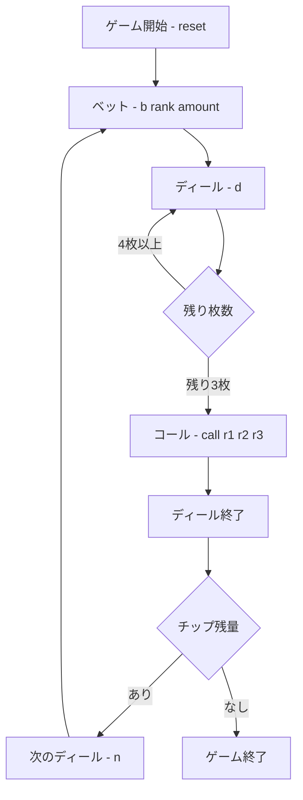

# ファロ（CUI版）遊び方

## ゲーム概要

ファロ（Faro）は19世紀アメリカの酒場で大流行した、プレイヤー1人対バンク（胴元）の賭けゲームです。52枚デッキとA〜Kの13ランクのレイアウトを使い、チップが尽きるまで遊びます。

## 起動方法

```sh
go run ./cmd/trumpcards faro
go run ./cmd/trumpcards --lang en faro  # 英語モード
```

## ルール

### 基本の流れ

1. **ベット**: A（1）〜K（13）の好きなランクにチップを置きます。「カッパー」を指定すると、そのランクが「負ける」方に賭けられます。
2. **ディール**: バンクは最初の1枚（ソーダ）を捨て、以後2枚ずつカードをめくります。
   - 1枚目（負け札）のランクに賭けていた額はバンクが回収します。
   - 2枚目（勝ち札）のランクに賭けていた額には1:1で配当されます。
   - 2枚が同じランクの「スプリット」では、そのランクの賭け金の半分をバンクが取ります。
3. **コール**: 最後の3枚は、並ぶ順序を予想する「コール」ができます。的中すれば4:1の配当です（予想しないこともできます）。

### ゲーム終了

チップが尽きるとゲーム終了です。

## ゲームの流れ



## コマンド一覧

| コマンド | 短縮形 | 説明 |
|----------|--------|------|
| `bet <rank> <amount> [c]` | `b` | ランク（1=A..13=K）にチップを置く。`c`でカッパー（負けに賭ける） |
| `clearBet <rank>` | `cb` | 指定ランクのベットを外す |
| `clearAll` | `ca` | すべてのベットを外す |
| `deal` | `d` | 1ターン（2枚）めくる |
| `call <r1> <r2> <r3>` | | 最後の3枚の順序を予想（引数なしでスキップ） |
| `next` | `n` | 次のディールへ |
| `log` | `l` | 棋譜を表示 |
| `reset` | `r` | 新しいゲームを開始 |
| `quit` | `q` | ゲーム終了 |
| `help` | `?` | コマンド一覧を表示 |

## 画面の見方

```
----------
chips: 1000
phase: BETTING
turns: 0/25
cards left: 51
Case keeper (remaining of 4 per rank): A:3 2:4 3:4 4:4 5:4 6:4 7:4 8:4 9:4 10:4 J:4 Q:4 K:4
--- BETS ---
  rank 7: 100
  rank 13: 50 (copper)
----------
```

- `chips` … 残りチップ
- `phase` … 現在のフェーズ（BETTING / TURN / CALL / ROUND END / GAME END）
- `cards left` … 山札の残り枚数
- `Case keeper` … **ランクごとの残り枚数（各 4 枚中）**。カードカウンティングがこのゲームの核なので常時表示されます。出尽くしたランクも `A:0` のように 0 で残ります
- `BETS` … 現在のベット一覧（`(copper)`はカッパー）

## 遊び方のコツ

- スプリットはバンク有利なので、過度なベットは避けましょう。
- コールは配当4:1と大きいですが的中は難しいため、ここぞというときに使いましょう。
