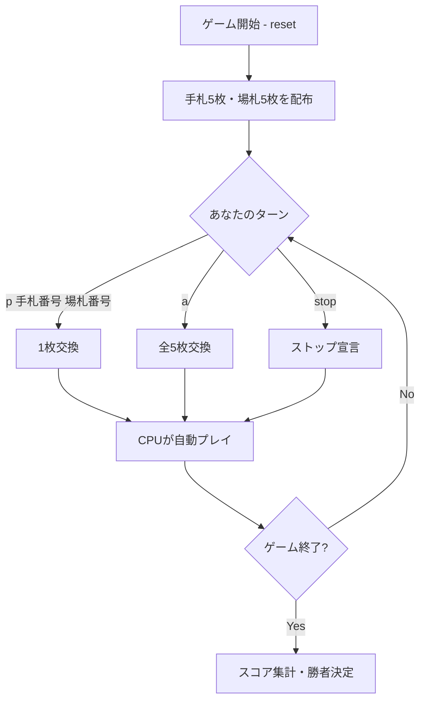

# フィフティワン（CUI版）遊び方

## ゲーム概要

フィフティワン（51）は、4人で遊ぶカード交換ゲームです。手札と場札を交換しながら、同じスートのカードの合計点を最大化することを目指します。最高得点は51点（同スートのA+K+Q+J+10）です。

## 起動方法

```sh
go run ./cmd/trumpcards fiftyone
go run ./cmd/trumpcards --lang en fiftyone  # 英語モード
```

## ルール

### 基本ルール
- プレイヤー4人（あなた + CPU 3人）
- 標準52枚デッキ使用
- 各プレイヤーに5枚、場に5枚配る
- カード点数: A=11点、J/Q/K=10点、2-10=額面通り

### 自分のターンにできること
1. **1枚交換** (`p <手札番号> <場札番号>`): 手札1枚と場札1枚を交換
2. **全交換** (`a`): 手札5枚と場札5枚を全て交換
3. **ストップ** (`stop`): ストップを宣言

### スコア計算
- 手札の中で、同じスートのカードの点数を合計
- 4つのスートの中で最も高い合計がスコア

### ゲーム終了
- 誰かがストップを宣言すると、残りのプレイヤーが各1回ずつプレイしてゲーム終了
- 最高スコアのプレイヤーが勝利
- 同点の場合、プレイヤー番号の小さい方が勝利

### CPU難易度
- **Easy (0)**: ランダムに交換。45点以上でストップ
- **Normal (1)**: ベストスートを狙って交換。40点以上でストップ
- **Hard (2)**: 全交換パターンを評価して最善手を選択。45点以上でストップ

## ゲームの流れ



## コマンド一覧

| コマンド | 短縮形 | 説明 |
|----------|--------|------|
| `play <手札番号> <場札番号>` | `p` | 手札1枚と場札1枚を交換 |
| `all` | `a` | 手札5枚と場札5枚を全交換 |
| `stop` | - | ストップを宣言 |
| `setdifficulty <0-2>` | `sd` | CPU難易度を変更 (0=Easy, 1=Normal, 2=Hard) |
| `log` | `l` | アクションログを表示 |
| `reset` | `r` | ゲームをリセット |
| `quit` | `q` | ゲームを終了 |
| `help` | `?` | ヘルプを表示 |

## 画面の見方

```
==== Fifty-one (フィフティワン) ====
CPU 1: 5枚 (スコア: ?)
CPU 2: 5枚 (スコア: ?)
CPU 3: 5枚 (スコア: ?)
あなた (スコア: 21)
[0]♠A  [1]♠10  [2]♥5  [3]♦3  [4]♣2
  スート別: SPADE 21*  CLOVER 2  HEART 5  DIAMOND 3
----------
場札: [0]♠K  [1]♥9  [2]♦Q  [3]♣6  [4]♠8
----------
あなたのターン: p <手札番号> <場札番号> / a (全交換) / stop
```

- **CPU行**: CPU名、手札枚数、スコア（ゲーム中は「?」、終了時に公開）
- **あなた行**: スコアと手札一覧（インデックス番号付き）
- **スート別行**: 4 スートそれぞれの合計点。`*` が付いているのが最良スート（上の「スコア」と同じ値）。自分の行だけに出ます
- **場札行**: 場に出ているカード一覧（インデックス番号付き）
- **操作行**: 現在使用可能なコマンドの案内

## 遊び方のコツ
- 1つのスートに集中してカードを集めましょう
- Aは11点と高いので、同スートのAがあるスートを狙いましょう
- 高スコアになったら早めにストップを宣言しましょう
- 場札に自分のベストスートのカードが出たら、不要なカードと交換しましょう
