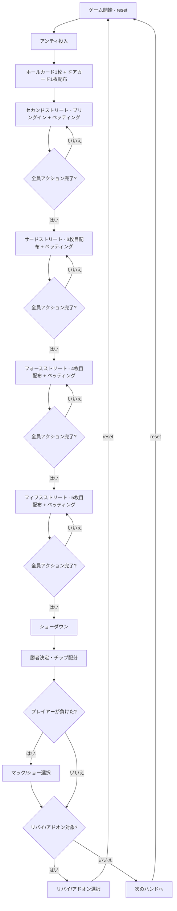

# ファイブカードスタッド（CUI版）遊び方

## ゲーム概要

ファイブカード・スタッドポーカーです。ポーカー最古のスタッド形式で、コミュニティカードを使わず、各プレイヤーに5枚のカードが配られ、その5枚で役を作ります。テーブルサイズは2人～6人（デフォルト4人 = 1人+CPU 3人）から選択できます。各CPUは異なるプレイスタイル（TAG/LAP/TAP/LAG/GTO）を持ち、ブラフを含む戦略的なプレイをします。サイドポットにも対応しています。

HUD統計（VPIP%/PFR%/3Bet%/AF）が全プレイヤーに表示されます。トーナメントモードでは、指定ハンド数ごとにアンティが自動的に上昇します。リバイ（チップ再購入）とアドオン（一回限りのチップ追加購入）にも対応しています。

## 起動方法

```sh
go run ./cmd/trumpcards fivecardstud
go run ./cmd/trumpcards --lang en fivecardstud  # 英語モード
```

## ルール

### 基本ルール

- 52枚のトランプを使用
- コミュニティカードなし — 各プレイヤーに個別にカードが配られる
- 合計5枚（裏向き1枚 + 表向き4枚）で役を作る
- ブラインドの代わりにアンティ（全員が支払う参加費）とブリングイン（最も低いドアカードのプレイヤーが支払う強制ベット）を使用
- 各ストリートでベッティング順は表向きカードの最強ハンドから開始

### ゲームの進行

1. **アンティ**: 全プレイヤーがアンティを支払う
2. **セカンドストリート**: 裏向き1枚（ホールカード）+ 表向き1枚（ドアカード）配布。最も低いドアカードのプレイヤーがブリングインを投入。ベッティングラウンド（スモールベット）
3. **サードストリート**: 表向き1枚追加（計3枚）。最強の表向きハンドから開始。ベッティングラウンド（スモールベット）
4. **フォースストリート**: 表向き1枚追加（計4枚）。最強の表向きハンドから開始。ベッティングラウンド（ビッグベット）
5. **フィフスストリート**: 表向き1枚追加（計5枚）。最強の表向きハンドから開始。最後のベッティングラウンド（ビッグベット）
6. **ショーダウン**: 残っているプレイヤーの手札を公開し、勝者を決定
7. **マック/ショー**: ショーダウンで負けた場合、手札をマック（伏せる）またはショー（公開）を選択
8. **リバイ/アドオン**: リバイ・アドオンが有効な場合、該当条件を満たすとチップの再購入・追加購入が可能

### ベッティングアクション

| アクション | 説明 |
|-----------|------|
| フォールド | 手札を捨ててラウンドから降りる |
| チェック | ベットせずにパスする（未ベット時のみ） |
| コール | 現在のベット額に合わせる |
| ベット | 新たにベットする（未ベット時のみ） |
| レイズ | 現在のベット額を上げる |
| オールイン | 全チップを賭ける |

### 役一覧（強い順）

| 役 | 説明 |
|----|------|
| Royal Flush | 同じスートの10・J・Q・K・A |
| Straight Flush | 同じスートの5枚連番 |
| Four of a Kind | 同じ数字4枚 |
| Full House | 同じ数字3枚 + 同じ数字2枚 |
| Flush | 同じスート5枚 |
| Straight | 5枚連番 |
| Three of a Kind | 同じ数字3枚 |
| Two Pair | ペア2組 |
| One Pair | ペア1組 |
| High Card | 上記に該当しない最も高いカード |

### CPUプレイスタイル

| スタイル | 略称 | 特徴 |
|---------|------|------|
| Tight-Aggressive | TAG | 強い手のみ参加し、積極的にレイズ。ブラフ率15% |
| Loose-Passive | LAP | 多くの手に参加するが、主にコール。ブラフ率5% |
| Tight-Passive | TAP | 厳選した手のみ参加し、主にコール。ブラフ率5% |
| Loose-Aggressive | LAG | 多くの手に参加し、頻繁にレイズ。ブラフ率30% |
| Game Theory Optimal | GTO | ハンド強度とボードテクスチャに基づく確率的混合戦略 |

## ゲームの流れ



## コマンド一覧

| コマンド | 短縮形 | 説明 |
|----------|--------|------|
| `reset` | `r` | 新しいゲームを開始 |
| `fold` | `f` | フォールド（降りる） |
| `check` | `ck` | チェック（パス） |
| `call` | `c` | コール（ベット額に合わせる） |
| `bet <額>` | `b <額>` | ベットする |
| `raise <額>` | `ra <額>` | レイズする |
| `allin` | `a` | オールイン |
| `bl [0-2]` | | ベッティングリミット変更（0=Fixed, 1=PotLimit, 2=NoLimit） |
| `ts [2-6]` | `tablesize` | テーブルサイズ変更（2～6人） |
| `rebuy` | `rb` | リバイ（チップを再購入） |
| `skiprebuy` | `sr` | リバイをスキップ |
| `addon` | `ad` | アドオン（チップを追加購入） |
| `skipaddon` | `sa` | アドオンをスキップ |
| `muck` | `m` | マック（手札を伏せる） |
| `show` | `sh` | ショー（手札を公開する） |
| `metaai` | `mai` | メタAIの ON/OFF を切り替え |
| `log` | `l` | アクションログを表示 |
| `quit` | `q` | ゲーム終了 |
| `help` | `?` | コマンド一覧を表示 |

例:
- `b 40` → 40チップをベット
- `ra 80` → 80チップにレイズ
- `c` → コール

## 画面の見方

```
==========
Five Card Stud
==========
ディーラー: Player 0
アンティ: 5  ブリングイン: 10  SB/BB: 20/40
ポット: 35
----------
[You] チップ:980 ベット:10
  ホール: ♠A
  ドア: ♣5
CPU 1 (TAG) チップ:980 ベット:10
  ドア: ♦7
CPU 2 (LAP) チップ:990
  ドア: ♠3  [ブリングイン]
CPU 3 (GTO) チップ:980 ベット:10
  ドア: ♥J
----------
[CPU行動]
  Player 1: コール
  Player 3: コール
==========
```

- `[You]`: プレイヤーのチップ残高とベット額
- `ホール`: あなたの裏向きカード（他プレイヤーからは見えない、1枚のみ）
- `ドア`: 表向きカード（全員に見える、最大4枚）
- `CPU N (スタイル)`: CPUのチップ残高、ベット額、状態
- `[ブリングイン]`: ブリングインを投入したプレイヤー
- `[フォールド]`: フォールド済み
- `[オールイン]`: オールイン状態
- `ポット`: 現在のポット額
- `[CPU行動]`: CPUが行ったアクションの記録

## 遊び方のコツ

- セカンドストリートで強いドアカード（A/K/Q）を見せると、弱い手を持つ対戦相手をフォールドさせやすくなります
- 他プレイヤーの表向きカードをよく観察し、自分のアウツ（必要なカード）が場に出ていないか確認しましょう
- フォースストリート以降はビッグベットになるため、弱い手で深追いしないようにしましょう
- ペアが見えているプレイヤーがレイズしてきたら、スリーカード（トリップス）の可能性を考慮しましょう
- HUD統計を活用して、CPUのプレイスタイルの傾向を把握しましょう
- トーナメントモードではアンティが上がるため、早めにチップを稼ぐ戦略が重要です
