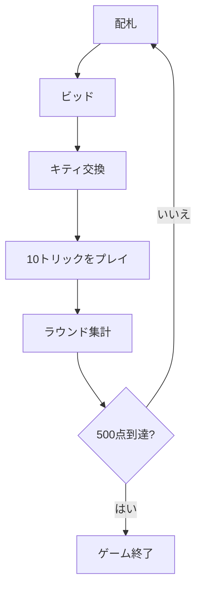

# 500 (ファイブハンドレッド)（CUI版）遊び方

## ゲーム概要

500（ファイブハンドレッド）は、オーストラリアの国民的トリックテイキングゲームです。4人が2対2のチームに分かれ、オークション（ビッド）で切り札と獲得トリック数を競い、10回のトリックを戦います。ジョーカー・ライトバウアー（切り札のJ）・レフトバウアー（同色のJ）が最強カードになります。先に500点に到達したチームの勝ちです。

## 起動方法

```sh
go run ./cmd/trumpcards fivehundred
go run ./cmd/trumpcards --lang en fivehundred   # 英語表示
```

インタラクティブモードからは `switch fivehundred` で切り替えられます。

## ルール

- **デッキ**: 43枚（ジョーカー1枚＋赤スートの 4〜A、黒スートの 5〜A）。
- **配札**: 各10枚＋キティ3枚。
- **ビッド**: 6〜10トリック × スート(♠＜♣＜♦＜♥＜NT)、ミゼール(250)、オープンミゼール(520)。
- **キティ交換**: 落札者がキティ3枚を加えて3枚捨てます。
- **得点**: 契約達成で加点、失敗で減点。守備側はトリック1つにつき10点。先に+500点で勝利、-500点で敗北。

## ゲームの流れ



## コマンド一覧

| コマンド | 短縮形 | 説明 |
|----------|--------|------|
| `bid <tricks> <suit>` | `b` | 切り札ビッド（tricks 6-10, suit 1=♠ 2=♣ 3=♥ 4=♦） |
| `bnt <tricks>` |  | ノートランプビッド（6-10） |
| `misere` | `m` | ミゼール |
| `openmisere` | `om` | オープンミゼール |
| `pass` | `pa` | パス |
| `exchange <i> <j> <k>` | `e` | キティ交換（捨てるカード3枚のインデックス） |
| `play <i> [s]` | `p` | カードをプレイ（NTでジョーカーをリードする場合 s=指名スート 1-4） |
| `next` | `n` | 次のトリックへ |
| `nextround` | `nr` | 次のラウンドへ |
| `setdifficulty <0-2>` | `sd` | CPU難易度（0=Easy, 1=Normal, 2=Hard） |
| `settarget <n>` | `st` | 勝利スコア設定 |
| `hint` | `h` | ヒント表示 |
| `log` | `l` | 棋譜表示 |
| `reset` | `r` | リセット |
| `quit` | `q` | 終了 |
| `help` | `?` | コマンド一覧を表示 |

## 画面の見方

- 先頭行にラウンド・トリック番号、続いてディーラー・契約・チームスコアを表示します。
- 各プレイヤーの行にチーム・獲得トリック数・手札枚数・ビッド状況（★宣言者／パス）が出ます。
- 自分の手札はインデックス付きで表示され、`p <i>` の `<i>` に対応します。
- 区切り線の下に現在のトリックと、フェーズごとの操作案内を表示します。

## 遊び方のコツ

- 強い切り札スートが揃っているときは高めのビッドで主導権を握りましょう。
- ジョーカーと2枚のバウアーは切り札契約で最強クラスです。温存して勝負所で使います。
- 手札が弱いときはミゼール（0トリック狙い）が有効な選択肢になります。
- 守備側はトリックを着実に取り、相手の契約達成を妨害しましょう。
