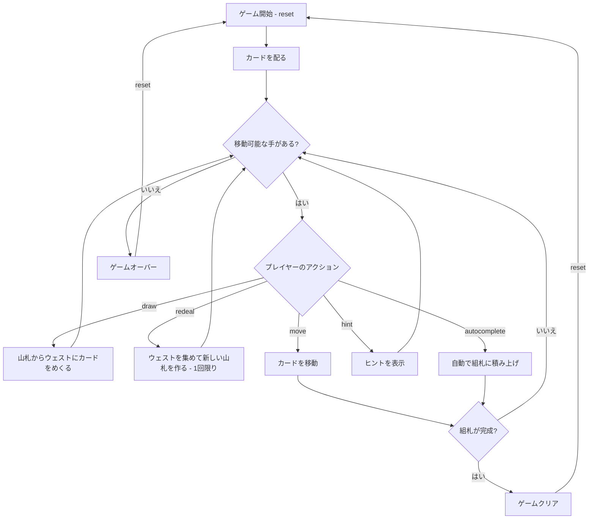

# フォーティ・アンド・エイト（CUI版）遊び方

## ゲーム概要

1人用のソリティアカードゲームです。フォーティシーブスの変種で、2デッキ（104枚）を使い、8列×5枚のタブロー、山札、ウェスト、8つの組札で構成されます。組札にA→Kまでスート別に積み上げればクリアです。山札を使い切った後、ウェストを1回だけ集めて新しい山札を作れる（リディール）のが特徴です。

## 起動方法

```sh
go run ./cmd/trumpcards fortyandeight
go run ./cmd/trumpcards --lang en fortyandeight  # 英語モード
```

## ルール

### 基本ルール

- 2デッキ（104枚、ジョーカーなし）を使用
- 8列のタブローに各5枚ずつ表向きで配る（計40枚）
- 残りの64枚は山札（ストック）に裏向きで置く
- 8つの組札（ファンデーション）はスート別にA→Kの順に積み上げる
- タブローでは同スート降順で重ねる（例: ♠Kの上に♠Qのみ）
- 移動できるのは1枚ずつのみ（複数枚の同時移動は不可）
- 空いた列にはどのカードでも置ける

### リディール（再構築）

- 山札を使い切った後、ウェストを集めて新しい山札を作れます（`rd` コマンド）
- リディールはゲーム全体で **1回限り**

### ゲームクリア

- 8つの組札すべてにA→Kまで13枚ずつ積み上げるとゲームクリア

### ゲームオーバー

- これ以上移動可能な手がない場合はゲームオーバー

### 山札のルール

- 山札から1枚ずつウェストにめくる
- 山札を使い切ったら、リディールで1度だけ再構築できる

## ゲームの流れ



## コマンド一覧

| コマンド | 短縮形 | 説明 |
|----------|--------|------|
| `reset` | `r` | 新しいゲームを開始 |
| `draw` | `d` | 山札からウェストにカードをめくる |
| `redeal` | `rd` | ウェストを集めて新しい山札を作る（1回限り） |
| `move` | `m` | カードを移動する（サブ引数で移動元・移動先を指定） |
| `undo` | `u` | 直前の操作を元に戻す |
| `giveup` | `g` | ギブアップしてゲームを終了 |
| `hint` | `h` | 次の一手のヒントを表示 |
| `autocomplete` | `ac` | 自動的に組札へ積み上げ可能なカードを移動 |
| `log` | `l` | アクションログ（棋譜）を表示 |
| `quit` | `q` | ゲーム終了 |
| `help` | `?` | コマンド一覧を表示 |

### コマンド例

- `d` → 山札からカードをめくる
- `rd` → ウェストを集めて新しい山札を作る
- `m` → 移動コマンド（移動元・移動先の入力を求められる）
- `u` → 直前の操作を元に戻す
- `h` → ヒントを表示
- `ac` → オートコンプリート

## 画面の見方

```
==========
Forty and Eight (フォーティ・アンド・エイト)
==========
山札: 60枚  ウェスト: ♠5  リディール: 可能
----------
組札:
[♠1] --  [♠2] --  [♥1] --  [♥2] --
[♦1] --  [♦2] --  [♣1] --  [♣2] --
----------
タブロー:
[0] ♠K ♠10 ♥7 ♦3 ♣8
[1] ♥Q ♣J ♠9 ♦6 ♥4
...
----------
手数: 0
m・・・カードを移動  d・・・山札をめくる  rd・・・リディール  h・・・ヒント
==========
```

- `山札: N枚`: 山札の残りカード数
- `ウェスト: ♠5`: ウェストの一番上のカード
- `リディール: 可能/使用済み`: リディールが使えるか
- `組札`: 8つのスート別の組札の状態（`--`は空）
- `♠K`: 表向きのカード
- `手数: N`: 現在の手数

## 遊び方のコツ

- すべてのカードが表向きなので、先を見越した計画が重要です
- Aが出たらすぐに組札へ移動しましょう
- 空いた列を作ることが攻略の鍵です — 一時的な置き場として活用できます
- 同スート降順でしか重ねられないため、移動先の選択は慎重に
- リディールは1回限り。本当に必要なときまで温存しましょう
- ヒントコマンドで詰まった時のアドバイスを得られます
