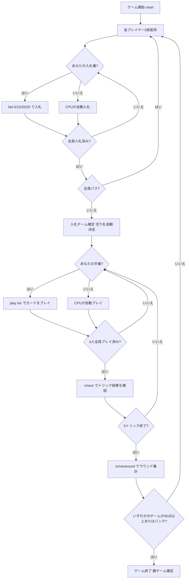

# オークション・フォーティファイブズ（CUI版）遊び方

## ゲーム概要

Auction Forty-Fives（フォーティファイブズ）はアイルランドとカナダ・ノバスコシア州で広く親しまれているトリックテイキングゲームです。52枚の標準デッキを4人2チーム（席0&2 vs 席1&3）でプレイします。各ラウンドの最初に**入札フェーズ**があり、最高入札チームが**入札チーム（デクレアラー側）**として5トリックを争います。切り札5、切り札J、♥Aの3枚は常に最強の**固定トップトランプ**です。先に**45点**を獲得したチームの勝利です。

## 起動方法

```sh
go run ./cmd/trumpcards fortyfives
go run ./cmd/trumpcards --lang en fortyfives  # 英語モード
```

## ルール

### デッキと配布

- **デッキ**: 52枚（A,2-10,J,Q,K × 4スート）
- **プレイヤー**: 4人2チーム（あなた = 席0、席0&2がチームA、席1&3がチームB）
- **配布**: 各プレイヤー5枚、計5トリック
- **カードの強さ（切り札スートの場合、強い順）**: 切り札5 > 切り札J > ♥A（常に上位） > 切り札A > 切り札K > 切り札Q > 切り札その他（10>9>8>7>6>4>3>2） > リードスートのカード

### 入札フェーズ

ディーラーの左隣から時計回りに、各プレイヤーが1回だけ入札します。

| 入札 | 内容 |
|------|------|
| **Pass（パス）** | 入札をパスする |
| **15** | チームとして15点以上取ることを宣言 |
| **20** | チームとして20点以上取ることを宣言 |
| **25** | チームとして25点以上取ることを宣言（最高入札） |

- パス以外の入札は、現在の最高入札を上回らなければなりません（15 < 20 < 25）。
- 全員がパスした場合はそのラウンドは無効となり、再配布されます。
- 最高入札者のチームが**入札チーム**となり、入札者の最長スートが自動的に**切り札スート**に決まります（カード交換ステップは省略）。

### 固定トップトランプとリネギング

切り札スートに関係なく、以下3枚は常に最強の切り札です（強い順）。

1. **切り札5**（Five Fingers）
2. **切り札J**（Knave of Trump）
3. **♥A**（Ace of Hearts — 常にトップトランプ、ハートが切り札でなくても適用）

**リネギング（Reneging）**: 上記3枚のトップトランプは**フォロー義務の免除**があります。切り札リードで通常なら切り札を出さなければならない場面でも、トップトランプを手元に温存して別のカードを出せます。

### トリック・テイキング

- **スートフォロー義務**: リードされたスートのカードを持っている場合は必ず出さなければなりません（リネギングの免除を除く）。
- 持っていない場合は任意のカードを出せます。
- **トリックの勝者**:
  - 切り札スートのカードが場にあれば、最も強い切り札カードが勝ちます（固定トップトランプが最優先）。
  - 切り札がなければ、リードスートの最も強いカードが勝ちます。
- トリックの勝者が次のトリックをリードします。

### 得点計算と勝利条件

- 各トリックは**5点**（勝ったチームに加算）。5トリックで最大25点。
- **入札チーム**が入札値以上の点を取った場合 → その点数をチームスコアに加算。
- **入札チーム**が入札値を下回った場合 → 入札値をチームスコアから減算（失点）。
- **非入札チーム**は獲得したトリック得点をそのまま加算。
- **ジンク（Jink）**: 入札値25で5トリックすべて取った場合 → **即座に勝利**。
- 先に**45点**に達したチームが勝利。

## ゲームの流れ



## コマンド一覧

| コマンド | 短縮形 | 説明 |
|----------|--------|------|
| `bid <0/15/20/25>` | — | 入札する（0=Pass, 15/20/25=入札点） |
| `pass` | — | パスする（bid 0 と同じ） |
| `play <idx>` | — | 手札のidx番目のカードを出す（トリックフェーズ） |
| `next` | `n` | 次のトリックへ進む（トリック終了後） |
| `nextround` | `nr` | 次のラウンドへ進む（5トリック終了後） |
| `setdifficulty <0-2>` | `sd <0-2>` | CPU難易度設定（0=Easy, 1=Normal, 2=Hard） |
| `log` | `l` | アクションログを表示 |
| `reset` | `r` | 新しいゲームを開始（設定保持） |
| `quit` | `q` | ゲーム終了 |
| `help` | `?` | コマンド一覧を表示 |

## 画面の見方

```
==========
Auction Forty-Fives (フォーティファイブズ)
==========
ラウンド: 1  トリック: 0
チームスコア: チームA(あなた)=0  チームB=0
----------
フェーズ: BID
入札状況: あなた=?  CPU1=?  CPU2=?  CPU3=?
あなたの手番です。入札してください。
bid <0/15/20/25>  (0=Pass)

==========
ラウンド: 1  トリック: 1
チームスコア: チームA(あなた)=0  チームB=0
切り札: ♠  入札チーム: チームA [20]
You: 5枚 [入札チーム]
[0]5♠ [1]J♠ [2]A♥ [3]K♦ [4]Q♣
CPU1: 5枚 [非入札チーム]  CPU2: 5枚 [入札チーム]  CPU3: 5枚 [非入札チーム]
----------
フェーズ: PLAY
あなたの手番です。カードを出してください。
play <idx>
```

- **フェーズ: BID**: 入札フェーズ。各プレイヤーが1回入札します。
- **フェーズ: PLAY**: トリックフェーズ。スートフォロー義務（リネギング免除あり）に従いカードを出します。
- **切り札行**: 現在の切り札スートと入札チーム・入札値を表示。
- **チームスコア行**: 両チームの累積得点。
- **`[n]`付き行**: あなたの手札（インデックス付き）。

## 遊び方のコツ

- **入札の判断**: 固定トップトランプ（切り札5・切り札J・♥A）を複数持っている場合は積極的に入札を検討しましょう。特に切り札5があれば最低1トリックは確実です。
- **チームメイトとの連携**: チームメイト（席2のCPU）の入札や動きを把握し、チームとして入札値の達成を目指しましょう。非入札チームはエース・キングで相手の入札チームを阻止します。
- **リネギングを活用**: 切り札5・切り札J・♥Aの3枚は温存が可能です。序盤の切り札合戦で温存しておき、終盤の決定的な場面で出すと有効です。
- **入札25のリスク**: 入札25は5トリックすべてを取ればジンクで即勝利ですが、取れなかった場合は25点の失点です。強力な手札（トップトランプ複数＋切り札多数）がなければ避けましょう。
- **点数管理**: 各トリック5点で計25点。入札チームは失敗すると入札値分の失点がチームに課されます。接戦時には相手チームの残り点数を意識しながら入札値を選びましょう。
- **スートフォロー義務を活用**: 非入札チームとして戦う場合、相手チームが苦手なスートをリードして手札を絞りましょう。入札チームが切り札を消耗せざるを得ない状況を作ることが有効です。
