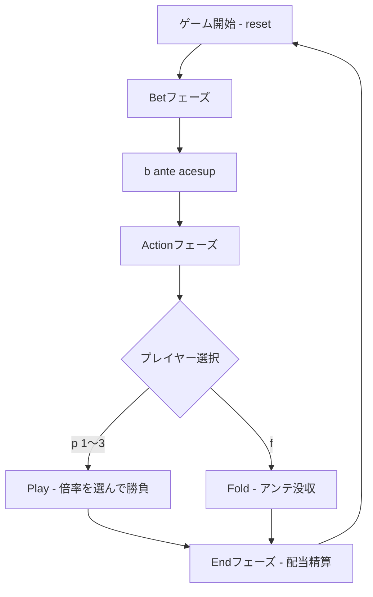

# フォーカードポーカー（CUI版）遊び方

## ゲーム概要

Four Card Poker は、プレイヤーに5枚・ディーラーに6枚（うち1枚は表）を配り、それぞれが「ベスト4枚」で作った役を比較するカジノポーカーゲームです。ディーラーのクオリファイ条件は無く、常に勝負を行うのが特徴です。

## 起動方法

```sh
go run ./cmd/trumpcards fourcardpoker
go run ./cmd/trumpcards --lang en fourcardpoker  # 英語モード
```

## ルール

### 役の強さ（昇順）

1. ハイカード
2. ペア
3. ツーペア
4. ストレート
5. フラッシュ（4枚揃いの場合、ストレートより高い）
6. スリーカード
7. ストレートフラッシュ
8. フォーカード

### 進行

1. **Bet フェーズ**: アンテ（必須）と任意のエースズアップ（サイドベット）を置きます。
2. ディーラーがプレイヤーに5枚、ディーラー自身に6枚配り、ディーラーの1枚目を表向きに見せます。
3. **Action フェーズ**: プレイヤーは表向きカードを参考に、Play（アンテの1〜3倍をプレイベット）または Fold を選びます。
4. **End フェーズ**: 双方のベスト4枚を比較して勝敗を決定し、配当を精算します。

### 配当

- **アンテ/プレイ**: 勝ち = 1:1、引き分け = ベット返却、負け = 没収。
- **アンテボーナス（自動配当）**: プレイヤーがスリーカード以上を作っていれば、結果に関係なく配当が付きます。
  - スリーカード: 2:1
  - ストレートフラッシュ: 20:1
  - フォーカード: 25:1
- **エースズアップ（サイドベット）**: Aペア以上で配当が発生します。
  - Aペア: 1:1
  - ツーペア: 2:1
  - ストレート: 4:1
  - フラッシュ: 5:1
  - スリーカード: 7:1
  - ストレートフラッシュ: 40:1
  - フォーカード: 50:1

## ゲームの流れ



## コマンド一覧

| コマンド | 短縮形 | 説明 |
|----------|--------|------|
| `reset` | `r` | 新しいゲームを開始 |
| `bet <ante> [acesup]` | `b` | アンテと任意のエースズアップを置いて配布 |
| `play [1\|2\|3]` | `p` | Anteの倍率(1〜3)でプレイベットを置いて勝負（未指定は1x） |
| `fold` | `f` | フォールド（アンテ没収。エースズアップは引き続き評価） |
| `log` | `l` | アクションログ表示 |
| `quit` | `q` | ゲーム終了 |
| `help` | `?` | コマンド一覧を表示 |

## 画面の見方

```
----------
チップ: 900
フェーズ: ACTION
--- PLAYER ---
ハンド: High Card
♠A,♣10,♥5,♦7,♣2
--- DEALER ---
アップカード: ♠K
----------
```

End フェーズではディーラーの全6枚も表示され、各サイドの役名と合計配当が出力されます。

## 遊び方のコツ

- 5枚から最良の4枚を選ぶゲームなので、フラッシュやストレートになりやすい構成は強気に倍率を上げて勝負しましょう。
- ディーラーには6枚あるため平均的な役強度は高めです。中途半端なハンドではアンテ没収のリスクが大きいので Fold が有効です。
- スリーカード以上を作れた場合はアンテボーナスが付くため、勝敗に関係なく Play 推奨です。
- エースズアップはハウスエッジが大きめのサイドベットです。遊びの一環として小額で楽しむのが安全です。
