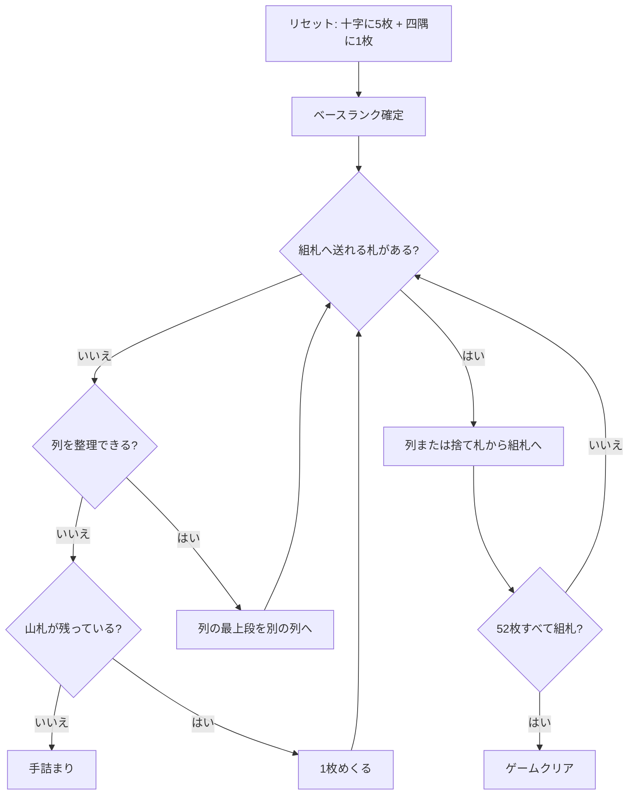

# フォーシーズンズ（CUI版）遊び方

## ゲーム概要

イギリスの古典的な一人用ソリティア。コーナーズ（Corners）とも呼ばれる。十字に並べた5つの列と、四隅の4つの組札で遊ぶ。

**組札が A から始まるとは限らない**のがこのゲームの核心。配りはじめの1枚のランクが「ベースランク」になり、4つの組札はすべてそこから始まる。しかも組札も列も**ラップアラウンド**する — K の次は A に戻り、A の下には K が置ける。

## 起動方法

```sh
go run ./cmd/trumpcards fourseasons
go run ./cmd/trumpcards --lang en fourseasons   # 英語
```

## ルール

- 52 枚 1 組。十字に5枚配り、さらに1枚を四隅の1つに置く。**この1枚のランクがベースランク**
- 残り46枚は山札。1枚ずつめくって捨て札にする（めくり直しは無い）
- **四隅（組札）**: ベースランクから**同じスート**で昇順に積む。K の次は A（ラップアラウンド）
- **十字（列）**: **スートを問わず**降順に積む。A の下は K（ラップアラウンド）
- 動かせるのは各列の**最上段1枚だけ**。列をまとめて動かすことはできない
- 空いた十字のマスには**どのカードでも**置ける
- 52 枚すべてが四隅に乗れば勝ち

## ゲームの流れ



## コマンド一覧

| コマンド | 短縮形 | 説明 |
|----------|--------|------|
| `draw` | `d` | 山札から1枚めくる |
| `m w f <idx>` |  | 捨て札を組札 `<idx>` (0..3) へ |
| `m w t <col>` |  | 捨て札を十字の列 `<col>` (0..4) へ |
| `m t <col> f <idx>` |  | 列 `<col>` の最上段を組札 `<idx>` へ |
| `m t <col> t <col2>` |  | 列 `<col>` の最上段を列 `<col2>` へ |
| `hint` | `h` | ヒントを表示する |
| `autocomplete` | `ac` | 送れるカードを自動で組札へ送る |
| `undo` | `u` | 1 手戻す |
| `giveup` | `g` | ギブアップ |
| `log` | `l` | 棋譜（アクションログ）を表示する |
| `reset` | `r` | 最初からやり直す |
| `quit` | `q` | 終了する |
| `help` | `?` | コマンド一覧を表示 |

## 画面の見方

```
ベースランク: 7 (この配りのファンデーションはここから始まります)
[F0] ♠7 (1/13) → 次: 8
[F1] (空) → 次: 7
[F2] (空) → 次: 7
[F3] (空) → 次: 7
----------
[T0] ♥12 (1枚)
[T1] ♣3 (1枚)
[T2] ♦9 (2枚)
[T3] (空)
[T4] ♠13 (1枚)
----------
ストック: 44枚 ウェイスト: ♥6
```

- 一番上の**ベースランク**が最重要。四隅はすべてこのランクから始まります
- `F0`〜`F3` が四隅の組札。`→ 次:` はその隅が次に必要とするランク（同じスート）
- `T0`〜`T4` が十字の列。表示されているのは最上段で、`(n枚)` はその列の枚数
- 空の列 `(空)` にはどのカードでも置けます

## 遊び方のコツ

- **ラップアラウンドを忘れない。** ベースランクが 7 なら、組札は 7→8→…→K→A→2→…→6 の順。K で止まりません
- 同じ理由で、十字の列も A の下に K を置けます。手が無いと思ったらまずここを確認
- **空きマスは強力**だがすぐ埋めない。どのカードでも置けるので、詰まったときの逃げ場として温存する
- 山札はめくり直しが無いので、捨て札に埋もれる札は基本的に戻ってきません。組札へ送れるものは送っておく
- 4つの隅は先着順にスートが決まります。同じランクが複数あるとき、どの隅に置くかは自由です
