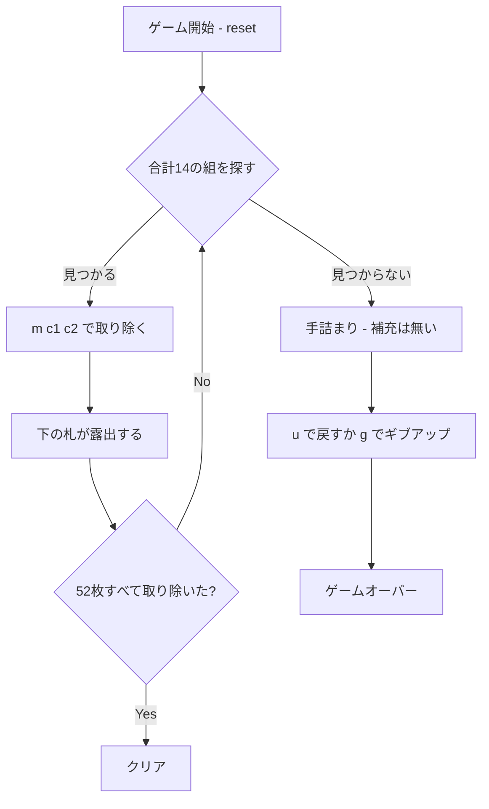

# フォーティーンアウト（CUI版）遊び方

## ゲーム概要

1人用のペア除去ソリティアです。52枚すべてを **12列** に配り、各列の**末尾（一番手前）の札だけ**を使って、**ランクの合計が14になる2枚**を取り除いていきます。52枚すべてを取り除ければクリアです。

**山札はありません。**52枚を最初に配り切るので、補充も配り直しもできません。合計14の組が作れなくなった時点で敗北です。

配りは 52 = 12×4 + 4 なので、**左から4列が5枚、残り8列が4枚**になります。

## 起動方法

```sh
go run ./cmd/trumpcards fourteenout
go run ./cmd/trumpcards --lang en fourteenout  # 英語モード
```

## ルール

### 基本ルール

- 52枚のトランプ（ジョーカーなし）を使用
- 起動時、**12列**に配り切る（列0〜3が5枚、列4〜11が4枚）
- **動かせるのは各列の末尾の札だけ**。その下の札は、上が取り除かれて初めて使える
- ペアになる条件は**ランクの合計が14**、ただそれだけ：
  - Aは1、J・Q・Kはそれぞれ11・12・13として数える
  - 成立する組は **K+A / Q+2 / J+3 / 10+4 / 9+5 / 8+6 / 7+7** の7通り
  - **スートは一切見ない**
  - **列が隣り合っている必要も無い**。列0と列11でも組める
- **K は A としか組めない**が、これは特別ルールではなく 13+1=14 という一般規則の結果です。K同士は26、Kと2は15で、どちらも14になりません
- **同ランクで組めるのは 7 と 7 だけ**です（7+7=14）

### ゲーム終了

- **クリア**: 全52枚を取り除いた状態
- **ゲームオーバー**: 露出している札のどの2枚も合計14にならない状態（手詰まり）。**補充する手段が無いので、そのまま敗北**です

## ゲームの流れ



## コマンド一覧

| コマンド | 短縮形 | 説明 |
|----------|--------|------|
| `remove <col1> <col2>` | `m` | 2つの列の末尾札を取り除く（合計14のときのみ。例: `m 0 3`） |
| `undo` | `u` | 直前の操作を1手だけ取り消す |
| `hint` | `h` | 取り除ける組を1つ表示する |
| `giveup` | `g` | ゲームを放棄する |
| `log` | `l` | 棋譜を表示する |
| `reset` | `r` | 新しいデッキでゲームを最初からやり直す |
| `quit` | `q` | 終了する |
| `help` | `?` | コマンド一覧を表示 |

## 画面の見方

実際の出力例です。配りは毎回シャッフルされるので、カードの並びは実行ごとに変わります。

```
==========
Fourteen Out (フォーティーンアウト)
==========
取り除いた枚数: 0/52
----------
列0: HEART 10 HEART 4 CLOVER 3 DIAMOND 3 HEART 5  ← HEART 5
列1: CLOVER 1 DIAMOND 13 SPADE 2 HEART 1 CLOVER 6  ← CLOVER 6
列2: DIAMOND 4 DIAMOND 2 CLOVER 4 HEART 13 HEART 2  ← HEART 2
列3: CLOVER 11 HEART 3 SPADE 13 CLOVER 13 HEART 6  ← HEART 6
列4: SPADE 5 HEART 9 CLOVER 2 SPADE 12  ← SPADE 12
...
列11: SPADE 7 CLOVER 8 DIAMOND 9 SPADE 3  ← SPADE 3
----------
除去可能: 5 組
==========
```

- **1〜3行目**: ゲーム名の見出し
- **取り除いた枚数**: 52枚中いくつ取り除いたか
- **列0〜11**: 各列のカード。**`←` の右が末尾＝いま使える札**です。`remove <col1> <col2>` に渡すのは列番号だけで、行の指定は要りません
- **除去可能**: いま作れる合計14の組の数。**0 になったら敗北が確定**しているので、そのときだけ色が変わります（ヒントや手詰まり判定と同じ数え方）
- **`列N: (空)`**: その列の札を出し切った状態。空いた列に札を置くことはできません

## 遊び方のコツ

- **同じ札が2通りの組に使える時が分かれ道です。**例えば場に 9 が1枚と 5 が2枚あるとき、どちらの 5 と組むかで、その下から出てくる札が変わります。配り直せないので、この選択がそのまま勝敗になります。
- **深い列を優先して掘る**と、選択肢が増えます。浅い列は最後に残しても手数が読めます。
- 7 は 7 としか組めません。場に 7 が奇数枚見えている状況は、どこかで詰む合図です。
- `h` は取り除ける組を1つ返すだけで、最善手を返すわけではありません。「除去可能」の数を見ながら、自分でどれを崩すか決めてください。
