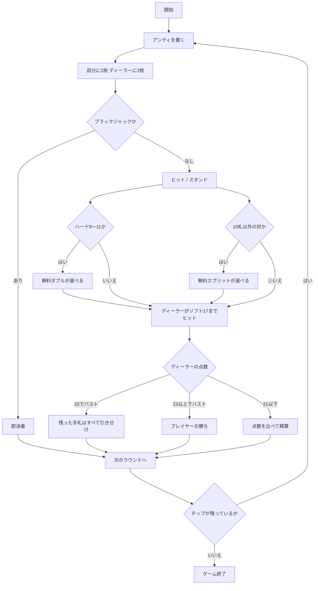

# フリーベット・ブラックジャック（CUI版）遊び方

## ゲーム概要

フリーベット・ブラックジャックは、**ダブルとスプリットの上乗せぶんをハウスが払ってくれる**ブラックジャック派生です。自分のチップは最初のアンティしか出しません。

ただしこれは取引です。その対価として、**ディーラーが 22 でバストしたときは引き分け**になります。勝てるはずだった手札が引き分けに変わる、という形でハウスが元を取ります。

**この 2 つは必ずセットで動きます。** 片方だけを思い浮かべると期待値の感覚が大きく狂うので、常に「ハウスが払う代わりに 22 は引き分け」と 1 つの規則として覚えてください。

## 起動方法

```sh
go run ./cmd/trumpcards freebet
```

英語で起動する場合:

```sh
go run ./cmd/trumpcards --lang en freebet
```

## ルール

- 標準 52 枚 × 6 組（312 枚）のシューを使います。
- アンティを置くと、プレイヤーに 2 枚、ディーラーに 2 枚配られます。
- **無料ダブル（`fd`）** は、最初の 2 枚が**ハード 9・10・11** のときだけ使えます。上乗せぶんはハウスが出し、1 枚だけ引いて打ち止めです。
  - 勝てば**自分の賭け金ぶんとハウスの出資ぶんの両方**に配当が付きます。
  - 負けても**失うのは最初の賭け金だけ**です。ハウスの出資は消えるだけで、あなたの損にはなりません。
  - ソフト（エースを 11 と数える形）は対象外です。
- **無料スプリット（`fs`）** は同じ数字 2 枚のときに使えます。ただし **10 点札の対（10・J・Q・K）は対象外**です。分けた手札の賭け金もハウス持ちです。
  - エースを割ったときは 1 枚ずつで打ち止めです。
- **ディーラーはソフト 17 でヒット**します。
- **ディーラーが 22 でバストしたら、残っている手札はすべて引き分け**です。23 以上のバストは普通どおりプレイヤーの勝ちになります。
  - 自分がバストしていたら、その手札はディーラーの 22 に関係なく負けです。
  - 22 の引き分けで戻るのは**自分が出した賭け金だけ**です。ハウスの出資ぶんに配当は付きません。
- **プレイヤーのブラックジャックは 3:2** のままです。

## ゲームの流れ



## コマンド一覧

| コマンド | 短縮形 | 説明 |
|----------|--------|------|
| `bet <額>` | `b` | アンティを置いて配る |
| `hit` | `h` | 1枚引く |
| `stand` | `s` | 打ち止めにする |
| `fd` | `freedouble` | 無料ダブル（ハード9〜11のときだけ） |
| `fs` | `freesplit` | 無料スプリット（10点札の対を除く） |
| `next` | - | 次のラウンドへ |
| `hint` | - | 助言を表示する |
| `log` | - | 棋譜を表示する |
| `reset` | `r` | ゲームをやり直す |
| `quit` | `q` | ゲームを終了する |
| `help` | - | ヘルプを表示する |

## 画面の見方

```
フェーズ: PLAY
ラウンド: 3（チップ: 850）
アンティ: 50
----------
ディーラー: ♠6 ♦9 = 15
*[1] ♥5 ♣5 = 10（賭け 50）
いま無料でできる操作: 無料ダブル / 無料スプリット
```

- **フェーズ**: `BET`（賭け）→ `PLAY`（プレイ）→ `RESULT`（決着）
- **手札行**: `*` が付いているのがいま操作している手札。スプリットすると `[1]` `[2]` と増えます
- **賭け 50 + ハウス 50**: 前が**自分の金**（負ければ失う額）、後ろが**ハウスの出資**（負けても失わない額）です。無料ダブル / 無料スプリットを使うと後ろが付きます
- **いま無料でできる操作**: サーバが判定した結果です。出ていないときはその手札では使えません

決着すると、ディーラーの全札と点数、手札ごとの勝敗、そのラウンドの収支が表示されます。収支は**自分が出した金だけ**で計算するので、ハウスの出資は損得に含まれません。

## 遊び方のコツ

- **無料ダブルと無料スプリットは、使えるなら基本的に使います。** 上乗せぶんを失うことがないので、勝ち目が五分を割っていても損になりません。ヒントもこの方針で助言します。
- **9・10・11 でしかダブルできない**点に注意してください。普通のブラックジャックでダブルするソフトハンドは対象外です。
- **10 点札の対は割れません。** 20 という完成した手を無料で 2 つに増やせてしまうと有利すぎるためです。
- **ディーラーの 22 が引き分けになる**ぶん、自分からバストしにいく手はいつもより損です。ディーラーが弱いアップカードのときは、無理に追いかけず立つほうが有利になります。
