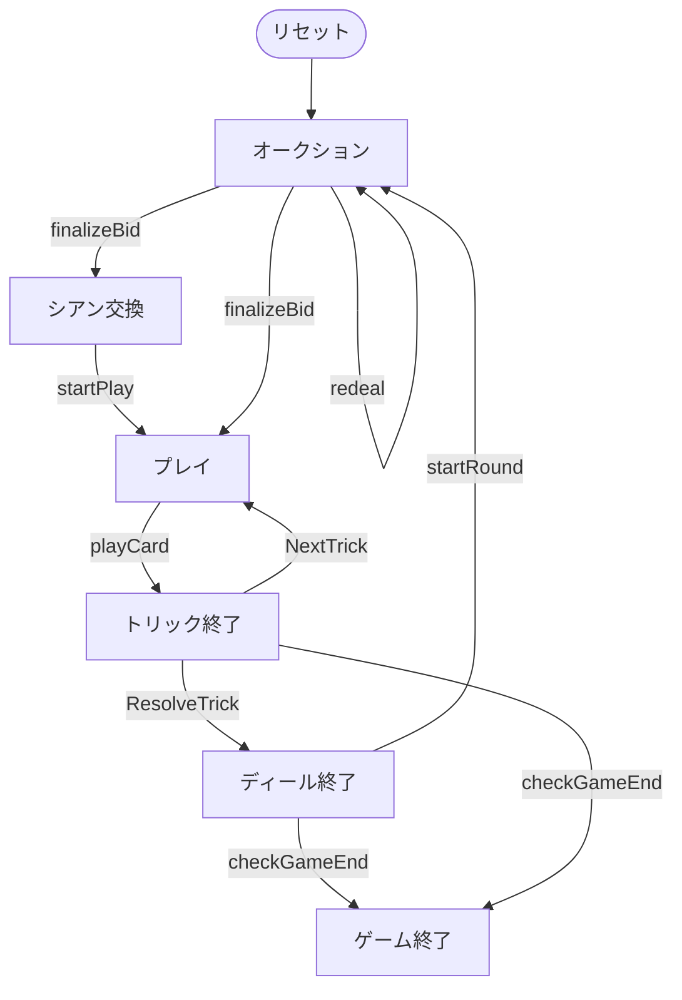

# フレンチタロット（CUI版）遊び方

## ゲーム概要

French Tarot（フレンチタロット）はフランスの4人用**トリックテイキングゲーム**です。78枚のタロットデッキ（4スート × 14枚、切り札21枚、エクスキューズ）を使い、あなた（プレイヤー0）はオークションに参加します。最高入札者が**デクレアラー（declarer）**となり、残り3人のCPUからなる**防御側（defenders）**と対戦します。契約の成否とウードラーの枚数で得点が決まります。

## 起動方法

```sh
go run ./cmd/trumpcards frenchtarot
go run ./cmd/trumpcards --lang en frenchtarot  # 英語モード
```

## ルール

### デッキと配布

- **デッキ**: 78枚。
  - **スート札**: ♠♥♦♣ の4スート × 各14枚（1〜10、V/C/D/R）。
  - **切り札**: 番号1〜21の21枚。数字が大きいほど強い。
  - **エクスキューズ**: 特殊札1枚。
- **プレイヤー**: 4人（プレイヤー0 = あなた、CPU1〜3）。各18枚。
- **シアン（chien）**: 場に伏せた6枚。

### ウードラー（bouts）

**切り札1・切り札21・エクスキューズ**の3枚がウードラー。デクレアラーが持つ枚数で契約成功に必要な得点が変わります（3枚=36点／2枚=41点／1枚=51点／0枚=56点）。

### オークション（入札）

パスするか、より高いコントラクトを宣言します。

- **プティット（Petite, ×1）**: シアンを公開・交換。
- **ガルド（Garde, ×2）**: シアンを公開・交換。
- **ガルド・サン（Garde Sans, ×4）**: シアンは非公開でデクレアラー側。
- **ガルド・コントル（Garde Contre, ×6）**: シアンは防御側。

全員パスなら再配札。最高入札者がデクレアラーです。

### シアン交換（エカルト）

プティット／ガルドのデクレアラーは、公開されたシアン6枚を手札に加え、6枚を伏せて捨てます。**キングとエクスキューズは捨てられません。**

### プレイ

リードスートにマストフォロー。フォローできなければ切り札を出し、それも無ければ任意の札。最も高い切り札（無ければリードスートの最高札）がトリックを取ります。エクスキューズはトリックを取れず自分の側に残ります。

### 得点

デクレアラーが必要点に達すれば成功、届かなければ失敗。基礎点にコントラクト倍率（×1〜×6）を掛け、デクレアラー（±3倍）と各防御側（∓1倍）でやり取りします。規定ディール後に累計得点が最多のプレイヤーが勝者です。

## ゲームの流れ

ゲームの進行は `internal/domain/FrenchTarot.go` のフェーズ機械そのものです。各ノードは同ファイルの `FrenchTarotPhase` 定数、矢印ラベルはその遷移を行うメソッド名です。



## コマンド一覧

| コマンド | 短縮形 | 説明 |
|----------|--------|------|
| `bid petite` |  | コントラクトを宣言 |
| `pass` |  | オークションでパス |
| `discard <i1> <i2> <i3> <i4> <i5> <i6>` |  | エカルトで6枚を捨てる |
| `play <idx>` | `p` | カードをプレイ |
| `next` | `n` | 次のトリックへ |
| `nextround` | `nr` | 次のディールへ |
| `hint` | `h` | ヒントを表示 |
| `reset` | `r` | ゲームをリセット |
| `quit` | `q` | 終了 |
| `help` | `?` | コマンド一覧を表示 |

## 画面の見方

実際の出力例です。配りは毎回シャッフルされるので、カードの並びは実行ごとに変わります。

```
==========
フレンチタロット
==========
ディール: 1  トリック: 0  コントラクト: -
あなた (防御側): 18 枚  得点: 0  トリック: 0
[0]♠1  [1]♠7  [2]♠10  [3]♠R  [4]♣1  [5]♣8  [6]♣C  [7]♣R  [8]♥2  [9]♥7  [10]♦10  [11]T6  [12]T8  [13]T10  [14]T11  [15]T17  [16]T18  [17]T20
CPU 1 (防御側): 18 枚  得点: 0  トリック: 0
CPU 2 (防御側): 18 枚  得点: 0  トリック: 0
CPU 3 (防御側): 18 枚  得点: 0  トリック: 0
----------
オークション — 手番: あなた  (最高: プティット)
bid petite|garde|gardesans|gardecontre ... 入札  |  pass ... パス
契約倍率: プティット×1 / ガルド×2 / ガルド・サン×4 / ガルド・コントル×6（現在の最高ビッドを上回る契約のみ入札可）
==========
```

- **1〜3行目**: ゲーム名の見出し
- **ディール / トリック**: 進行状況
- **プレイヤー行**: 各席の残り手札枚数と獲得状況
- **`[i]` 付きの行**: あなたの手札。`play <idx>` の `<idx>` はこの番号。`T1`〜`T21` が切り札、`Excuse` は特殊札
- **`----------` の下**: 現在のフェーズ・手番と、そのフェーズで打てるコマンド
