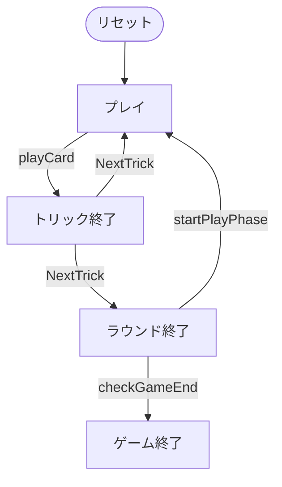

# ガイゲル（CUI版）遊び方

## ゲーム概要

Gaigel（ガイゲル）はドイツ・シュヴァーベン地方の伝統的なトリックテイキングゲームで、シュナプセン（66）の系統に属します。48枚デッキ（A,10,K,Q,J,7 を各2枚ずつ）を使って4人2チームで対戦し、山札（タロン）から補充しながらプレイします。K+Q のマリッジ宣言でボーナス点を獲得し、先に101点に達したチームが勝利します。

## 起動方法

```sh
go run ./cmd/trumpcards gaigel
go run ./cmd/trumpcards --lang en gaigel  # 英語モード
```

## ルール

### 基本ルール

- プレイヤーは4人（人間1 + CPU3）。プレイヤー0と2、プレイヤー1と3が同チーム（人間はプレイヤー0）。
- 48枚デッキ（A,10,K,Q,J,7 × 4スート × 2枚）を使用。各プレイヤーに5枚配り、残りは山札（タロン）に。

### 2つのフェーズ

1. **フェーズ1（山札あり）**: フォローは任意。各トリック後に山札から手札が5枚になるよう補充する。
2. **フェーズ2（山札なし）**: 厳格なフォロー義務（マストフォロー）が発生する。

### マリッジ

リード時に同一スートの K+Q を持っていれば「マリッジ」を宣言し、自チームに20点（切り札なら40点）を加算できる。

### カード点とトリックの強さ

- カード点: A=11, 10=10, K=4, Q=3, J=2, 7=0
- トリックの強さ: A > 10 > K > Q > J > 7

### 勝敗

各ラウンドのカード点＋マリッジ点を累計し、先に101点（変更可）に達したチームが勝利。

## ゲームの流れ

ゲームの進行は `internal/domain/Gaigel.go` のフェーズ機械そのものです。各ノードは同ファイルの `GaigelPhase` 定数、矢印ラベルはその遷移を行うメソッド名です。



## コマンド一覧


| コマンド | 短縮形 | 説明 |
|----------|--------|------|
| `play <idx>` | `p` | カードをプレイ |
| `marriage <idx>` | `m` | マリアージュ宣言 (K/Q をリード) |
| `next` | `n` | 次のトリックへ |
| `nextround` | `nr` | 次のラウンドへ |
| `log` | `l` | action log |
| `setdifficulty [0-2]` | `sd` | CPU難易度 (0=易, 1=普通, 2=難) |
| `settarget <n>` | `st` | 目標スコア (デフォルト101) |
| `hint` | `h` | ヒントを表示 |
| `reset` | `r` | 新しいゲームを開始 |
| `quit` | `q` | ゲーム終了（`exit` も同じ） |
| `help` | `?` | コマンド一覧を表示 |

## 画面の見方

実際の出力例です。配りは毎回シャッフルされるので、カードの並びは実行ごとに変わります。

```
==========
ガイゲル
==========
ラウンド: 1  トリック: 1
ディーラー: あなた
切り札: DIAMOND（表示カード: DIAMOND 11） (山札: 27)
チーム0: 0  チーム1: 0
あなた: チーム 0 トリック=0 手札=5
[0]SPADE 7  [1]SPADE 13  [2]CLOVER 7  [3]DIAMOND 11  [4]DIAMOND 12
CPU 1: チーム 1 トリック=0 手札=4
CPU 2: チーム 0 トリック=0 手札=4
CPU 3: チーム 1 トリック=0 手札=4
----------
トリック: CPU 1=CLOVER 7, CPU 2=CLOVER 12, CPU 3=SPADE 11
あなた の番です
p <i> (プレイ) / m <i> (マリアージュ)
==========
```

- **1〜3行目**: ゲーム名の見出し
- **ラウンド / トリック**: 進行状況
- **切り札**: そのラウンドの切り札スートと、それを決めた表向きのカード（山札の最後の1枚として引かれる）。山札が尽きて引かれた後はスートのみ
- **山札**: 残り枚数。尽きるとフォロー義務が発生する
- **プレイヤー行**: 各席の得点と残り手札枚数
- **`[i]` 付きの行**: あなたの手札。`play <idx>` の `<idx>` はこの番号
- **`----------` の下**: 場に出ているカードと手番
