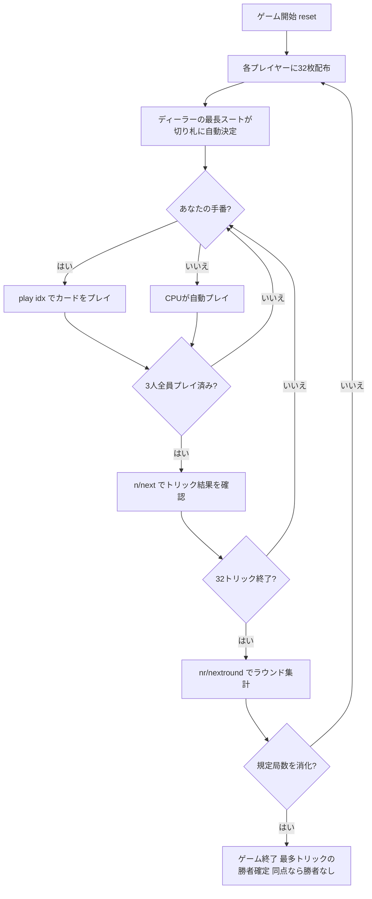

# ガンジファ（CUI版）遊び方

## ゲーム概要

Ganjifa（ガンジファ）はムガル帝国期のインドで遊ばれていたトリックテイキングゲームです。8スート × 1〜12 の円形96枚デッキを3人でプレイします。このゲームを他と分けているのは **スート群でランクの向きが逆転する** ことに尽きます。

- **強いスート群**（design 1〜4 / Taj・Shamsher・Ashrafi・Ghulam）: 数字が**大きい**ほど強い（12 が最強、1 が最弱）
- **弱いスート群**（design 5〜8 / Chang・Surkh・Barat・Qimash）: 数字が**小さい**ほど強い（1 が最強、12 が最弱）

同じ「3」が、強い群では下から3番目、弱い群では上から3番目になります。**生の数字で比べるとデッキの半分で答えが逆になる**ため、比較は必ずこの群を踏まえて行います。

入札はありません。切り札はディーラーの手札で最も枚数の多いスートが局ごとに自動で決まり、3人が対等に32トリックを競います。規定局数（デフォルト**3局**）を終えた時点で累計トリック数が最大のプレイヤーが勝者です。同点なら勝者なしとなります。

## 起動方法

```sh
go run ./cmd/trumpcards ganjifa
go run ./cmd/trumpcards --lang en ganjifa  # 英語モード
```

## ルール

### デッキと配布

- **デッキ**: 96枚（8スート × 1〜12）
- **プレイヤー**: 3人（プレイヤー0 = あなた、プレイヤー1〜2 = CPU）
- **配布**: 各プレイヤー32枚、1ラウンド32トリック（山札に残る札はありません）

### カードの強さ

| スート群 | design | 最強 → 最弱 |
|----------|--------|-------------|
| 強い群 | 1〜4 | 12 → 11 → 10 → … → 2 → 1 |
| 弱い群 | 5〜8 | 1 → 2 → 3 → … → 11 → 12 |

同じスート内での比較にのみこの順序が使われます。異なるスート同士の強弱は、切り札とリードスートによって決まります（後述）。

### 切り札

- 各ラウンドの開始時に、**ディーラーの手札で最も枚数の多いスート**が自動的に切り札になります。入札も宣言もありません。
- 切り札が強い群か弱い群かによって、その局の読み方が変わります。画面には毎フレーム、切り札がどちらの群かが1行で表示されます。

### トリック・テイキング

- **スートフォロー義務**: リードされたスートのカードを持っている場合は必ず出さなければなりません。
- 持っていない場合は任意のカードを出せます（切り札でも他スートでも可）。
- **トリックの勝者**:
  - 切り札スートのカードが場にあれば、最も強い切り札カードが勝ちます。
  - 切り札がなければ、リードスートの最も強いカードが勝ちます。
  - いずれの「最も強い」も、上表の**群を踏まえた順序**で判定されます。
- トリックの勝者が次のトリックをリードします。

### 得点計算と勝利条件

- **1トリック = 1点**。取ったトリック数がそのまま得点になります。
- 規定局数（デフォルト**3局**）を終えた時点で、累計得点が最大のプレイヤーが勝者です。
- **同点の場合は勝者なし**となります。

## ゲームの流れ



## コマンド一覧

| コマンド | 短縮形 | 説明 |
|----------|--------|------|
| `play <idx>` | — | 手札のidx番目のカードを出す（プレイフェーズ） |
| `next` | `n` | 次のトリックへ進む（トリック終了後） |
| `nextround` | `nr` | 次のラウンドへ進む（32トリック終了後） |
| `setdifficulty <0-2>` | `sd <0-2>` | CPU難易度設定（0=Easy, 1=Normal, 2=Hard・ゲームはリセットされます） |
| `hint` | `h` | ヒントを表示 |
| `log` | `l` | アクションログを表示 |
| `reset` | `r` | 新しいゲームを開始（設定保持） |
| `quit` | `q` | ゲーム終了 |
| `help` | `?` | コマンド一覧を表示 |

入札は存在しないため、`bid` / `pass` コマンドはありません。

## 画面の見方

```
==========
ガンジファ コマンド一覧
==========
ラウンド: 1  トリック: 1  切り札: ♛ Taj
切り札は強い群 — 数字が大きいほど強い
You: 32枚  得点: 0  トリック: 0
[0]♛ Taj 12  [1]♪ Chang 1  [2]† Shamsher 7  ...
CPU1: 32枚  得点: 0  トリック: 0
CPU2: 32枚  得点: 0  トリック: 0
----------
手番: You
play <idx>・・・カードを出す（リードスートにマストフォロー／強さの向きは切り札の群による）
```

- **切り札行**: 現在の切り札スートを記号と名前で表示します。
- **群の行**: いま手札をどちらの向きで読むべきかを示します。**この1行がないと手札の並びを読み違えます。**
- **`[n]`付き行**: あなたの手札（インデックス付き）。各札は「記号 スート名 数字」の形式です。
- **プレイヤー行**: 手札枚数・累計得点・このラウンドで取ったトリック数。
- **トリック勝者行**: トリック終了時に「〈名前〉 がトリックを獲得」と表示します。取ったプレイヤーが次のリードになります。

## 遊び方のコツ

- **まず群を確認する**: 手札を見る前に切り札がどちらの群かを確認してください。強い群なら12が、弱い群なら1が最強札です。この確認を飛ばすと、最強札を最弱札と勘違いして捨ててしまいます。
- **弱い群の1と2は隠れたエース**: 数字が小さいので見落としがちですが、弱いスートの1は同スートの最強札です。手札の「小さい数字」がどのスートに属しているかを常に意識しましょう。
- **切り札の枚数を数える**: 切り札はディーラーの最長スートなので、ディーラーが切り札を多く持っています。あなたがディーラーでない局では切り札の勝負を早めに仕掛けず、切り札を持たないスートでの取り合いを優先する方が安全です。
- **マストフォローを利用して相手の手札を読む**: 誰かがリードスートを出せなかったら、そのプレイヤーはそのスートを切らしています。32トリックは長いので、序盤に判明したボイド情報が終盤で効いてきます。
- **1トリック1点なので大きな博打は不要**: 契約もペナルティもありません。取れるトリックを堅実に積む方が、一発逆転を狙うより有利です。取れないトリックには最弱札（強い群なら1、弱い群なら12）を捨てましょう。
- **ヒントは群を考慮済み**: `hint` が示す札は、群の反転を踏まえた強弱で選ばれています。判断に迷ったら、まずヒントで自分の読みと突き合わせてみてください。
