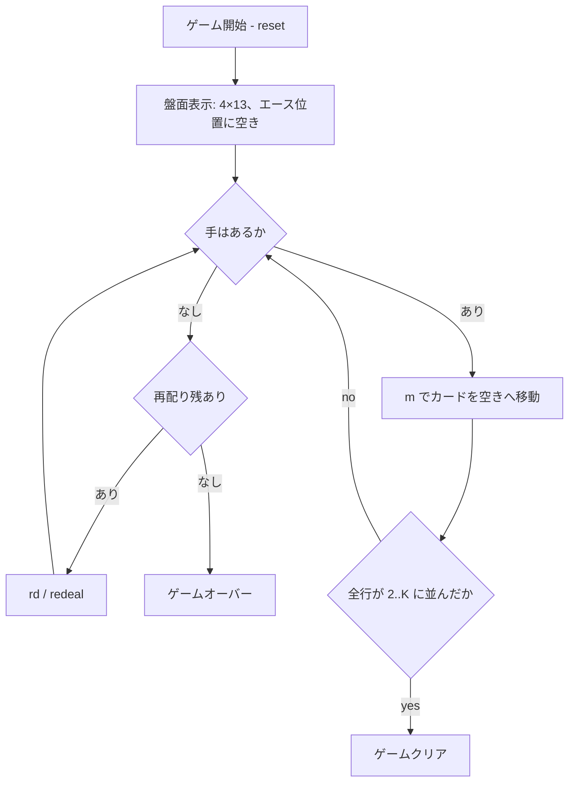

# ギャップス（CUI版）遊び方

## ゲーム概要

Gaps（別名 Montana / Addiction）は、52 枚を 4 行 × 13 列の盤面に表向きに配り、4 枚のエースを抜いて生まれた「空き（gap）」を埋めながら、各行を同じスートの 2〜K の昇順に並び替えるパズル系ソリティアです。

## 起動方法

```sh
go run ./cmd/trumpcards gaps
go run ./cmd/trumpcards --lang en gaps  # 英語モード
```

## ルール

### 基本ルール

- 52 枚を 4 行 × 13 列のグリッドに表向きで配ります。
- すべてのエース（A）を抜き取り、4 つの空きセルを作ります。
- 空きセルにカードを「スライド」させて、各行が `2,3,4,…,K` の昇順 (1 行は 1 スート) になれば勝利です。

### 移動ルール

- 空きセルの左隣にあるカードと「同じスートで +1 のランクのカード」だけを、そのセルへ動かせます。
- 行の左端 (列 0) の空きセルには、任意のスートの「2」だけを置けます (各行のチェーン開始点)。
- 空きセルの左隣が K の場合、そのセルは「死に枠」となり何も置けません (チェーンが終端しているため)。

### 再配り (Redeal)

ゲーム中に手詰まりになった場合、最大 3 回まで再配りができます。各行で左端から続いている「正しく並んだ接頭辞」(2 から始まる同スート連番) はそのまま残り、それ以降のセルをすべて回収・シャッフルした上で再配置します。再配り直後は、各行のロック済み接頭辞の直後が空きセルになります。

### 終了条件

- **ゲームクリア**: 4 行すべてが `2..K` の昇順かつ同スートになったとき。
- **ゲームオーバー**: 再配りを使い切り、かつ動かせるカードが 1 枚もなくなったとき。`g` (giveup) でも終了できます。

## ゲームの流れ



## コマンド一覧

| コマンド | 短縮形 | 説明 |
|----------|--------|------|
| `move <fr> <fc> <tr> <tc>` | `m` | (fr,fc) のカードを空き (tr,tc) へ移動 |
| `redeal` | `rd` | 残ったカードを再配り (最大 3 回) |
| `undo` | `u` | 直前の操作を取り消す |
| `hint` | `h` | 次に打てる手を 1 つ表示 |
| `giveup` | `g` | ギブアップしてゲーム終了 |
| `log` | `l` | 棋譜を表示 (ゲーム終了後) |
| `reset` | `r` | 新しいゲームを開始 |
| `quit` | `q` | ゲーム終了 |
| `help` | `?` | コマンド一覧を表示 |

## 画面の見方

```
==========
Gaps / Montana (ギャップス)
==========
 (0,0)[2♠] (0,1)[ . ] (0,2)[4♠] ... (0,12)[K♣]
 (1,0)[3♥] (1,1)[2♣] (1,2)[ . ] ... (1,12)[8♦]
 (2,0)[7♦] (2,1)[Q♠] (2,2)[5♥] ... (2,12)[ . ]
 (3,0)[ . ] (3,1)[J♥] (3,2)[3♦] ... (3,12)[5♠]
----------
再配り 0/3 (残り3)
----------
手数: 0
```

- `[2♠]` のような表示は `(row,col)` の位置にあるカードのスートとランク。
- `[ . ]` は空き (gap)。
- 末尾の `再配り x/3` は使用済みの再配り回数と残り回数。

## 遊び方のコツ

- 各行の左端を 2 から並べて固めると、再配り時に長いロック接頭辞が残り、ゲームが進めやすくなります。
- 空きセルの左隣が K になると死に枠です。K を盤面右端へ追いやらないよう優先順位に注意してください。
- 手詰まりを感じたら早めに `redeal` を切り、長いロック列を維持する戦略が有効です。
