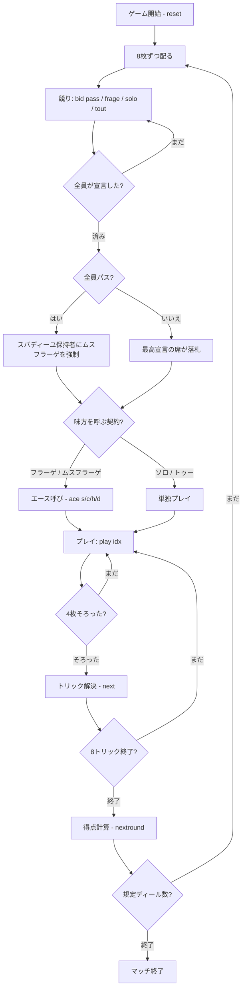

# ジャーマン・ソロ（CUI版）遊び方

## ゲーム概要

German Solo（ジャーマン・ソロ）は、スペインのオンブル → フランスのカドリールと伝わった「ソリスト対多数」系トリックテイキングの**ドイツ版**です。32枚のスカート・パック（A・K・Q・J・10・9・8・7）を4人に8枚ずつ配り切り、競りで契約を取った1人（味方を呼ぶ場合は2人）が8トリック中の規定数を取れば成功。既定5ディールを終えた時点で累積点が最も高い席が勝者です。

## 起動方法

```sh
go run ./cmd/trumpcards germansolo
go run ./cmd/trumpcards --lang en germansolo  # 英語モード
```

## ルール

### デッキと配り

- 標準52枚から2〜6を抜いた**32枚**（各スート A・K・Q・J・10・9・8・7）。
- 4人（あなた + CPU 3人）に**8枚ずつ**配り切ります。山札は残りません。
- 8枚 = 8トリック。ディーラーの左隣（forehand）が最初に宣言し、最初のトリックもリードします。

### 三大マタドール（常時最強の切り札3枚）

切り札スートが何であっても、次の3枚が上から順に最強の切り札です。

| 順位 | 名前 | カード |
|------|------|--------|
| 1 | スパディーユ (Spadille) | ♣Q |
| 2 | マニーユ (Manille) | 切り札スートの 7 |
| 3 | バスタ (Basta) | ♠Q |

**黒の2枚のクイーンは常に切り札**なので、♠や♣が平札のときそのスートにQは現れません。切り札スートの残りは A > K >（Q）> J > 10 > 9 > 8 で、Qが普通の切り札として残るのは切り札が赤（♥♦）のときだけです。したがって切り札は赤なら10枚、黒なら9枚。平札は A > K > Q > J > 10 > 9 > 8 > 7 です。

### 競り（ビッド）

各席が1回ずつ、パスするか契約を宣言します。宣言は現在の最高宣言を**厳密に上回る**必要があります。

| 契約 | 単独／味方 | 必要トリック | 契約値 |
|------|------------|--------------|--------|
| ムスフラーゲ (Mussfrage) | 味方あり | 5 | 1 |
| フラーゲ (Frage) | 味方あり | 5 | 2 |
| ソロ (Solo) | 単独 | 5 | 4 |
| トゥー (Tout) | 単独 | **8** | 8 |

- **ムスフラーゲは宣言できません。** 全員がパスしたとき、スパディーユ（♣Q）を持つ席に強制されます。配り直しにすると、CPUがビッドしない手を引き続ける限りディールが終わらないためです。
- フラーゲ／ムスフラーゲでは**エース呼び**フェーズに入ります。落札者は「自分が持っていない・切り札スートでない」エースを1枚指名し、そのエースを持つ席が味方になります。切り札のエースを呼べないのは、それが上から4番目の切り札で、味方探しではなく切り札の補充になってしまうからです。
- 呼ばれたエースが場に出るまで、**誰が味方かは伏せられます**。
- 落札者が呼べるエースを1枚も持っていない盤面では、フラーゲのまま単独で戦います。

### プレイ

- forehand がリードし、以降は前のトリックの勝者がリードします。
- **マストフォロー**。三大マタドールと切り札スートは「1つの切り札グループ」として扱うので、切り札がリードされたら♣Q・♠Q・切り札の7も含めて従う義務があります。
- 切り札が出ていればその中の最強札、出ていなければリードスートの最強札がトリックを取ります。

### 得点

契約値 V が宣言側と守備側の間でゼロ和に動きます。

- **成功**: 守備側の各席が V を失い、その合計を宣言側で山分け（単独なら +3V、味方ありなら1人あたり +V）。
- **失敗**: 符号が反転します。

規定ディール数（既定5）を終えた時点で累積点が最上位の席が勝者です。

### CPU難易度

`sd 0`（Easy: ランダムプレイ・常にパス）／`sd 1`（Normal）／`sd 2`（Hard）。Easy では全員がパスするため、ムスフラーゲが発生します。

## ゲームの流れ



## コマンド一覧

| コマンド | 短縮形 | 説明 |
|----------|--------|------|
| `reset` | `r` | 新しいゲームを開始 |
| `quit` | `q` | ゲーム終了 |
| `help` | `?` | コマンド一覧を表示 |
| `bid pass` | `bid p` | 競りから降りる |
| `bid frage <s\|c\|h\|d>` | `bid f <s>` | フラーゲを宣言（切り札を指定、味方を呼ぶ） |
| `bid solo <s\|c\|h\|d>` | `bid s <s>` | ソロを宣言（単独で5トリック） |
| `bid tout <s\|c\|h\|d>` | `bid t <s>` | トゥーを宣言（単独で8トリック） |
| `ace <s\|c\|h\|d>` | `a <s>` | 味方を呼ぶエースを指名（エース呼びフェーズ） |
| `play <idx>` | — | 手札の idx 番のカードを出す |
| `next` | `n` | 次のトリックへ |
| `nextround` | `nr` | ディールを精算して次のディールへ |
| `setdifficulty <0-2>` | `sd <0-2>` | CPU難易度を変更（ゲームはリセット） |
| `hint` | `h` | 推奨アクション／カードを表示 |
| `log` | `l` | 棋譜を表示 |

## 画面の見方

```
==========
ジャーマン・ソロ
==========
ディール: 1  トリック: 3  切り札: ハート
契約: ソロ（必要 5 トリック）  宣言側 2 - 守備側 0
エース呼び: 単独プレイ（味方なし）
あなた (宣言者): 6枚  得点: 0  トリック: 2
[0]CLOVER 12(スパディーユ)  [1]HEART 7(マニーユ)  [2]HEART 1  [3]SPADE 13  [4]DIAMOND 10  [5]DIAMOND 8
CPU 1 (守備): 6枚  得点: 0  トリック: 0
CPU 2 (守備): 6枚  得点: 0  トリック: 0
CPU 3 (守備): 6枚  得点: 0  トリック: 0
----------
場: CPU 1: DIAMOND 13
----------
手番: あなた  切り札: ハート
play <idx>・・・カードを出す（切り札 スパディーユ(♣Q)>マニーユ(切り札の7)>バスタ(♠Q)>A>K>Q>J>10>9>8／マストフォロー）
==========
```

- **契約行**: 確定した契約と必要トリック数、宣言側と守備側の獲得トリック数。トゥーだけ必要数が8です。
- **エース呼び行**: 未指名／呼ばれたエース（持ち主は伏せられる）／公開後の味方名／単独プレイのいずれか。
- **手札**: `[索引]スート ランク` の形式。三大マタドールには `(スパディーユ)` のように注記が付きます（切り札が確定してから）。
- **役柄**: 宣言者／守備／味方。味方は呼ばれたエースが場に出るまで「守備」に見えます。

## 遊び方のコツ

- **マタドールを数える。** ♣Q・切り札の7・♠Qの3枚は誰が切り札を選んでも最強です。この3枚を持っていれば、切り札が短くてもソロが視野に入ります。
- **呼ぶエースは手札に少ないスートから。** 自分で取れないスートほど、味方に持たせる価値があります。
- **トゥーは1枚も落とせません。** 切り札序列の上から連続した8枚でない限り、どこかで必ず1トリック落ちます。5トリック取れる手でも、8トリックはまったく別の要求です。
- **守備側は温存する。** 宣言側を5トリックに届かせなければ勝ちなので、無理に取りに行くよりも、宣言側が取れないトリックを確実に残す方が効きます。
