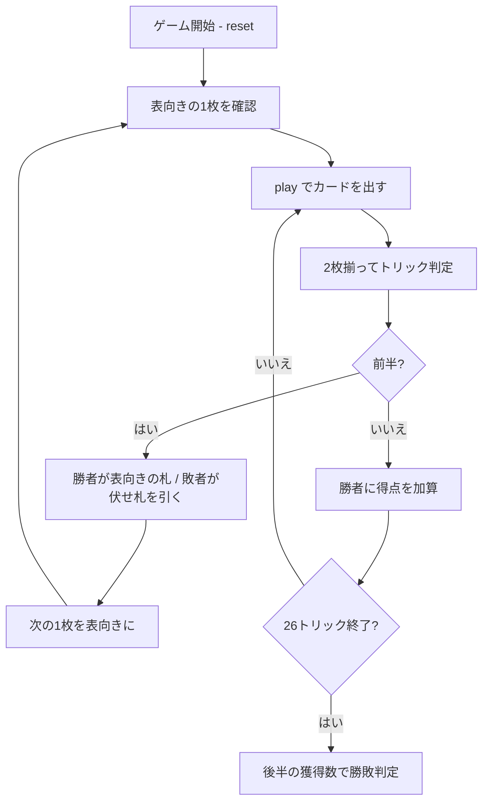

# ジャーマンホイスト（CUI版）遊び方

## ゲーム概要

2人用のトリックテイキング。**26トリックを前半13・後半13に分け、得点になるのは後半だけ**。前半は場に表向きで置かれた1枚を奪い合うためのトリックで、勝っても点にならない。イギリスで19世紀から遊ばれている、ホイスト系でもっとも有名な2人用の形。

## 起動方法

```sh
go run ./cmd/trumpcards germanwhist
go run ./cmd/trumpcards --lang en germanwhist  # 英語モード
```

## ルール

### 配り方と切り札

- 52枚。各プレイヤーに **13枚**ずつ配る
- 次の1枚を**表向き**にして場に置く。**この札のスートが、そのハンド全体の切り札**
- 残り **25枚**が山札

### 前半（13トリック・得点にならない）

- リードは自由。**リードのスートを持っていれば必ずそれを出す**（フォロー義務）
- 切り札があれば切り札が勝つ。無ければリードのスートの最強札が勝つ
- **勝者が表向きの1枚を取り、敗者は山札の次の1枚を伏せたまま引く**
- その次の1枚を新たに表向きにする
- **このトリックは1点にもならない。** 表向きの札が欲しくなければ**わざと負けるのが定石**

### 後半（13トリック・ここだけが得点）

- 山札が尽きると、双方13枚を持った状態で後半が始まる
- フォロー義務は同じ
- **取ったトリックがそのまま得点。** 13は奇数なので引き分けにならない
- 7トリック以上取ったほうが勝ち

## ゲームの流れ



## コマンド一覧

| コマンド | 短縮形 | 説明 |
|----------|--------|------|
| `play <idx>` | `p` | 手札の `<idx>` 番目のカードを出す |
| `hint` | `h` | 打つべき札とその狙いを表示する |
| `giveup` | `g` | 投了する |
| `log` | `l` | 棋譜（アクションログ）を表示する |
| `reset` | `r` | 最初からやり直す |
| `quit` | `q` | 終了する |
| `help` | `?` | コマンド一覧を表示 |

## 画面の見方

```
==========
German Whist (ジャーマンホイスト)
==========
トリック: 3/26  山札: 21枚  (前半: 表向きの札を取り合う (得点にならない))
切り札: ハート
表向きの札 (勝者が獲得): ♥A
あなた: 獲得2トリック 得点0 手札13枚
  [0]♠3 [1]♠9 [2]♠K [3]♣5 ...
CPU: 獲得0トリック 得点0 手札13枚
----------
手番: あなた
play <idx>・・・カードを出す
```

- **1行目のヘッダー**: 何トリック目か、山札の残り、そして**前半か後半か**
- **切り札**: 最初に表向きになった札のスート。ハンド中は変わらない
- **表向きの札**: このトリックの勝者が取る1枚。後半に入ると「なし」になる
- **得点**: **後半に取ったトリック数だけ**。前半にいくら勝っても0のまま
- **`[n]`**: `play <n>` で指定する手札の番号

## 遊び方のコツ

- **前半の勝ち負けそのものには意味がない。** 見えている1枚が欲しいときだけ取りに行く
- **要らない札なら、わざと安い札で負ける。** 相手に無価値な札を押し付けつつ、自分は伏せ札を引ける
- **狙うのはA・K・切り札。** 表向きの札がこれらなら、多少高い札を使ってでも取る価値がある
- **切り札は後半まで温存する。** 前半で切り札を使い切ると、点になる13トリックで何もできなくなる
- **後半に入る時点の手札がすべて。** 前半は「後半用の手札を作る13トリック」だと考える
- `hint` は前半と後半で狙いが変わる。「取りに行く」のか「わざと負ける」のかを言葉で示す
