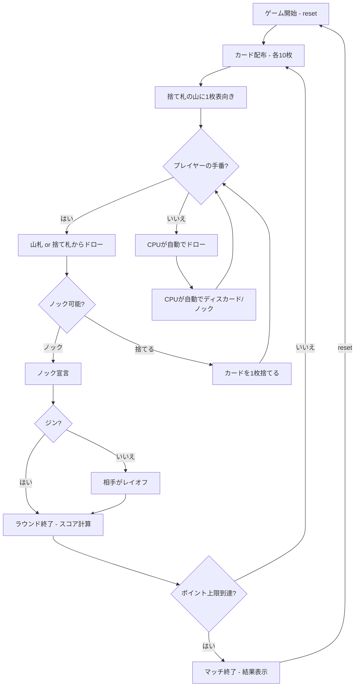

# ジンラミー（CUI版）遊び方

## ゲーム概要

2人（プレイヤー1人 + CPU 1人）で遊ぶカードゲームです。手札のカードでメルド（セットやラン）を作り、デッドウッド（メルドに含まれないカード）の合計点を減らします。ポイント上限（デフォルト100点）に先に達したプレイヤーが敗北します。

## 起動方法

```sh
go run ./cmd/trumpcards ginrummy
go run ./cmd/trumpcards --lang en ginrummy  # 英語モード
```

## ルール

### 基本ルール

- 52枚のトランプを使用、2人プレイ
- 各プレイヤーに10枚ずつ配り、1枚を表向きにして捨て札の山を開始、残りは山札（ストック）
- 手番ではまず山札または捨て札の山からカードを1枚ドローする
- その後、手札からカードを1枚捨てるか、ノックする

### メルドとデッドウッド

- **メルド**: セット（同ランク3〜4枚）またはラン（同スート3枚以上の連番）
- **デッドウッド**: メルドに含まれない手札の合計点（J/Q/K=10点、A=1点、その他=額面）

### ノック・ジン・アンダーカット

- **ノック**: デッドウッド合計が10以下の時にノック可能。相手はノッカーのメルドにレイオフ（カードを付け足す）できる
- **ジン**: デッドウッド0でノック。25点ボーナス。相手はレイオフ不可
- **アンダーカット**: 相手のデッドウッドがノッカー以下の場合、相手に25点ボーナス

### ゲーム終了

- ポイント上限（デフォルト100点）に達したプレイヤーが出たらマッチ終了

### CPU難易度

- **Easy** (0): ランダムにカードを出す
- **Normal** (1): 基本的なメルド戦略（デフォルト）
- **Hard** (2): 戦略的なプレイ（相手の捨て札を分析等）

## ゲームの流れ



## コマンド一覧

| コマンド | 短縮形 | 説明 |
|----------|--------|------|
| `reset` | `r` | ゲームリセット（設定保持） |
| `drawstock` | `ds` | 山札から1枚ドロー |
| `drawdiscard` | `dd` | 捨て札の山から1枚ドロー |
| `discard <idx>` | `d <idx>` | カードを捨てる（インデックス指定） |
| `knock` | `k` | ノック（デッドウッド≤10の時） |
| `layoff <idx...>` | `lo <idx...>` | レイオフ（相手のメルドにカードを付け足す） |
| `nextround` | `nr` | ラウンドをスコアリングして次のラウンドへ |
| `setdifficulty <0-2>` | `sd <0-2>` | CPU難易度設定（0=Easy, 1=Normal, 2=Hard） |
| `setlimit <n>` | `sl <n>` | ポイント上限設定 |
| `log` | `l` | 棋譜表示 |
| `quit` | `q` | ゲーム終了 |
| `help` | `?` | ヘルプ表示 |

### コマンド例

- `ds` → 山札から1枚ドロー
- `dd` → 捨て札の山からトップカードをドロー
- `d 3` → インデックス3のカードを捨てる
- `k` → ノック（デッドウッド≤10の時）
- `lo 0 3` → インデックス0, 3のカードをレイオフ

## 画面の見方

```
==========
Gin Rummy (ジンラミー)
==========
ラウンド: 1  山札: 31枚
捨て札: HEART 3
あなた: 累積0点 ラウンド0点 10枚
[0]SPADE 3  [1]SPADE 10  [2]SPADE 11  [3]CLOVER 1  [4]CLOVER 4  ...
CPU 1: 累積0点 ラウンド0点 10枚
----------
手番: あなた (ドローフェーズ)
ds・・・山札から引く
dd・・・捨て札から引く
==========
```

- `ラウンド: N  山札: M枚`: 現在のラウンド番号と山札の残り枚数
- `捨て札: X`: 捨て札の一番上のカード
- `あなた: 累積N点 ラウンドM点 X枚`: 累積得点・このラウンドの得点・手札枚数。
  CPU の行も同じ形式です
- `[0]SPADE 3`...: インデックス付きの手札カード
- `手番: あなた (ドローフェーズ)` / `(ディスカードフェーズ)`: いまどちらの
  手番かで、使えるコマンドが変わります
- `最小デッドウッド(1枚捨て後): N点`: ディスカードフェーズで表示。**1 枚捨てた
  あとに残る最小のデッドウッド**で、いまの手札そのものの点ではありません
- `ノック可能 (デッドウッド10点以下)`: ノックできる状態のときだけ出ます
- `[ノッカーのメルド]` と `メルドN(種別): 札...`: ノック後のレイオフフェーズで、
  相手のメルドを見せる行です

## 遊び方のコツ

- 序盤は捨て札からドローして、メルドを素早く作りましょう
- 相手がどのカードを捨てているか注意し、相手のメルドを推測しましょう
- デッドウッドの高いカード（J/Q/K=10点）は早めに処理するのが有効です
- ジン（デッドウッド0）を狙えるなら、ノックを待ってボーナスを獲得しましょう
- 相手のノックに備えて、レイオフできるカード（相手のメルドに付け足せるカード）を意識しておきましょう
