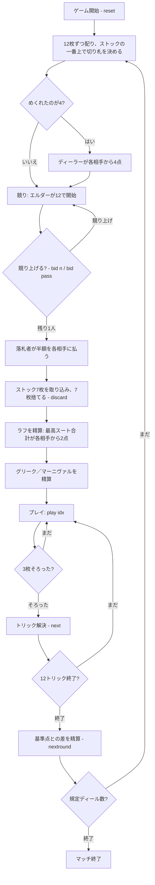

# グリーク（CUI版）遊び方

## ゲーム概要

Gleek（グリーク）は16〜17世紀のイングランドで遊ばれた3人用のゲームです。44枚（標準52枚から2と3を抜いたもの）を12枚ずつ配り、**1ディールの中で「ストックの競り」「ラフ」「グリーク／マーニヴァル」「12トリック」という4つの段階すべてで点が動きます**。既定5ディールを終えた時点で累積点が最も高い席が勝者です。

## 起動方法

```sh
go run ./cmd/trumpcards gleek
go run ./cmd/trumpcards --lang en gleek  # 英語モード
```

## ルール

### デッキと配り

- 44枚（各スート A・K・Q・J・10・9・8・7・6・5・4）。2と3は入りません。
- 3人（あなた + CPU 2人）に**12枚ずつ**配り、残り8枚がストックになります。
- **ストックの一番上を表にして切り札を決めます。** めくれたのが4（Tiddy）なら、ディーラーが各相手から4点を取ります。

### 段階1: ストックの競り

- エルダー（ディーラーの左隣）は**12から始めなければならず、降りられません**。
- 以降は**2刻み**で競り上げるか降りるか。刻みが2なのは、落札額の半額を各相手に払うので、半分が整数である必要があるためです。
- 最高額の席が**半額を各相手に払い**、表向きの札を除く7枚を手に入れて**7枚捨てます**。

### 段階2: ラフ (ruff)

- 同一スートに固めた札の合計（A=11、K/Q/J=10、数札は額面）が最も高い席が、各相手から2点を取ります。
- **エース4枚のマーニヴァルはどんなラフにも勝ちます。**

### 段階3: グリークとマーニヴァル

A・K・Q・Jの同ランク3枚が「グリーク」、4枚が「マーニヴァル」です。各相手から次の点を取ります。

| ランク | グリーク（3枚） | マーニヴァル（4枚） |
|--------|----------------|--------------------|
| エース | 4 | 8 |
| キング | 3 | 6 |
| クイーン | 2 | 4 |
| ジャック | 1 | 2 |

### 段階4: 12トリック

- エルダーがリードし、以降は前のトリックの勝者がリードします。
- **マストフォロー。** 切り札が最強で、切り札が無ければリードスートの最強札が取ります。
- 1トリック3点。加えて**切り札の名札**が点を持ちます。

| 切り札の札 | 名前 | 点 |
|-----------|------|----|
| A | Tib | 15 |
| J | Tom | 9 |
| 6 | Tumbler | 6 |
| 5 | Towser | 5 |
| 4 | Tiddy | 4 |
| K | — | 3 |
| Q | — | 3 |

### 精算

各席は「自分のトリック点 − 基準点」を受け取ります。**基準点はそのディールから数えます。** 表向きの札と落札者の捨て札は卓に出ないので、1ディールにある点は上限81点より小さくなることがあります（実際は72〜81点）。基準点はその配りの合計を3で割った値です。

### CPU難易度

`sd 0`（Easy: ランダムプレイ・競らない）／`sd 1`（Normal）／`sd 2`（Hard）。

## ゲームの流れ



## コマンド一覧

| コマンド | 短縮形 | 説明 |
|----------|--------|------|
| `reset` | `r` | 新しいゲームを開始 |
| `quit` | `q` | ゲーム終了 |
| `help` | `?` | コマンド一覧を表示 |
| `bid <額>` | — | その額まで競り上げる（刻みは2） |
| `bid pass` | `bid p` | 競りから降りる |
| `discard <i> <j> ...` | `d <i> ...` | 落札者が7枚捨てる（捨て札フェーズ） |
| `play <idx>` | — | 手札の idx 番のカードを出す |
| `next` | `n` | 次のトリックへ |
| `nextround` | `nr` | ディールを精算して次のディールへ |
| `setdifficulty <0-2>` | `sd <0-2>` | CPU難易度を変更（ゲームはリセット） |
| `hint` | `h` | 推奨アクション／カードを表示 |
| `log` | `l` | 棋譜を表示 |

## 画面の見方

```
==========
グリーク
==========
ディール: 1  トリック: 3  切り札: ハート
ストック: 表向き HEART 4 — あなた が 14 で落札
ラフ: CPU 1 が スペード の 38 で獲得
グリーク: あなた のキング3枚（各相手から 3）
あなた (落札者): 10枚  得点: 5  トリック: 2  札点: 21
[0]HEART 1(15)  [1]HEART 11(9)  [2]HEART 8  [3]SPADE 13  ...
CPU 1 (対抗): 10枚  得点: -1  トリック: 0  札点: 0
CPU 2 (対抗): 10枚  得点: -4  トリック: 0  札点: 0
----------
場: CPU 1: SPADE 13
----------
手番: あなた  切り札: ハート
play <idx>・・・カードを出す（マストフォロー／切り札が最強。括弧内は切り札の名札の点）
==========
```

- **ストック行**: 表向きの札（切り札を決めた札）と、落札者・落札額。
- **ラフ行／メルド行**: 段階2と段階3で動いた点。競りとトリックの間で累積点が動く理由がここに出ます。
- **札点**: そのディールで取ったトリック点（3点×トリック＋名札）。精算はこの値と基準点の差です。
- **手札**: `[索引]スート ランク` の形式。切り札の名札には `(15)` のように点が付きます。

## 遊び方のコツ

- **競りは手札が弱いほど価値がある。** 7枚入れ替えられるので、伸びしろの大きい手ほどストックを取る意味があります。逆に既に切り札が固まっている手で高く買っても、得られるものは小さくなります。
- **名札を相手のトリックに渡さない。** Tib（切り札のA）だけで15点あります。取れないトリックには名札を出さないでください。
- **ラフは1スートに固める。** A+K+Q で31点になります。捨て札は、長いスートを伸ばす方向で選ぶとラフとトリックの両方に効きます。
- **マーニヴァルは倍。** 同ランク4枚はグリークのちょうど2倍で、エース4枚ならラフも同時に取れます。
