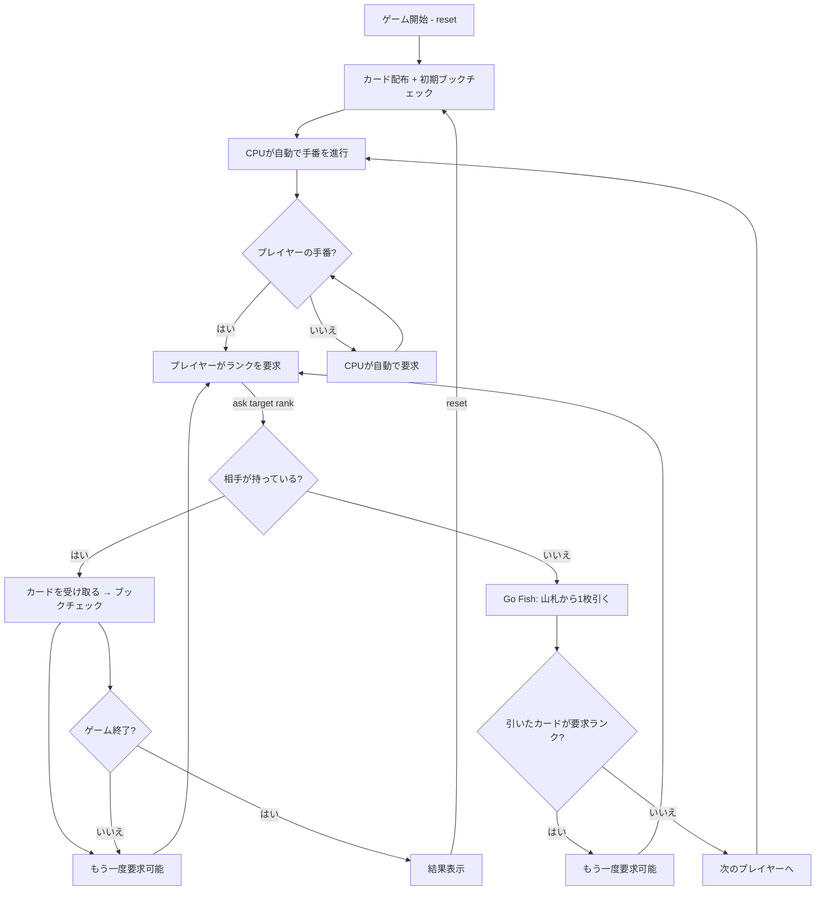

# ゴーフィッシュ（CUI版）遊び方

## ゲーム概要

4人（プレイヤー1人 + CPU 3人）で遊ぶカードゲームです。相手にカードのランク（数字）を要求し、同じランク4枚を揃えて「ブック」を作ります。最も多くブックを集めたプレイヤーの勝ちです。

## 起動方法

```sh
go run ./cmd/trumpcards gofish
go run ./cmd/trumpcards --lang en gofish  # 英語モード
```

## ルール

### 基本ルール

- 52枚のトランプ（ジョーカーなし）を使用
- 各プレイヤーに5枚ずつ配布、残りは山札
- 自分のターンに、手札に持っているランクを指定して相手に要求する
- 相手がそのランクのカードを持っていれば、全て受け取り、もう一度要求できる
- 相手が持っていなければ「Go Fish」 → 山札から1枚引く
  - 引いたカードが要求したランクならもう一度要求できる
  - 異なるランクなら次のプレイヤーのターンへ
- 同じランク4枚が揃うと「ブック」として場に出す
- 全13ブックが完成するか、山札がなくなりどのプレイヤーも行動できなくなったらゲーム終了
- 最も多くブックを持つプレイヤーの勝ち

### 得点

- ブック1つ = 1点
- 最多ブック数のプレイヤーが勝利

### CPU難易度

| 難易度 | コマンド | 説明 |
|--------|----------|------|
| Easy | `sd 0` | ランダムに要求 |
| Normal | `sd 1` | 手札のランクのみ要求、直近の記憶に基づいて判断 |
| Hard | `sd 2` | 全要求履歴から最適な相手とランクを推測 |

## ゲームの流れ



## コマンド一覧

### 基本コマンド

| コマンド | 短縮形 | 説明 |
|----------|--------|------|
| `reset` | `r` | 新しいゲームを開始（現在の設定を維持） |
| `ask <target> <rank>` |  | 指定プレイヤーに指定ランクを要求（例: `ask 1 7`） |
| `log` | `l` | 棋譜（アクションログ）を表示 |
| `quit` | `q` | ゲーム終了 |
| `help` | `?` | コマンド一覧を表示 |

### 設定コマンド

| コマンド | 短縮形 | 説明 |
|----------|--------|------|
| `sd N` | — | CPU難易度変更（0=Easy, 1=Normal, 2=Hard） |

> **Note**: `target` はプレイヤーインデックス（1, 2, 3のいずれか）、`rank` はカードのランク（1=A, 2-10, 11=J, 12=Q, 13=K）です。

## 画面の見方

```
==========
Go Fish (ゴーフィッシュ)
==========
あなた: 5枚, ブック: 0
[0]CLOVER 11  [1]HEART 13  [2]CLOVER 2  [3]HEART 6  [4]DIAMOND 4
CPU 1: 5枚, ブック: 0
CPU 2: 5枚, ブック: 0
CPU 3: 5枚, ブック: 0
----------
山札: 32枚
----------
あなたのターン
ask <相手番号> <ランク> で要求
==========
```

- プレイヤー行: `あなた: 5枚, ブック: 0` — 手札枚数とブック数。
  **区切りは読点で、`|` ではありません**。CPU の行も同じ形式
- `山札: N枚`: 山札の残り枚数。**プレイヤー行より下**に出ます
- `あなたのターン` / `ask <相手番号> <ランク> で要求`: 手番の案内と操作
  (`手番:` という行はありません)
- `[0]`, `[1]`...: 手札カードの参照（ランク確認用）
- `成功!`: 相手がランクを持っていた場合
- `Go Fish!`: 相手がランクを持っていなかった場合

## 遊び方のコツ

- 手札に2枚以上持っているランクを要求すると、ブック完成に近づきやすい
- CPUの要求を観察して、どのランクを持っているか推理しましょう
- `log` コマンドで過去の要求履歴を確認し、誰がどのランクを持っているか推測できます
- Hard難易度のCPUは全要求履歴を分析して最適な要求をするため、手強い対戦相手です
