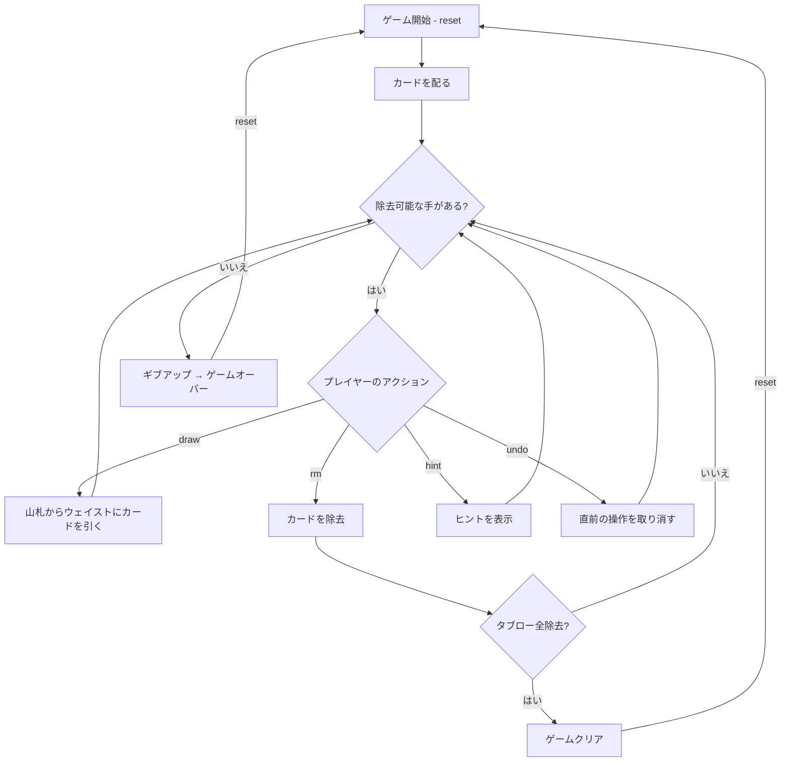

# ゴルフ（CUI版）遊び方

## ゲーム概要

1人用のソリティアカードゲームです。52枚のカードを使い、7列×5段に並べた35枚の表向きカードから、ウェイストのトップカードと±1のランクのカードを除去していきます。タブローのカードをすべて除去すればクリアです。

## 起動方法

```sh
go run ./cmd/trumpcards golf
go run ./cmd/trumpcards --lang en golf  # 英語モード
```

## ルール

### 基本ルール

- 52枚のトランプ（ジョーカーなし）を使用
- 7列×5段に35枚をすべて表向きに配る
- 残りの17枚のうち1枚をウェイストに、16枚を山札（ストック）に置く
- 各列の一番下の未除去カードのみ選択可能（露出カード）

### 除去ルール

- ウェイストのトップカードと±1のランクのカードを除去できる
- K-Aは繋がる（ラップアラウンド）：KからAへ、AからKへ除去可能
- 例：ウェイストが5なら、4または6を除去できる

### ゲームクリア

- タブローの35枚すべてを除去するとゲームクリア

### ゲームオーバー

- これ以上除去可能な手がない場合はギブアップでゲームオーバー

### 手詰まり検出

- ヒントが存在せず、かつ山札が空の場合に「手詰まりです」と表示します
- 手詰まり状態では「元に戻す」またはギブアップを選択できます

## ゲームの流れ



## コマンド一覧

| コマンド | 短縮形 | 説明 |
|----------|--------|------|
| `reset` | `r` | 新しいゲームを開始 |
| `draw` | `d` | 山札からウェイストにカードを引く |
| `remove <col>` | `rm` | 指定列のカードを除去（ウェイストトップ±1） |
| `giveup` | `g` | ギブアップしてゲームを終了 |
| `hint` | `h` | 次の一手のヒントを表示 |
| `undo` | `u` | 直前の操作を元に戻す |
| `log` | `l` | アクションログ（棋譜）を表示 |
| `quit` | `q` | ゲーム終了 |
| `help` | `?` | コマンド一覧を表示 |

### コマンド例

- `d` → 山札からカードを引く
- `rm 0` → 1列目のカードを除去
- `rm 3` → 4列目のカードを除去
- `u` → 直前の操作を元に戻す
- `h` → ヒントを表示

## 画面の見方

```
==========
Golf Solitaire (ゴルフ)
==========
   ♥6     ♦13     ♠6     ♣1     ♦12     ♣11     ♦4
   ♣12     ♠8     ♦7     ♠2     ♣13     ♠13     ♥1
   ♦5     ♠10     ♠4     ♦10     ♥4     ♠7     ♣8
   ♥11     ♣3     ♥7     ♦9     ♠1     ♣6     ♠9
(0)♣7  (1)♠5  (2)♠12  (3)♥8  (4)♣4*  (5)♦3  (6)♥12
----------
Stock: 16枚 | Waste: ♥5
----------
手数: 0 （戻せる手はありません）
==========
```

- 先頭の 4 行が 7 列 x 5 段のタブロー。**列見出しは付きません**
- `(0)♣7 ... (6)♥12`: 各列の一番下の露出カード。番号がそのまま
  `rm <n>` の引数になります。**末尾の `*` は「いまウェイストに出せる札」**の印
- `Stock: N枚 | Waste: X`: 山札の残り枚数とウェイストの一番上のカード
- `手数: N （戻せる手はありません）`: 現在の手数と、アンドゥできるかどうか

## 遊び方のコツ

- ウェイストのトップカードから連続して除去できるチェーンを狙いましょう
- K-Aのラップアラウンドを活用して長いチェーンを作りましょう
- カードが多く残っている列を優先的に除去すると効率的です
- 山札を引く前に、タブロー内で除去できるカードがないか確認しましょう
- ヒントコマンドで詰まった時のアドバイスを得られます
- アンドゥを活用して、異なる戦略を試しましょう
