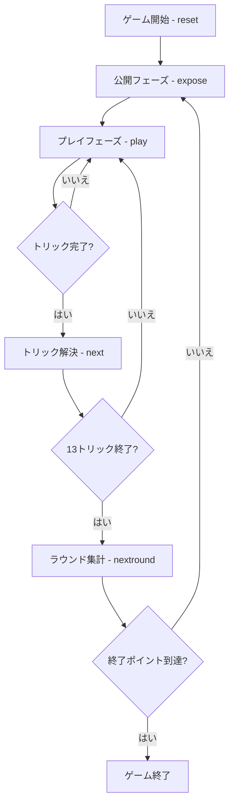

# 拱猪（ゴングジュー）（CUI版）遊び方

## ゲーム概要

Gong Zhu（拱猪／中国版ハーツ）は4人で対戦するトリックテイキングゲームです。ハーツと同じ要領でトリックを取り合いますが、マイナス点だけでなくプラス点があり、得点を倍にする変圧器カードや、ラウンド開始前の「公開（明牌）」による倍化があるため、点数の振れ幅が大きいのが特徴です。いずれかのプレイヤーの累積スコアが終了ポイントの負の値（既定 -1000）に達した時点でゲーム終了となり、**最高スコア**のプレイヤーが勝者です。

## 起動方法

```sh
go run ./cmd/trumpcards gongzhu
go run ./cmd/trumpcards --lang en gongzhu  # 英語モード
```

## ルール

### ポイントカード

| カード | 得点 | 備考 |
|--------|------|------|
| ♠Q（豚） | -100 | |
| ♦J（羊） | +100 | |
| ♣10（変圧器） | 獲得点を×2（単体取得なら +50） | |
| ♥A | -50 | |
| ♥K | -40 | |
| ♥Q | -30 | |
| ♥J | -20 | |
| ♥10〜♥5 | 各 -10 | |
| ♥4〜♥2 | 0 | ハート合計は -200 |

- **全ハート獲得**: 1人が13枚のハートをすべて取ると、ハートは -200 ではなく **+200** になります（シュート・ザ・ムーン相当）。

### 公開（明牌 / Exposure）

ラウンド開始時、♠Q・♦J・♥A・♣10 を持つプレイヤーはそれを公開できます。公開したカードは、誰が獲得しても得点が倍増します（♠Q→-200、♦J→+200、♥A→全ハート×2、♣10→×4・単体+100）。公開は任意で、何も公開しなくても構いません。CPUは公開しません。

### プレイ

- ♣2を持つプレイヤーが最初にリードします。
- リードスートに従う必要があります（フォロースート）。
- ハートはブレイクされるまでリードできません（他にカードがある場合）。
- トリックの最高位のリードスートカードを出したプレイヤーがそのトリックを獲得します（Aが最強）。

### ゲーム終了

いずれかのプレイヤーの累積スコアが -（終了ポイント）以下になるとゲーム終了。最高スコアのプレイヤーが勝者です。

## ゲームの流れ



## コマンド一覧

| コマンド | 短縮形 | 説明 |
|----------|--------|------|
| `reset` | `r` | 新しいゲームを開始（設定保持） |
| `expose [i...]` | | ポイントカードを公開（引数なしで公開なし） |
| `play <i>` | `p` | 手札のi番目のカードを出す |
| `next` | `n` | 次のトリックへ |
| `nextround` | `nr` | ラウンドを集計して次のラウンドへ |
| `setdifficulty <0-2>` | `sd` | CPU難易度設定（0=Easy, 1=Normal, 2=Hard） |
| `setlimit <n>` | `sl` | 終了ポイント設定 |
| `hint` | `h` | ヒントを表示 |
| `log` | `l` | 棋譜を表示 |
| `quit` | `q` | ゲーム終了 |
| `help` | `?` | コマンド一覧を表示 |

## 画面の見方

```
==========
Gong Zhu (拱猪)
==========
ラウンド: 1  トリック: 1
公開済み: ♦J
You: 累積0点 ラウンド0点 13枚 0トリック
[0]♠2 [1]♠Q [2]♦J [3]♥A ...
CPU 1: 累積0点 ラウンド0点 13枚 0トリック
...
----------
手番: You
play <idx>・・・カードを出す
```

- 1行目: ラウンド・トリック番号
- 2行目: 公開済みのポイントカード
- 各プレイヤー行: 累積スコア・ラウンドスコア・手札枚数・獲得トリック数
- `[n]` 付きの行: あなたの手札（インデックス付き）

## 遊び方のコツ

- ♠Q（豚）は早めに手放すか、確実に勝てないトリックで押し付けましょう。
- ♦J（羊）は+100点。取りに行く価値があります。公開すると+200点になります。
- ♣10（変圧器）はプラス点を集めているときに強力ですが、マイナス点を抱えていると損失も倍増します。
- 全ハートを狙える手札なら、ハートを集めて +200 を狙うのも一手です。
