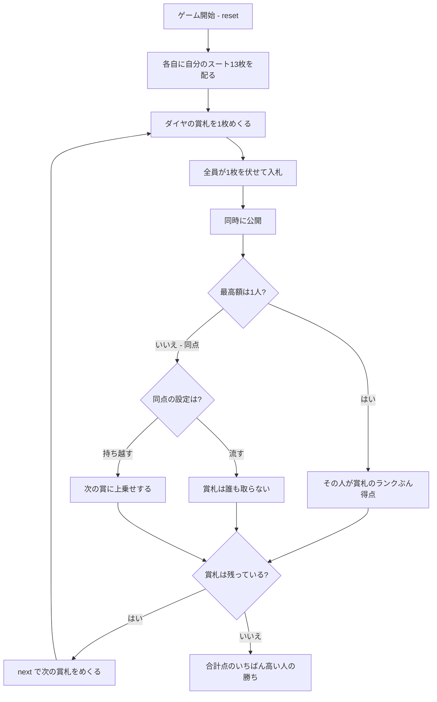

# ゴフスピール（CUI版）遊び方

## ゲーム概要

アメリカ発の**数学的ゲーム**（GOPS とも）。ゲーム理論の教材としても有名です。**手番がありません。** ダイヤの賞札を1枚ずつめくり、全員が自分のスートから1枚を伏せて**同時に入札**します。最高額を出した人が賞札のランクぶん得点。2〜3人で遊べます。

## 起動方法

```sh
go run ./cmd/trumpcards goofspiel
go run ./cmd/trumpcards --lang en goofspiel  # 英語モード
```

## ルール

### 配り

**ダイヤを賞札、残りのスートを各自の入札札**にします。各自13枚です。

| 人数 | 賞札 | 席0（あなた） | 席1 | 席2 |
|------|------|--------------|-----|-----|
| 2人 | ダイヤ13枚 | スペード13枚 | クラブ13枚 | — |
| 3人 | ダイヤ13枚 | スペード13枚 | クラブ13枚 | ハート13枚 |

**3人卓は賞札1スート + 入札3スート = 4スート**要ります。ちょうど標準52枚に収まります。

### 入札

賞札が1枚めくられたら、全員が自分の入札札から1枚を選んで**伏せます**。全員が伏せたら**同時に公開**します。

**最高額を出した人が、賞札のランクぶん得点**します（A=1、K=13）。使った入札札は戻りません。

### 同点

**同点なら誰も取りません。** 設定によって、賞札が流れるか次のラウンドに持ち越されます。持ち越しの場合、次の賞に上乗せされます。

### 隠されているのは「今いくら出したか」だけ

使った入札札は場に出るので、**相手の残り札は自分のスートから使ったぶんを引けば完全に分かります**。情報が非対称なのではなく、**同時であること**だけが読み合いを生みます。だからこの実装では、相手の残り札もそのまま表示します。

### 勝敗

13ラウンドで賞札を使い切ります。**合計点のいちばん高い人の勝ち**です。

## ゲームの流れ



## コマンド一覧

| コマンド | 短縮形 | 説明 |
|----------|--------|------|
| `bid <idx>` | `b` | 手札の `<idx>` 番目を伏せて入札する |
| `next` | `n` | 次の賞札をめくる |
| `hint` | `h` | 入札すべき札を提示する |
| `giveup` | `g` | 投了する |
| `log` | `l` | 棋譜（アクションログ）を表示する |
| `reset` | `r` | 最初からやり直す |
| `quit` | `q` | 終了する |
| `help` | `?` | コマンド一覧を表示 |

**`bid` 1回でそのラウンドの結果まで進みます。** 同時入札なので、CPU の番を待つ工程がありません。

## 画面の見方

```
==========
Goofspiel (ゴフスピール／GOPS)
==========
ラウンド: 3  賞札の残り: 10枚
ダイヤの賞札を1枚ずつめくり、全員が自分のスートの札から1枚を伏せて同時に入札します。最高額を出した人が賞札のランクぶん得点。同点なら誰も取りません。隠されているのは「今いくら出したか」だけで、相手の残り札は使ったぶんを引けば分かります。13ラウンドで賞札を使い切り、合計点のいちばん高い人が勝ちです。
賞札: DIAMOND 11（11 点）
あなた: 残り11枚 得点13点
[0]SPADE 1 [1]SPADE 2 [2]SPADE 4 ...
CPU1: 残り11枚 得点9点
  CLOVER 1,CLOVER 3,CLOVER 5,...
----------
bid <idx>・・・伏せて入札する
```

- **賞札**: いま懸かっている札と得点。持ち越しがあるときは「（うち持ち越し N 枚ぶんを含む）」が付きます
- **残り枚数と得点**: 得点はそのまま順位です
- **残り札**: **全員分が見えます。** 使った札は場に出るので隠しても意味がありません
- **`[入札済み]`**: 伏せたことだけを示します。中身は公開まで見せません
- **`[N を出した]`**: 公開後の入札。同時に見えます

## 遊び方のコツ

- **13枚の配分がすべて。** 高い賞に高い札を使うか、あえて流して次に備えるか
- **相手の残り札を数える。** 完全に分かるので、相手が高い札を使い切ったあとは安い札で取れます
- **A（1点）は捨て札に近い。** 取っても1点なので、A の賞札は最低札を出して流すのが基本です
- **持ち越し設定では賞が膨らみます。** 同点が続いたあとの賞は、多少高い札を切っても引き合います
- **同じ札を出すと誰も取りません。** 読み合いが完全に一致すると、賞札は流れます
