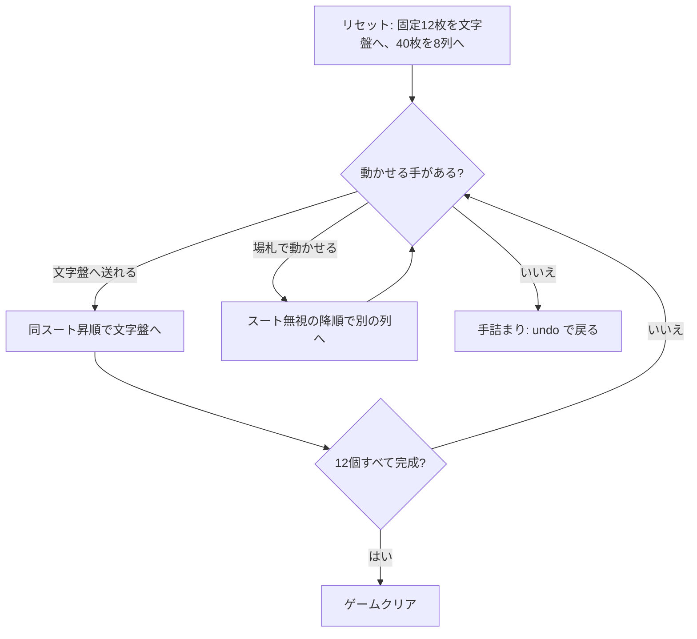

# グランドファーザーズ・クロック (Grandfather's Clock) — CUI マニュアル

## ゲーム概要

12 個の基礎札を時計の文字盤に見立てたイギリス発祥のソリティア。各文字盤は「その位置の時刻」のランクで完成させる — 1 時の文字盤は A、12 時の文字盤は Q で止める。

**山札は無い。** 52 枚すべてが最初から場に出ており（文字盤 12 枚 + タブロー 8 列×5 枚 = 52）、運の要素は配り方だけ。文字盤に置かれる 12 枚は毎回同じ固定札で、これが「各文字盤があと 3〜4 枚を必要とし、合計がちょうど 40 枚になる」という設計を成立させている。

## 起動方法

```sh
go run ./cmd/trumpcards grandfathersclock
go run ./cmd/trumpcards --lang en grandfathersclock   # 英語
```

## ルール

- 52 枚 1 組。固定の 12 枚を文字盤に置き、残り 40 枚を 8 列×5 枚のタブローに表向きで配る
- 文字盤は**同じスートで昇順**に積む。**K の次は A に折り返す**（1〜4 時の文字盤は 10/J/Q/K から始まるので、折り返さないと目標に届かない）
- 各文字盤の目標ランクはその時刻: 1 時→A、2 時→2、…、11 時→J、12 時→Q
- **目標ランクに達した文字盤は完成**で、それ以上カードを受け付けない
- タブローは**スートを無視して降順**に 1 枚ずつ重ねる。空き列には任意のカードを置ける
- 12 個すべての文字盤が目標ランクに達すればクリア。動かせる札が 1 枚も無くなれば手詰まり

> 補足: issue #4399 の仕様案は「山札が尽きるか…」としているが、12 + 8×5 = 52 で全札が配り切られるため山札は存在しえない。山札なしで実装している。

## ゲームの流れ



## コマンド一覧

| コマンド | 説明 |
|---------|------|
| `m <col> f <idx>` | 列 `<col>` の最上段を文字盤 `<idx>` (0..11) に置く |
| `m <fromCol> <toCol>` | 列 `<fromCol>` の最上段を列 `<toCol>` に重ねる |
| `h`, `hint` | ヒントを表示する |
| `ac`, `autocomplete` | 文字盤へ送れる札がなくなるまで自動で送る |
| `u`, `undo` | 1 手戻す |
| `g`, `giveup` | ギブアップ |
| `l` | 棋譜（アクションログ）を表示する |
| `r`, `reset` | 最初からやり直す |
| `q`, `quit` | 終了する |

**文字盤の番号は省略できない。** 12 個の文字盤には同じスートのものが複数あるため、送り先をカードのスートから決められない（他のソリティアと違う点）。

## 画面の見方

```
文字盤 (0=1時 … 11=12時):
[0] HEART 10 →1
[1] SPADE 11 →2
...
[4] HEART 3 →5
[11] CLOVER 9 →12 ✔完成
----------
列0: [0]SPADE 7 [1]DIAMOND 2 [2]CLOVER 9 [3]HEART 4 [4]SPADE 6
...
列7: [0]CLOVER 4 [1]DIAMOND 9 [2]SPADE 12 [3]HEART 2 [4]DIAMOND 5
----------
手数: 12
```

- `[n]` が文字盤の番号で、`m <col> f <n>` の `<n>` に対応する
- `→数字` がその文字盤の目標ランク。到達すると `✔完成` が付く
- 各列の `[n]` は列内のインデックス。動かせるのは常に一番右の 1 枚
- 手詰まりになると、脱出に必要なアンドゥ回数が表示される

## 遊び方のコツ

- **1〜4 時の文字盤（10/J/Q/K 始まり）は K→A の折り返しを通る。** A・2・3・4 を安易に他へ使わず、折り返し先として残す
- 空き列は貴重。降順に長く繋がった列を作る足場として使い、埋め潰さない
- 文字盤は 12 個あるので、同じランクのカードでも行き先が複数ありうる。どの文字盤に送るかで後半の詰まり方が変わる
- `hint` は文字盤への手を優先して 1 つ返すだけで最善手ではない。詰まったら `undo` で分岐をやり直す
