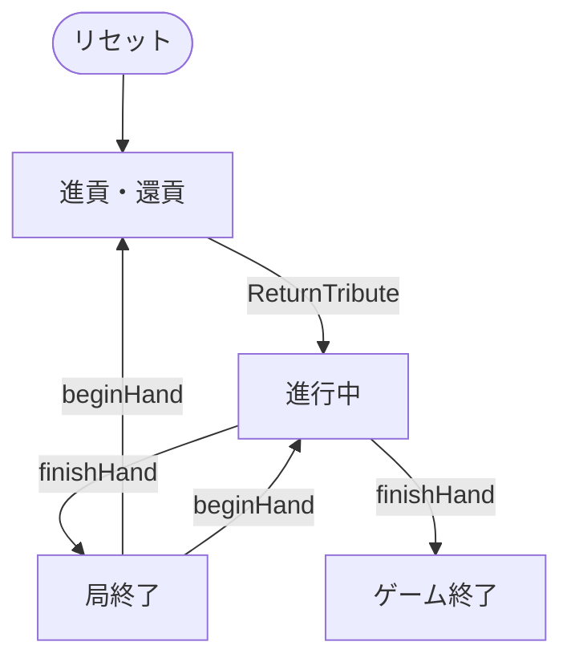
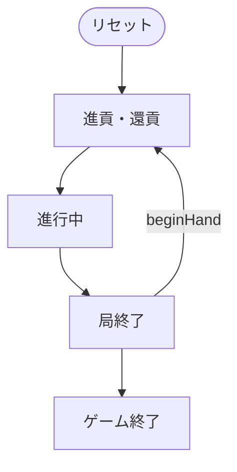

# 掼蛋（CUI版）遊び方

## ゲーム概要

中国・江蘇省で生まれ、いまや全国区になった**2 デッキの大貧民**。**52 枚 × 2 + ジョーカー 4 枚 = 108 枚**を **4 人 2 対 2**（**パートナーは向かい合わせ**）で **27 枚ずつ**持ちます。1 局ごとに自チームの**レベル**が上がり、**2 から A まで上がりきった側の勝ち**です。

**このゲームの肝は「レベル札」です。**その局のレベルと同じランクの札は、**A より強く、黒ジョーカーより弱い**位置に割り込みます。さらにその中の **♥ の 2 枚はワイルド**で、ジョーカー以外の任意の札の代わりになります。

出典: [pagat.com: Guandan](https://www.pagat.com/climbing/guan_dan.html)

## 起動方法

```sh
go run ./cmd/trumpcards guandan
go run ./cmd/trumpcards --lang en guandan   # 英語表示
```

## ルール

### デッキと序列

**52 枚 × 2 + ジョーカー 4 枚（赤 2・黒 2）= 108 枚**です。序列は下から順に:

```
2 3 4 5 6 7 8 9 10 J Q K A < 【レベル札】 < 黒ジョーカー < 赤ジョーカー
```

**レベル札はそのランク本来の位置からも消えません。**レベルが 5 のとき、5 は「4 と 6 のあいだ」ではなく **A の上**にいます。

| 呼称 | 内容 |
|---|---|
| レベル札 | その局のレベルと同じランクの 8 枚 |
| ワイルド | レベル札のうち **♥ の 2 枚だけ** |

**ワイルドはジョーカーの代わりにはなれません。**それ以外の任意の札として使えます。

### 役

| 役 | 構成 |
|---|---|
| シングル | 1 枚 |
| ペア | 同ランク 2 枚 |
| スリーカード | 同ランク 3 枚 |
| フルハウス | スリーカード + ペア |
| ストレート | 連続する 5 ランク |
| チューブ | **連続する 3 ランクのペア**（6 枚） |
| プレート | **連続する 2 ランクのスリーカード**（6 枚） |
| ボム | 同ランク 4 枚以上 |
| ストレートフラッシュ | 同スートの連続 5 ランク |
| ジョーカーボム | **ジョーカー 4 枚。最強で、何にも負けません** |

**ボムは役の種類を問わず割り込めます。**枚数が多いほど強く、同枚数ならランクで比べます。ストレートフラッシュは 5 枚ボムと 6 枚ボムのあいだの強さです。

### プレイ

リードしたプレイヤーの役に対し、**同じ形・同じ枚数でより強いもの**か、**ボム**だけが被せられます。出せない（出したくない）ならパスです。

**残り全員がパスしたら場が流れ**、最後に出した人が新しくリードします。**場が流れているときはパスできません。**必ず何か出します。

**手札を出しきった人はその局から抜けます。**残った人だけで続け、着順が決まります。

### 昇級 — 3 段階は存在しない

局が終わると、**1 着を出したチーム**が上がります。上がり幅は**同じチームの 2 人目が何着だったか**で決まります。

| 上がり順 | 昇級 |
|---|---|
| **1 着 2 着を独占** | **4 段階** |
| 1 着 3 着 | **2 段階** |
| 1 着 4 着 | **1 段階** |

**3 段階上がることはありません。**1 着 2 着の独占だけが 4 段階です。局の狙いどころがここに集約されます。

A を超えて上がりきったチームの勝ちです。

### 進貢・還貢 — 前局が次局の手札を動かす

2 局目以降は配り終えたあとに**貢**があります。

- **前局の最下位**が、**ワイルドを除く手札最強の 1 枚**を **1 着**に渡します
- 前局が**1 着 2 着の独占**だったときは、**3 着が 2 着に、4 着が 1 着に**渡します
- 受け取った側は、**手札から任意の 1 枚を選んで返します**（還貢）

**抗貢（貢の取り消し）:** 払うはずの側が**赤ジョーカーを 2 枚**持っていたら、**その局の貢は丸ごと流れます。**

貢が終わったら、**最も重い貢を払った側**がリードして局が始まります。



## ゲームの流れ

ゲームの進行は `internal/domain/Guandan.go` のフェーズ機械そのものです。各ノードは同ファイルの `GuandanPhase` 定数、矢印ラベルはその遷移を行うメソッド名です。



## コマンド一覧

| コマンド | 短縮形 | 説明 |
|----------|--------|------|
| `play <添字...>` | `p` | 役を出す（**複数枚まとめて**。例: `p 0 1 2` でスリーカード） |
| `pass` | `ps` | パスする |
| `tribute <添字>` | `t` | 還貢する札を選ぶ |
| `next` | `n` | 次の局へ進む |
| `log` | `l` | 棋譜を表示する |
| `reset` | `r` | ゲームごとリセットする |
| `quit` | `q` | 終了する |
| `help` | `?` | コマンド一覧を表示 |

## 画面の見方

```
第3局 / この局のレベル: 5 / 提供チーム: 0 / チーム0: 5 / チーム1: 3
【5のレベル札はAより強く、黒ジョーカーより弱い】です。うち♥の2枚はワイルドで、ジョーカー以外の任意の札の代わりになります。
席0 あなた(T0 着順-) <- 手番: 12枚  0:SPADE 2 1:HEART 5 ...
席1 CPU 1(T1 着順1): 0枚  非公開 0枚
席2 CPU 2(T0 着順-): 14枚  非公開 14枚
席3 CPU 3(T1 着順-): 9枚  非公開 9枚
場: ペア (2枚) — 席1が出しました
----------
手番: あなた
p <添字...> ・・・役を出す／ps ・・・パス
```

- **手札には添字がついています。**`p 0 1 2` のように並べて 1 つの役として出します
- **着順**は次局の貢と昇級量を決めます。「-」はまだ上がっていない席です
- **自分以外の手札は枚数しか見えません。**味方も含めてです
- **「場: 流れています」のときはパスできません。**必ず何か出します

## 遊び方のコツ

- **ワイルドを安売りしないでください。**♥ のレベル札 2 枚は、終盤に足りない 1 枚を埋めてボムを作れます
- **ボムは割り込みの権利そのものです。**早く崩すと、終盤に相手のリードを止められなくなります
- **狙うのは 1 着 2 着の独占です。**1 着だけを急ぐより、パートナーを 2 着に押し込むほうが 4 倍速く上がれます
- **貢で渡す札は選べません**（ワイルドを除く最強が自動で出ます）が、**還貢で返す札は選べます。**要らない低い札を返してください
- **レベル札の位置を忘れないでください。**レベルが A のとき、A のペアは「最強のペア」ではありません
