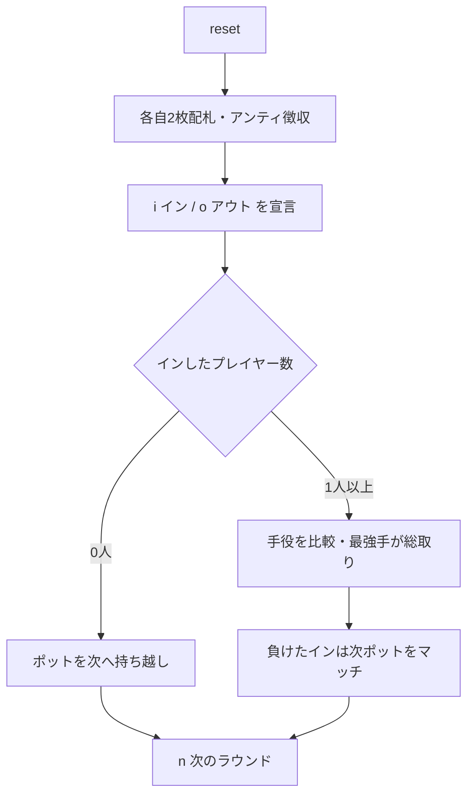

# ガッツ（CUI版）遊び方

## ゲーム概要

ガッツ（Guts）はアメリカのホームポーカー文化から生まれた、シンプルながらスリリングなポット・ヴァイイング（vying）ゲームです。各プレイヤーは2枚の手札を持ち、全員が同時に「イン（残る）」か「アウト（降りる）」かを宣言します。残った者同士が手役を比べ、最強手がポットを総取り。インして負けたプレイヤーはポット額をマッチして次ラウンドに積み増すため、勝負が続くほどポットが膨らみます。

## 起動方法

```sh
go run ./cmd/trumpcards guts
go run ./cmd/trumpcards --lang en guts
```

## ルール

### 基本ルール

1. 全員がアンティを支払い、標準52枚デッキから各自2枚の手札が配られます。
2. 自分の2枚を見て、「イン（残る）」か「アウト（降りる）」を宣言します。CPU は手札の強さで自動判断します。
3. 「イン」したプレイヤー同士が手役を比較します。
   - **ペア** はノーペアに勝ちます。
   - ペア同士はランクの高い方が勝ち。
   - ノーペア同士はハイカード → キッカーの順で比較（A が最強）。
4. 最強手のプレイヤーがポットを総取りします。
5. 「イン」して負けたプレイヤーは、その時点のポット額を **マッチ** して次ラウンドの種銭に積みます。
6. 誰も「イン」しなかったラウンドは、ポットが丸ごと次ラウンドへ持ち越されます。

### 停止条件

規定ラウンド数を消化するか、アンティを払えるプレイヤーが2人未満になるとゲーム終了。最終的にチップが最も多いプレイヤーが勝者です。

## ゲームの流れ



## コマンド一覧

| コマンド | 短縮形 | 説明 |
|----------|--------|------|
| `in` | `i` | イン（勝負に残る）を宣言 |
| `out` | `o` | アウト（降りる）を宣言 |
| `nextround` | `n` / `nr` | 次のラウンドへ |
| `setplayers <n>` | `sp <n>` | プレイヤー数を設定（2-7） |
| `setante <n>` | `sa <n>` | アンティ額を設定 |
| `setchips <n>` | `sc <n>` | 初期チップを設定 |
| `setrounds <n>` | `st <n>` | 実施ラウンド数を設定 |
| `hint` | `h` | ヒントを表示 |
| `log` | `l` | 棋譜を表示 |
| `reset` | `r` | ゲームをリセット（設定は保持） |
| `quit` | `q` | ゲーム終了 |
| `help` | `?` | コマンド一覧を表示 |

## 画面の見方

```
----------
ラウンド: 1  ポット: 40  アンティ: 10
You  チップ 190  賭け 10  [イン]
  S1, HK
CPU 1  チップ 190  賭け 10  [勝者]
  DK, CK  (ペア)
----------
```

- 1行目 — ラウンド番号・現在のポット・アンティ額
- 各プレイヤー行 — 名前・チップ・このラウンドの賭け累計・状態（イン／アウト／宣言待ち／勝者／マッチ）
- カード行 — 手札（結果フェーズではインで残ったプレイヤーの手札と役名を公開）
- `手役: … 勝率目安: …` — 宣言フェーズで常時出る診断（`hint` のオン/オフとは無関係）。ペアは「高い」、K か A のハイカードは「普通」、それ以外は「低い」。Web の宣言ガイドと同じ判定です

## 遊び方のコツ

- ペアは非常に強い手です。ペアが来たら基本的にインで問題ありません。
- ノーペアでもハイカードが J 以上あれば、参加人数が少ないラウンドでは勝機があります。
- ポットが大きく膨らんでいるときのインはハイリスク・ハイリターン。マッチ負担を意識して宣言しましょう。
