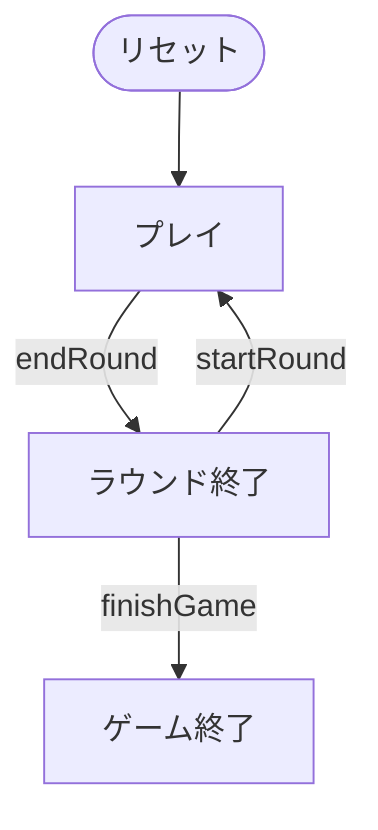

# 八八（CUI版）遊び方

## ゲーム概要

八八（はちはち / Hachi-Hachi）は、日本の**花札（48枚）**を使う古典的な **3 人用のキャプチャ（合わせ）ゲーム**です。手札の札と山札からめくった札で、場に出ている**同じ月（花）の札**を捕獲します。こいこいのような続行／勝負の判断はなく、全員の手札が尽きたらラウンド終了です。取り札の素点（光20・タネ10・短冊5・カス1）に出来役ボーナスを加え、基準点 **88** との差で各自を精算します。

## 起動方法

```sh
go run ./cmd/trumpcards hachihachi
go run ./cmd/trumpcards --lang en hachihachi  # 英語モード
```

## ルール

### デッキと配布

- **デッキ**: 花札48枚（12か月 × 各4枚：光・タネ・短冊・カス）。
- **プレイヤー**: 3人（プレイヤー0 = あなた、プレイヤー1・2 = CPU）。
- **配布**: 各プレイヤーに **7枚**、場に **6枚**を表向きに置きます。

### 手番と捕獲

1. 手札から1枚を出し、場にある**同じ月**の札を捕獲します。同じ月の札が場に**2枚**あるときは、捕獲する場札のインデックスを指定します。
2. 続けて山札から1枚めくり、同じ月の札があれば捕獲します。
3. 一致しなければ場に残ります。

### 素点

- 光20 / タネ10 / 短冊5 / カス1（全48枚の合計264、3人で割ると基準点88）。

### 出来役ボーナス

- 五光(100) / 四光(80) / 雨四光(60) / 三光(40)
- 猪鹿蝶(50) / 赤短(40) / 青短(40)

### 精算と勝敗

- 各プレイヤーの差分 = 素点 + 役ボーナス − 88。差分を累計します。
- 設定した**ラウンド数**（1〜12、既定3）を戦い、累計得点が最も高いプレイヤーが勝ちです。

## ゲームの流れ

ゲームの進行は `internal/domain/HachiHachi.go` のフェーズ機械そのものです。各ノードは同ファイルの `HachiHachiPhase` 定数、矢印ラベルはその遷移を行うメソッド名です。



## コマンド一覧

| コマンド | 短縮形 | 説明 |
|----------|--------|------|
| `play <h> [f]` | `p` | 手札 h を出す。場札 f を指定（2枚一致時のみ必要） |
| `nextround` | `n` | 次のラウンドを配る |
| `hint` | `h` | ヒントを表示 |
| `reset` | `r` | ゲームをリセット |
| `quit` | `q` | 終了 |
| `help` | `?` | コマンド一覧を表示 |

## 画面の見方

```
=== Hachi-Hachi ===
round: 1  deck: 21  phase: Play
field: [0]🌸 [1]🌕 ...
P0(You): 7 cards  captured=0  raw=0  score=0
  [0]🌸 [1]🎋 [2]🐦 ...
```

ラウンド精算では、そのラウンドを制したプレイヤーの行に `★このラウンドの一番手` が付きます（Web の 👑 と同じ印）。総取りが決まらなかったラウンドでは誰にも付きません。

```
ラウンド精算（素点 − 88 = 差分）:
  あなた: 素点70 + 役0 − 88 = -18
  CPU 1: 素点120 + 役10 − 88 = +42  ★このラウンドの一番手
```
