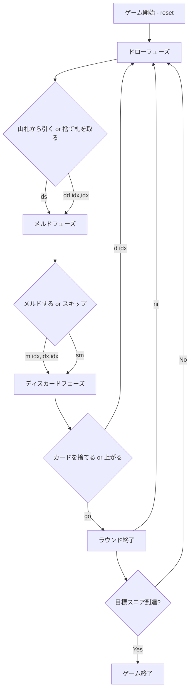

# ハンド・アンド・フット（CUI版）遊び方

## ゲーム概要

ハンド・アンド・フットは4人2チームで対戦するカナスタ系のラミーゲームです。4デッキ＋8枚のジョーカー（計216枚）を使用し、各プレイヤーは「ハンド（手札22枚）」と「フット（伏せ札13枚）」の2束を持ちます。まずハンドをプレイし、ハンドを使い切るとフットに移ります。同ランクのカードを集めてメルド（3枚以上の組）を作り、7枚以上の「カナスタ」を完成させ、赤（クリーン）カナスタと黒（ダーティ）カナスタを揃えて上がります。先に目標スコア（デフォルト5000点）に到達したチームが勝利します。

## 起動方法

```sh
go run ./cmd/trumpcards handandfoot
go run ./cmd/trumpcards --lang en handandfoot
```

## ルール

### 基本ルール

- **デッキ**: 標準52枚×4デッキ＋ジョーカー8枚＝216枚
- **プレイヤー**: 4人、2チーム（座席0/2がチーム0、座席1/3がチーム1）
- **配布**: 各プレイヤーにハンド22枚＋フット13枚
- **ハンドとフット**: まずハンドをプレイし、ハンドを使い切るとフット（13枚）を手札にして続行
- **ワイルドカード**: 2とジョーカーはワイルド
- **赤3**: ハート3・ダイヤ3は引いた時点で自動的にチームの場に出し、山札から補充
- **黒3**: スペード3・クローバー3は捨てるだけ（メルド不可、相手のピックアップをブロック）

### メルド（チーム共有）

- メルドはチームで共有して管理します
- 同ランク3枚以上で構成
- ナチュラルカード最低2枚必要
- ワイルドカードは最大3枚まで
- カナスタ: 7枚以上のメルド
  - 赤（クリーン／ナチュラル）カナスタ＝ワイルドなし
  - 黒（ダーティ／ミックス）カナスタ＝ワイルドあり

### 上がり条件

- チームが赤カナスタ1組以上＋黒カナスタ1組以上を完成していること
- 上がるプレイヤーはフットに到達済みであること

### 捨て札の山を取る

- トップカードと同ランクのナチュラルカード2枚（ペア）が必要
- 山全体を手札に加える
- フリーズ状態（ワイルドが捨てられた場合）でも同条件

### 得点

| カード | 点数 |
|--------|------|
| ジョーカー | 50点 |
| 2、A | 20点 |
| K〜8 | 10点 |
| 7〜4 | 5点 |
| 黒3 | 5点 |

| ボーナス | 点数 |
|----------|------|
| 赤（クリーン）カナスタ | 500点 |
| 黒（ダーティ）カナスタ | 300点 |
| 上がりボーナス | 100点 |
| 赤3（1枚あたり） | 100点 |

### CPU難易度

- Easy: ランダムプレイ
- Normal: 基本戦略（ペアがあれば山を取る）
- Hard: 戦略的プレイ（山のサイズを考慮）

## ゲームの流れ



## コマンド一覧

| コマンド | 短縮形 | 説明 |
|----------|--------|------|
| reset | r | ゲームをリセット |
| drawstock | ds | 山札から引く |
| drawdiscard idx,idx | dd idx,idx | 捨て札の山を取る（ナチュラルペアのインデックス） |
| meld idx,idx,idx;idx,idx,idx | m idx,...;idx,... | メルドを出す（;でグループ区切り） |
| skipmeld | sm | メルドせずにスキップ |
| discard idx | d idx | カードを捨てる |
| goout | go | 上がる（赤・黒カナスタが必要） |
| nextround | nr | 次のラウンドへ |
| setdifficulty n | sd n | CPU難易度変更 (0=Easy, 1=Normal, 2=Hard) |
| setlimit n | sl n | 目標スコア変更 |
| log | l | 棋譜を表示 |
| quit | q | 終了 |
| help | ? | ヘルプを表示 |
| `reset` | `r` | 新しいゲームを開始 |
| `quit` | `q` | ゲーム終了（`exit` も同じ） |
| `help` | `?` | コマンド一覧を表示 |

## 画面の見方

```
==============================
Hand and Foot (ハンド・アンド・フット)
==============================
ラウンド: 1  山札: 67枚  捨て札: 1枚
捨て札: ♠7
You: 累積0点 ラウンド0点 手札22枚 フット13枚 [チーム0]
  [0]♣2 [1]♠4 [2]♥5 [3]♦6 [4]♣7 ...
CPU 1: 累積0点 ラウンド0点 手札22枚 フット13枚 [チーム1]
----------
チーム0: メルド[赤]: ♠7, ♥7, ♣7  赤3=1
----------
手番: You (ディスカードフェーズ)
d <idx>・・・カードを捨てる
  まだ上がれません: フット未突入 / 赤キャナスタ 0/1 / 黒キャナスタ 0/1
go・・・上がる
==============================
```

- メルドフェーズには `初回メルド最低点: 50点 (累積 0点)` が出ます。累積得点が上がると 50 → 90 → 120 点と上がり、マイナスの間は 15 点です（表示のみで、強制はされません）。
- ディスカードフェーズには上がり条件の充足状況が出ます。3 つ（フット突入・赤キャナスタ・黒キャナスタ）のうち足りないものだけが並び、揃うと `上がれます` に変わります。

## 遊び方のコツ

- 上がるには赤カナスタと黒カナスタの両方が必要です。バランスよく作りましょう
- ハンドを使い切るまではフットに触れません。ハンドの整理を優先しましょう
- 赤（クリーン）カナスタは500点と高得点。ワイルドを温存して狙いましょう
- 捨て札の山が大きい時は積極的に取りましょう
- ワイルドカードを捨てると山がフリーズするので注意
- 黒3を捨てると相手の山取りをブロックできます
- チーム戦なのでパートナーのメルドと連携して点を伸ばしましょう
