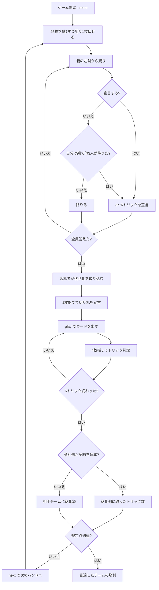

# ハーゼンプフェファー（CUI版）遊び方

## ゲーム概要

アメリカのドイツ系移民に伝わるユーカー派生の切り札トリックテイキング。**25枚**（ユーカーの24枚 + ジョーカー1枚）を4人2対2で**6枚ずつ**配り、余った1枚を伏せます。**ジョーカーが全カード中最強の切り札（Best Bower）**になるのがこのゲームの顔で、**競りは全員参加が義務**——3人が降りたら親は降りられません。

## 起動方法

```sh
go run ./cmd/trumpcards hasenpfeffer
go run ./cmd/trumpcards --lang en hasenpfeffer  # 英語モード
```

## ルール

### デッキと配り

9・10・J・Q・K・A の6ランク × 4スート = **24枚**に**ジョーカー1枚**を足した **25枚**を使います。4人に**6枚ずつ**配ると24枚で、**余った1枚が伏せ札**になります。1ハンドは**6トリック**です（ユーカーの5ではありません）。

### 札の強さ

切り札のとき:

| 順位 | 札 |
|------|-----|
| 1 | **ジョーカー（Best Bower）** |
| 2 | 切り札スートの J（**Right Bower**） |
| 3 | **同色**スートの J（**Left Bower**） |
| 4以下 | A > K > Q > 10 > 9 |

**ジョーカーと Left Bower は切り札スートの札として扱われます。** 切り札がリードされたら、どちらもフォローする義務があります。切り札でないスートは A > K > Q > J > 10 > 9 です。

### 競り（全員参加が義務）

1. 親の左隣から順に、**3〜6トリック**を宣言するか降りる
2. 宣言は**上回らないと通りません**。上限の6が立ったら誰も上回れないので、以降は降りるしかありません
3. **3人が降りたら、親は降りられません**（最低3を宣言する義務があります）

このため**流局するハンドがありません**。

### 伏せ札と切り札

落札した人は**伏せ札を手に入れて7枚**になり、**1枚捨てて切り札スートを宣言**します。

### 得点

| 結果 | 得点 |
|------|------|
| 契約を達成（宣言以上のトリックを取る） | 落札側に**取ったトリック数** |
| 落とした（euchred） | **相手チームに落札額** |

多く取ったぶんは無駄になりません。先に規定点（既定10点）に達したチームの勝ちです。

## ゲームの流れ



## コマンド一覧

| コマンド | 短縮形 | 説明 |
|----------|--------|------|
| `bid <n>` | `b` | n トリック宣言する（3〜6） |
| `pass` | — | 降りる（親は3人が降りたら降りられません） |
| `discard <idx> <suit>` | `d` | `<idx>` を捨てて切り札を宣言する（1:♠ 2:♣ 3:♥ 4:♦、落札者のみ） |
| `play <idx>` | `p` | 手札の `<idx>` 番目のカードを出す |
| `next` | `n` | 次のハンドを開始する |
| `hint` | `h` | 宣言額・捨て札・打つべき札を提示する |
| `giveup` | `g` | 投了する |
| `log` | `l` | 棋譜（アクションログ）を表示する |
| `reset` | `r` | 最初からやり直す |
| `quit` | `q` | 終了する |
| `help` | `?` | コマンド一覧を表示 |

**降りるのは `pass` 専用です。** `bid 0` は下限（3）未満として弾かれます。

## 画面の見方

```
==========
Hasenpfeffer (ハーゼンプフェファー)
==========
ハンド: 2  トリック: 3/6  (10点先取)
ジョーカーが全カード中最強の切り札（Best Bower）です。切り札の J（Right Bower）、同色の J（Left Bower）がそれに次ぎます。競りは全員参加が義務で、3人が降りたら親は降りられません。
得点: あなたのチーム=3  相手=5
切り札: ハート（CPU1 が 4 トリックで落札）
 あなた[T0]: 宣言降り 獲得1 手札4枚
  [0]♠9 [1]♠K [2]♣J [3]♦A
>CPU1[T1][落札]: 宣言4 獲得1 手札4枚
 CPU2[T0]: 宣言降り 獲得0 手札4枚
 CPU3[T1][親]: 宣言降り 獲得0 手札4枚
----------
手番: CPU1
play <idx>・・・カードを出す
```

- **ルール行**: ジョーカーが最強という序列。**知らないと打ち方が変わります**
- **切り札行**: 誰が何トリックで落札したか
- **`[落札]` / `[親]`**: 落札者とディーラー
- **宣言**: `降り` / 数字 / `-`（未宣言）の3状態
- **`[n]`**: `play <n>` で指定する手札の番号

## 遊び方のコツ

- **ジョーカーは1枚しかない。** 出されたら誰も勝てないので、自分が持っているなら確実な1トリックです
- **Left Bower を数え忘れない。** 同色の J は切り札なので、切り札の枚数は「そのスートの枚数 + 1」になります
- **親のときは競りを見る。** 3人が降りたら降りられないので、弱い手でも受ける覚悟が要ります
- **上限の6を宣言すると誰も上回れません。** 強い手なら競りを終わらせる手があります
- **落札したら伏せ札で1枚強くなります。** 際どい手でも、伏せ札を見込んで宣言する価値があります
- **多く取っても損はしません。** 契約を超えたぶんもそのまま得点になるので、達成が見えたら取りにいきましょう
- **相手の契約は落とさせる。** 落とせば落札額がまるごとこちらに入ります
