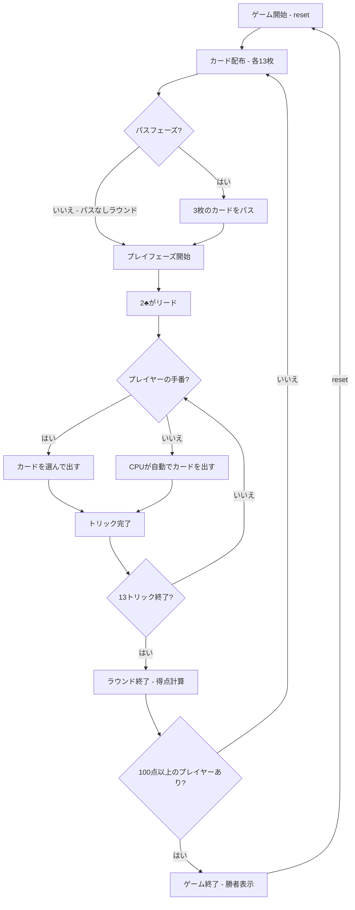

# ハーツ（CUI版）遊び方

## ゲーム概要

4人（プレイヤー1人 + CPU 3人）で遊ぶトリックテイキング型カードゲームです。ハート（各1点）とQ♠（13点）を取らないようにし、誰かが100点以上になった時点で最も点数の低いプレイヤーが勝者です。

## 起動方法

```sh
go run ./cmd/trumpcards hearts
go run ./cmd/trumpcards --lang en hearts  # 英語モード
```

## ルール

### 基本ルール

- 52枚のトランプを4人に配布（1人13枚）
- 各ラウンド開始時に3枚のカードをパスする（左→右→向かい→パスなし のローテーション）
- 2♣を持っているプレイヤーが最初のトリックをリードする
- リードされたスートに従う（フォロー必須）。なければ任意のカードを出せる
- トリックの最高ランクのカード（リードスート）を出したプレイヤーがトリックを取る
- ハートはブレイクされるまでリードできない（ハートブレイク）

### 得点

- ハート（♥）各1点（計13点）
- スペードのクイーン（Q♠）13点
- 1ラウンドの合計は26点

### シュート・ザ・ムーン

- 1人のプレイヤーが26点すべてを取った場合、そのプレイヤーは0点、他の3人に+26点が加算される

### オムニバス・ハーツ（オプション）

- J♦を獲得すると-10点（プレイヤーにとって有利）
- シュート・ザ・ムーンのしきい値は16点（26 - 10）に変更される
- J♦は最初のトリックでポイントカードとして扱われる（出せない）
- CPUはJ♦を保持し、パスで渡さない戦略を取る

### ゲーム終了

- いずれかのプレイヤーが100点（デフォルト）以上に達した時点でゲーム終了
- 最も点数の低いプレイヤーが勝者

### CPU難易度

- **Easy** (0): ランダムにカードを出す
- **Normal** (1): ポイントカード（ハート・Q♠）を避ける戦略（デフォルト）
- **Hard** (2): 戦略的なプレイ（ボイド作り、カウンティング等）

## ゲームの流れ



## コマンド一覧

| コマンド | 短縮形 | 説明 |
|----------|--------|------|
| `reset` | `r` | 新しいゲームを開始 |
| `pass <i1> <i2> <i3>` | — | 3枚のカードをパス（手札インデックスを3つ指定） |
| `play <i>` | `p <i>` | 手札のカードを1枚出す（インデックス指定） |
| `next` | `n` | 次のトリックへ進む |
| `nextround` | `nr` | 次のラウンドへ進む |
| `setdifficulty <0-2>` | `sd <0-2>` | CPU難易度を設定（0=Easy, 1=Normal, 2=Hard） |
| `setlimit <n>` | `sl <n>` | ポイント上限を設定 |
| `hint` | `h` | 推奨カードのヒントを表示（パス・プレイフェーズで使用可） |
| `log` | `l` | アクションログ（棋譜）を表示 |
| `quit` | `q` | ゲーム終了 |
| `help` | `?` | コマンド一覧を表示 |

### コマンド例

- `pass 0 3 7` → インデックス0, 3, 7のカードをパスする
- `p 2` → インデックス2のカードを出す
- `sd 2` → CPU難易度をHardに設定
- `sl 50` → ポイント上限を50に設定
- `h` → 推奨カードのヒントを表示

## 画面の見方

```
==========
Hearts (ハーツ)
==========
ラウンド 3 / トリック 5
パス方向: 左
ハートブレイク: はい
----------
[You]: 26点 (今ラウンド: 3点)
[0]SPADE 2  [1]CLOVER 5  [2]HEART 9  [3]DIAMOND 11  ...
CPU 1: 18点 (今ラウンド: 0点)
CPU 2: 31点 (今ラウンド: 13点)
CPU 3: 12点 (今ラウンド: 0点)
----------
現在のトリック:
  CPU 1: CLOVER 10
  CPU 2: CLOVER K
手番: あなた
p <idx>・・・カードを出す
==========
```

- `ラウンド N / トリック M`: 現在のラウンドとトリック番号
- `パス方向`: 現在のラウンドのパス方向（左/右/向かい/なし）
- `ハートブレイク`: ハートがブレイクされたかどうか
- `[You]: N点 (今ラウンド: M点)`: プレイヤーの累計得点と今ラウンドの得点
- `[0]SPADE 2`...: インデックス付きの手札カード
- `現在のトリック`: 現在のトリックに出されたカード

## 遊び方のコツ

- Q♠を持っている場合は、早めにスペードの高いカードを処理しておきましょう
- ハートや高いカードを避けるために、特定のスートをボイド（手札からなくす）にする戦略が有効です
- パスフェーズでは、Q♠やハートの高いカード、特定スートの残り枚数が少ないカードをパスすると良いでしょう
- シュート・ザ・ムーンを狙う場合は、高いカードを多く保持し、すべてのポイントカードを確実に取れる手札構成が必要です
- 他のプレイヤーがシュート・ザ・ムーンを狙っている兆候があれば、ポイントカードを1枚でも取って阻止しましょう
- 迷った時は `h` コマンドでヒントを表示できます。CPUのHard戦略に基づく推奨カードが表示されます
