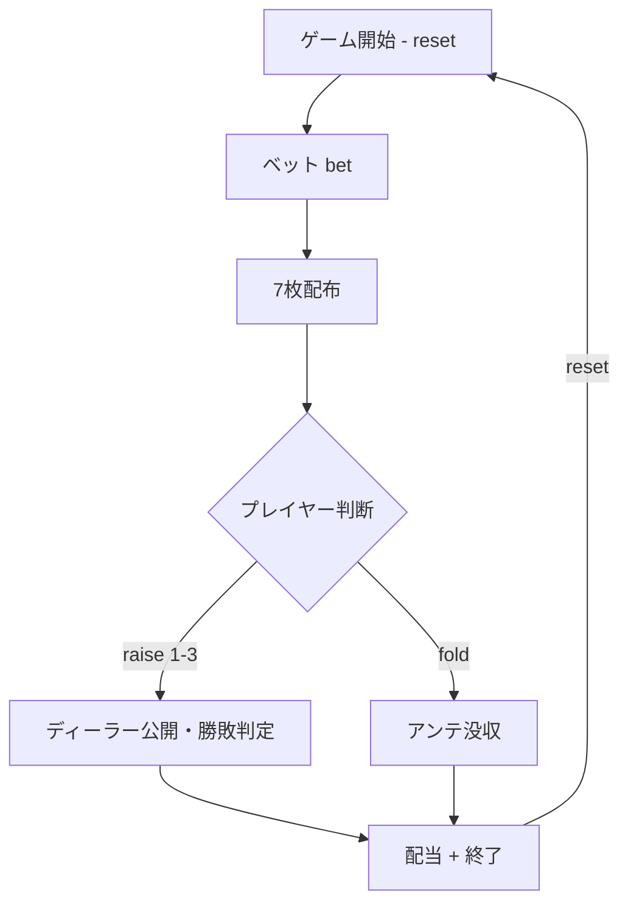

# ハイカードフラッシュ（CUI版）遊び方

## ゲーム概要

プレイヤーとディーラーに7枚ずつカードが配られ、「同じスートの最大枚数（フラッシュ長）」で勝負するカジノ系1対1のテーブルゲームです。配布枚数の同点時はフラッシュ内のカード強さで勝敗を決します。

## 起動方法

```sh
go run ./cmd/trumpcards highcardflush
go run ./cmd/trumpcards --lang en highcardflush  # 英語モード
```

## ルール

### 基本ルール

- アンテとオプションのサイドベット（Flush Bonus / Straight Flush Bonus）を置く
- 7枚ずつカードが配られる
- プレイヤーは自分のハンドを見てから「レイズ」または「フォールド」を選択
- レイズはアンテの倍数（1倍/2倍/3倍）で、最大倍率はフラッシュ枚数に依存する
  - 2〜4枚フラッシュ: 最大1倍
  - 5枚フラッシュ: 最大2倍
  - 6〜7枚フラッシュ: 最大3倍
- ディーラーは「3枚以上のフラッシュかつ9以上の高位カード」でクオリファイ

### 配当

| 状況 | アンテ | レイズ |
|------|--------|--------|
| ディーラー未クオリファイ | 1:1 | プッシュ |
| ディーラークオリファイ・勝ち | 1:1 | 1:1 |
| ディーラークオリファイ・負け | 没収 | 没収 |
| 同点 | プッシュ | プッシュ |

### サイドベット

**Flush Bonus** (プレイヤーの最長フラッシュで判定):

- 4枚: 1:1
- 5枚: 10:1
- 6枚: 50:1
- 7枚: 100:1

**Straight Flush Bonus** (プレイヤーの最長ストレートフラッシュで判定):

- 3枚: 8:1
- 4枚: 60:1
- 5枚: 100:1
- 6枚: 1000:1
- 7枚: 8000:1

## ゲームの流れ



## コマンド一覧

| コマンド | 短縮形 | 説明 |
|----------|--------|------|
| `bet <ante> [flushBonus] [straightFlush]` | `b` | アンテ＋オプションのサイドベットを置く |
| `raise <multiplier>` | `ra` | レイズ（1〜3、最大値は手札のフラッシュ長で決まる） |
| `fold` | `f` | フォールド（アンテを放棄） |
| `reset` | `r` | 新しいゲームを開始 |
| `log` | `l` | 棋譜を表示 |
| `quit` | `q` | ゲーム終了 |
| `help` | `?` | コマンド一覧を表示 |

## 画面の見方

```
----------
chips: 1000
phase: ACTION
--- PLAYER ---
longest flush: 5 cards
S5*,S6*,S7*,S11*,S13*,H9,C4
----------
```

- `chips`: 現在のチップ残高
- `phase`: 現在のフェーズ（BET / ACTION / END）
- `longest flush`: 同じスートの最大枚数
- カード表記: スート1文字 + 値（例 `S13` = スペードのK）
- **末尾に `*` が付くカード**: `longest flush` を数えたスートの札。7枚のうちどれがそのフラッシュを構成するかを示します（Web 版でカードが浮いて見えるのと同じ集合）。同じ枚数のスートが並んだ場合は、高い札を持つ方が選ばれます

## 遊び方のコツ

- 6枚以上のフラッシュなら必ず3倍レイズ
- 5枚フラッシュは2倍レイズが基本
- 4枚フラッシュは1倍レイズ
- 3枚フラッシュはQ以上の高位カードがある場合に限り1倍レイズ、それ以外はフォールド
- Flush Bonus は4枚以上で1:1配当が始まるため、5枚以上のフラッシュは確実に拾いに行ける
